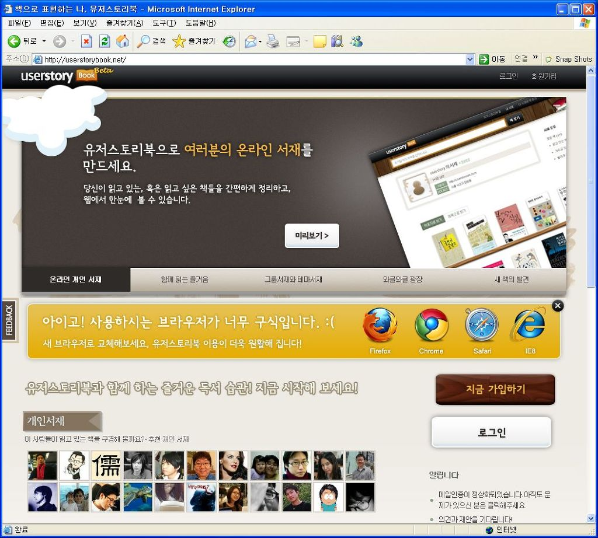

~~[유노](http://www.jungyunho.com/blog/ "[http://www.jungyunho.com/blog/]로 이동합니다.")~~[윤호님](http://www.jungyunho.com/blog/ "[http://www.jungyunho.com/blog/]로 이동합니다.")이 CEO로 있는 [유저스토리랩](http://userstorylab.net/ "[http://userstorylab.net/]로 이동합니다.")에서 준비하던 [유저스토리북](http://userstorybook.net/ "[http://userstorybook.net/]로 이동합니다.")이 드디어 오픈했습니다.

<!-- truncate -->

유저스토리북 서비스는 "유저스토리북은 '책'이라는 재료를 통해서 다양한 사람들과 만나고, 소통할 수 있는 서비스" 입니다 (라고 [도움말](http://help.userstorybook.net/entry/%EC%8B%9C%EC%9E%91%ED%95%98%EA%B8%B0 "[http://help.userstorybook.net/entry/%EC%8B%9C%EC%9E%91%ED%95%98%EA%B8%B0]로 이동합니다.")에 쓰여있네요. ^^)

오랜 기다림 끝에 공개된 서비스라서 기대가 더욱 크기도 하고, 실제로 매우 유용한 서비스라고 생각합니다. 앞으로도 많이 번창하소서!

* * *

서비스가 오픈되기 전에 윤호님과 구글톡질을 하다가 제가 **'우리나라 서비스도 IE6로 접속하면 다른 브라우저를 추천해주면 좋겠다. 유튜브나 트위터 등 해외 서비스들은 IE6를 지양한다.'**고 했더니 유저스토리북은 그렇게 하겠다고 했었죠.

그래서! 오픈날인 오늘 IE6 로 들어가보니 정말 그렇게 뜨더군요. 문구는 제가 생각한 것과는 뉘앙스가 살짝 달랐지만 어쨌든 저 안내문을 보니 좋네요. 웹개발자들을 살려주는 유저스토리랩 만세! :)

사족) 혹시 국내 최초인가요? 저는 국내 서비스 중에서는 처음 봤습니다.
