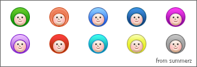

[이승환님](http://realfactory.net/ "[http://realfactory.net/]로 이동합니다.")의 [요청](http://blog.summerz.pe.kr/1476#comment3066367 "[http://blog.summerz.pe.kr/1476#comment3066367]로 이동합니다.")으로 공개합니다.

<!-- truncate -->

faces 1.0

아래 링크를 클릭하면 psd 파일을 다운로드 받을 수 있습니다.

[faces\_1-0\_by\_summerz.psd](./faces_1-0_by_summerz.psd)

열어보면 얼굴은 모두 똑같고, 결국 머리 부분만 gradient overlay 효과를 줘서 변화를 준 것이기 때문에 얼굴 표정이나 머리 색 등 필요하면 얼마든지 변경해서 사용할 수 있습니다.

사실 제가 진행하는 프로젝트에 사용할 이미지였는데, 아직도 그 프로젝트는 완성이 덜 됐습니다. ㅠ.ㅠ

이 파일은 상업적인 용도로도 사용 가능하고, 원하는 형태로 변경하는 것도 가능합니다. 단 사용하실 때 저작물의 원저작자 (써머즈, http://summerz.pe.kr )를 표기해주세요.

[써머즈](http://blog.summerz.pe.kr)에 의해 창작된 faces 1.0 은(는) [크리에이티브 커먼즈 저작자표시-동일조건변경허락 2.0 대한민국 라이선스](http://creativecommons.org/licenses/by-sa/2.0/kr/)에 따라 이용할 수 있습니다.
