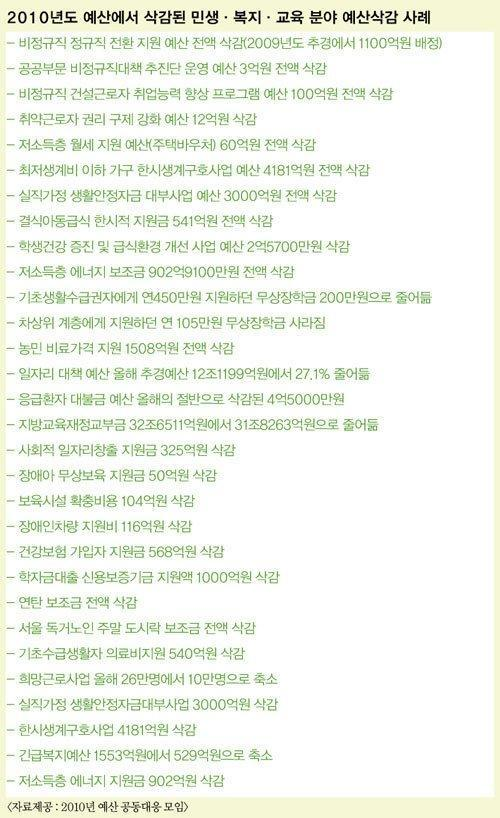

보관 차원에서 포스팅합니다. 잘못된 부분이 있으면 알려주세요.

<!-- truncate -->

**2010도 예산에서 삭감된 민생, 복지, 교육 분야 예산삭감 사례**

- 비정규직 정규직 전환 지원 예산 전액 삭감(2009년도 추경에서 1100억원 배정)

- 공공부문 비정규직대책 추진단 운영 예산 3억원 전액 삭감

- 비정규직 건설근로자 취업능력 향상 프로그램 예산 100억원 전액 삭감

- 취약근로자 권리 구제 강화 예산 12억원 삭감

- 최저생계비 이하 가구 한시생계구호사업 예산 4181억원 전액 삭감

- 실직가정 생활안정자금 대부사업 예산 3000억원 전액 삭감

- 결식아동급식 한시적 지원금 541억원 전액 삭감

- 학생건강 증진 및 급식환경 개선 사업 예산 2억5700만원 삭감

- 저소득층 에너지 보조금 902억9100만원 전액 삭감

- 기초생활수급권자에게 연450만원 지원하던 무상장학금 200만원으로 줄어듦

- 차상위 계층에게 지원하던 연 105만원 무상장학금 사라짐

- 농민 비료가격 지원 1508억원 전액 삭감

- 일자리 대책 예산 올해 추경예산 12조1199억원에서 27.1% 줄어듦

- 응급환자 대불금 예산 올해의 절반으로 삭감된 4억5000만원

- 지방교육재정교부금 32조6511억원에서 31조8263억원으로 줄어듦

- 사회적 일자리창출 지원금 325억원 삭감

- 장애아 무상보육 지원금 50억원 삭감

- 보육시설 확충비용 104억원 삭감

- 장애인차량 지원비 116억원 삭감

- 건강보험 가입자 지원금 568억원 삭감

- 학자금대출 신용보증기금 지원액 1000억원 삭감

- 연탄 보조금 전액 삭감

- 서울 독거노인 주말 도시락 보조금 전액 삭감

- 기초수급생활자 의료비지원 540억원 삭감

- 희망근로사업 올해 26만명에서 10만명으로 축소

- 실직가정 생활안정자금대부사업 3000억원 삭감

- 한시생계구호사업 4181억원 삭감

- 긴급복지예산 1553억원에서 529억원으로 축소

- 저소득층 에너지 지원금 902억원 삭감

원출처는 이미지에 - 2010년 예산 공동대응 모임

제가 본 출처는 [世說 -](http://xfelix.egloos.com/2769068 "[http://xfelix.egloos.com/2769068]로 이동합니다.") [친서민정책의 위엄](http://xfelix.egloos.com/2769068 "[http://xfelix.egloos.com/2769068]로 이동합니다.")

※ 위에서도 적었지만 잘못된 부분이 있으면 알려주세요.
