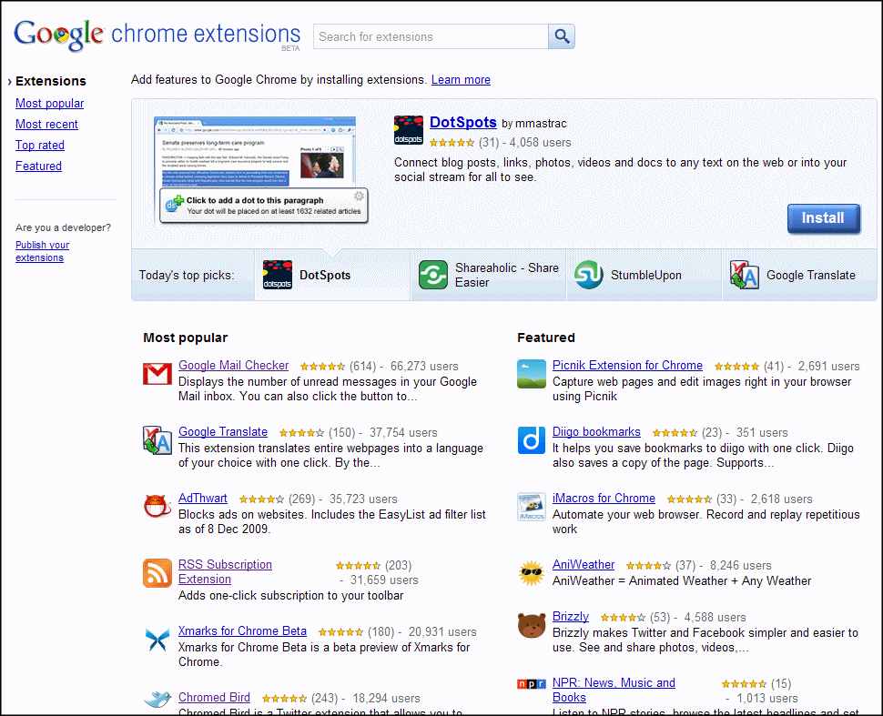
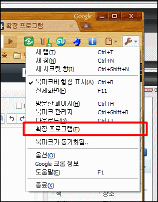
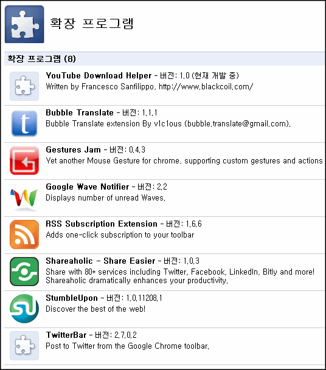

<!-- truncate -->

  

아시는 분들은 이미 아시겠지만 구글이 만든 브라우저 크롬 (Chrome)에 익스텐션 기능이 베타 오픈되었습니다. 우리말로는 확장 프로그램이라고 번역되었군요.

**[▶ Google chrome extensions (beta) 바로 가기](https://chrome.google.com/extensions/ "[https://chrome.google.com/extensions/]로 이동합니다.")**

익스텐션 (extension)이란 크롬 브라우저의 원래 기능에 추가 기능을 사용할 수 있도록 확장된 어플리케이션이라고 보시면 됩니다. 다른 프로그램에서는 애드온 (add-on) 혹은 플러그인 (plugin)과 같은 개념이죠.

인기순, 최근순, 고득점순 등 여러 형태의 리스트를 지원하니 필요한 기능들을 선택해서 설치를 하면 됩니다.

편리한 점은 익스텐션을 설치하고 나서 크롬 브라우저를 재실행할 필요가 없다는 것입니다. **[파이어폭스의 애드온](https://addons.mozilla.org/ko/firefox/ "[https://addons.mozilla.org/ko/firefox/]로 이동합니다.")**은 설치 후 꼭 파이어폭스를 재실행해야 했거든요.

설치 후에는 사용자설정 및 관리에서 확장 프로그램을 선택하면 설치된 현황도 볼 수 있고, 삭제도 할 수 있습니다.

저도 몇 개 설치해 봤습니다. 제가 설치한 건 현재까지 총 8개. 다음과 같습니다. 크롬 사용하시는 분들은 한번 필요한 기능들을 선택해서 설치해 보세요. 웹서핑이 보다 쾌적해지실 겁니다. :)

아, 현재 익스텐션은 윈도버전의 크롬 4 베타에서만 구동됩니다. [**http://www.google.com/chrome/eula.html?extra=betachannel**](http://www.google.com/chrome) 에서 다운로드 받을 수 있어요.

추가) **[맥 버전의 크롬에서도 익스텐션 버튼을 활성화 시키는 방법 바로가기 (영문)](http://grack.com/blog/2009/12/08/re-enable-install-button-for-mac-chrome-extensions/ "[http://grack.com/blog/2009/12/08/re-enable-install-button-for-mac-chrome-extensions/]로 이동합니다.")**
