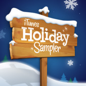

<!-- truncate -->

**[iTunes Holiday Sampler](http://itunes.apple.com/us/album/itunes-holiday-sampler/id344104720 "[http://itunes.apple.com/us/album/itunes-holiday-sampler/id344104720]로 이동합니다.")**

애플 아이튠스 (iTunes)에서 크리스마스 기념 무료 캐롤 앨범을 준비했군요. 애미 그란트, 배리 매닐로우, 사라 맥라클란, 위저, 샬롯 처치 등 아티스트들이 화려합니다. 제대로 준비했군요.

**[▶ 앨범 다운로드 받으러 가기 클릭](http://itunes.apple.com/us/album/itunes-holiday-sampler/id344104720 "[http://itunes.apple.com/us/album/itunes-holiday-sampler/id344104720]로 이동합니다.")**

총 20곡이고, 곡 리스트는 다음과 같습니다.

**iTnues Holiday Sampler**

트랙번호. 곡명 (아티스트명)

1. O Come All Ye Faithful (Amy Grant)

2. The First Noel (David Archuleta)

3. Silent Night (Sarah McLachlan)

4. Carol of the Bells / Jingle Bells (Barry Manilow)

5. It Snowed (Meaghan Smith)

6. Above the Northern Lights (Mannheim Steamroller)

7. Baby, It's Cold Outside (Lady Antebellum)

8. We Three Kings (Toby Keith)

9. God Rest Ye Merry Gentlemen (Rascal Flatts)

10. Silent Night (Wynonna)

11. Twelve Days of Christmas (Mexicani Marimba Band)

12. We Wish You a Merry Christmas (Weezer)

13. A Snowflake Fell (And It Felt Like a Kiss) (Glasvegas)

14. Another Christmas Song (Stephen Colbert)

15. Greensleeves (Vince Guarald)

16. Dream a Dream (Charlotte Church)

17. The Nutcracker, Op. 71, Act 2: Character Dances (Divertissement) - Dance of the Reed Pipes (Kirov Orchestra & Valery Gergiev)

18. Angels We Have Heard On High (Aretha Franklin)

19. O Holy Night (Musiq Soulchild)

20. Auld Lange Syne (The Lonesome Travelers)

아마도 아이튠스 미국 계정이 필요할 겁니다. 한국 계정으로는 다운로드가 안될 거예요. 아직 아이튠스 뮤직 스토어 한국은 없는 걸로 알고 있거든요.

미국에서 사용 가능한 신용카드가 없어도 아이튠스 미국 계정을 만들 수 있습니다. 인터넷에 방법이 많이 있으니 구글링 하셔서 따라 해보시면 될 듯 합니다. 굳이 결제되는 계정까지 만들지 않아도 그냥 무료 컨텐츠 다운받을 수 있는 정도까지만 만드시면 되요.

**[▶ 아이튠스 미국 계정 만들기 위한 검색 결과 보기](http://www.google.co.kr/search?q=%EC%95%84%EC%9D%B4%ED%8A%A0%EC%8A%A4+%EB%AF%B8%EA%B5%AD+%EA%B3%84%EC%A0%95&hl=ko&lr= "[http://www.google.co.kr/search?q=%EC%95%84%EC%9D%B4%ED%8A%A0%EC%8A%A4+%EB%AF%B8%EA%B5%AD+%EA%B3%84%EC%A0%95&hl=ko&lr=]로 이동합니다.")**

다들 아시겠지만... (^^)

**미국 계정을 만들어 두면 좋은 점**

1. 미국 앱스토어에서 무료 어플 (게임 포함)이 나왔을 때 다운로드 받을 수 있다.

2. 미국 뮤직 스토어에서는 매주 무료 음원 2곡, 무료 뮤직비디오 1편을 다운로드 받을 수 있다.
