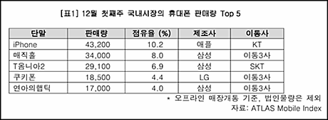
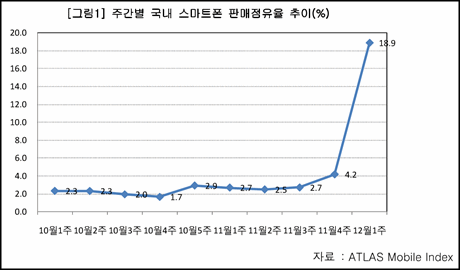
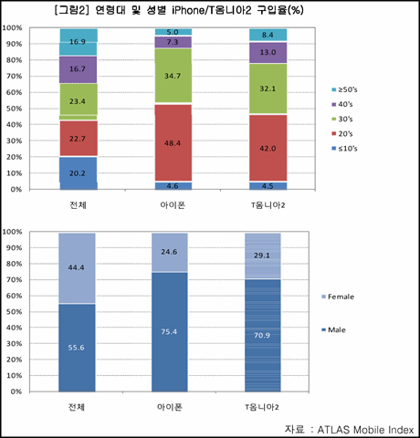
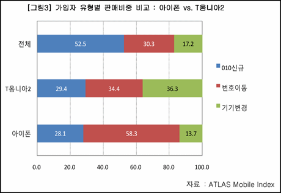
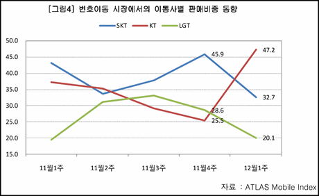
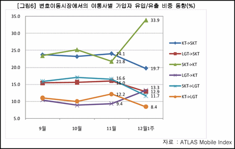
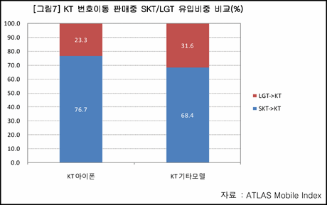
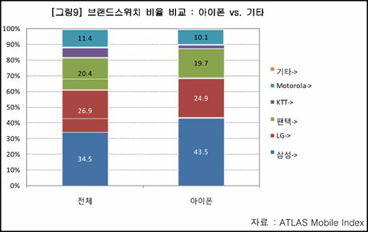
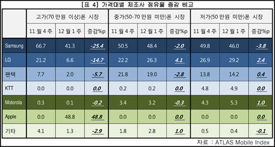

[ATLAS Research & Consulting](http://arg.co.kr/ "[http://arg.co.kr/]로 이동합니다.") 에서 배포한 보도자료 **[애틀러스보도자료 iPhone 판매량 심층 분석](http://www.slideshare.net/jung127/i-phone-2708690 "[http://www.slideshare.net/jung127/i-phone-2708690]로 이동합니다.")**을 읽어 보았습니다.

<!-- truncate -->

주욱 읽어보시면 아시겠지만 저에게 인상적인 내용은 아래와 같이 요약이 되는군요. 요약문만 적어보면 다음과 같습니다.

* 최초로 스마트폰이 판매점유율 1위를 차지
* (아직까지는?) 남자들에게 인기가 있는 폰
* 번호이동 고객 유치 효과가 확실
* SKT 고객들에게 더욱 어필
* 삼성 단말기 사용자들에게 더욱 어필

동의하시나요? 아래 표를 함께 보시죠.

**아이폰, 최초로 스마트폰이 판매점유율 1위를 차지**

아이폰 발매 1주일 만에 판매점유율 10.2%를 차지하면서 전체단말기 판매점유율 1위를 차지했다는군요. 놀랍습니다.  
  

  
더군다나 2%에 머물던 스마트폰 점유율이 11월 4주차에 4.2%로 증가하더니 12월 1주차에는 무려 18.9%로 뛰었다는군요. 아이폰이 전체 스마트폰 판매량의 53.9%를 차지했다고 하니  아이폰이 이 상승세의 중심에 있는 거겠죠.

**아이폰은 (아직까지는?) 남자들에게 인기가 있는 폰**

표를 보니 아이폰은 20대, 30대의 지지율이 가장 크고, 남성들에게 인기가 있는 폰이더군요. 스마트폰이라는 성격상 어느 정도 예상했지만, 여느 폰들에 비해 남성들에게 더 인기가 있다는 건 살짝 의외였습니다.

반대로 이야기하면, 만약 여성들이 좋아하기 시작한다면 이 추세는 더 가파르게 진행될 거라는 건가 하는 생각도 살짝 들고요.

**아이폰은 번호이동 고객 유치 효과가 확실**

표를 보고 좀 놀랬는데, 이 정도로 번호이동 고객이 많을 줄은 몰랐습니다. 아이폰 구매 고객의 절반 이상인 58.3%가 번호이동 고객이군요. 국내 이통시장이 제로썸 시장이라고 볼 때, 아이폰이 가장 확실한 무기로 입증이 되는 셈이군요.

  
게다가 전체 이통사별 판매비중까지 살펴본다면 아이폰이 KT에게 얼마나 확실하게 고객들을 유치시켜줬는지가 더욱 분명해집니다. SKT와 LGT에 속절없이 고객들을 뺏기다가 확실하게 가져왔군요.

안 그래도 내년부터는 쇼옴니아를 더 적극적으로 밀거라는 둥, 차세대 아이폰 (예를 들어 아이폰 4G)은 KT에서 들여오지 않을 거라는 둥 하는 이야기들이 있는데, 앞으로도 계속 제때 발매해달라고 요구할 명분이 생겼군요.

**아이폰은 SKT 고객들에게 더욱 어필**

번호이동한 고객들을 보면 SKT에서 KT로 넘어온 고객들의 숫자가 압도적입니다. 즉, 아이폰 발매를 바라던 SKT 고객들이 엄청 많았다는 것이고, KT가 그 기대에 기꺼이 부응을 해줬다는 것이죠.

위에서 이야기한 것처럼 전체 판매량에서 일단 1위를 한 상태에서 기타 다른 핸드폰 모델이 보여주는 번호이동 효과보다도 앞섰기 때문에 효과는 배가 된 거겠죠.

SKT의 입장은 참 난처하겠죠. 심지어 SKT 내부에서도 **'아이폰의 대항마는 아이폰'**이라는 이야기가 나온다고 하던데, 삼성전자와의 관계를 버릴 수도 없고... 속이 타겠습니다.

**아이폰은 삼성 단말기 사용자들에게 더욱 어필**

아이폰을 구매한 고객들은 유난히 삼성 핸드폰을 쓰다가 구매한 고객들이 많군요. LG, 팬택 등은 거의 타격이 없는 반면에 말이죠. 저 표는 무엇을 의미할까요?

사실 아이폰은 고가의 핸드폰이기 때문에 모든 단말기 사용자들에게 어필할 수는 없습니다. 현재 시장에서 비싸게 팔리는 제품은 몇 없습니다. 햅틱, 옴니아 시리즈 정도가 전부일텐데, 잠재적인 옴니아 고객들이 아이폰으로 몰렸다는 이야기가 될 수 있을까요?

'핸드폰을 바꿀 때가 됐는데, 이번에 좋은 걸로 바꿔보자. 뭐가 있나... T옴니아2로 바꿀까? 아이폰이 나왔네? 아이폰으로 바꾸자.' 뭐 이런 거겠죠. 고가폰 시장에서 삼성의 점유율이 무려 -25.4%를 기록하며 제일 급격하게 떨어진 것을 보면 확실하다 하겠습니다.

결과적으로 본다면 아이폰 출시로 인해 3가지 결과가 발생한 것이군요.

* 스마트폰 시장 활성화
* SKT 고객 감소
* 삼성 소비자 감소

KT는 얄밉게도 이렇게 삼성에 한방 날려놓고 이제 자신들도 제작에 참여한 삼성의 쇼옴니아를 전폭적으로 밀 테세입니다. 이런 일도 있고 했으니 앞으로 삼성이 KT 말을 더 잘 듣게 되고, KT의 시장 지배력도 더욱 높아질까요?

개인적으로는 KT가 옴니아 제품군을 가지고 밀게 되면 통신사 선호도가 더 좋은 SKT가 같은 옴니아 시리즈를 내는 한 결과적으로는 밀릴 것 같습니다. 준비해온 게 있으니 일단 시장에는 내놓아야겠지만 쇼옴니아에 주력하는 건 효율성이 떨어지는 판단이 아닌가 하는 생각입니다.

더군다나 삼성은 이제 한동안은 윈도우 모바일 플랫폼 보다는 자체 플랫폼인 [바다 (Bada)](http://www.bada.com/ "[http://www.bada.com/]로 이동합니다.") 를 밀 것 같고, 안드로이드 폰들도 계속 낼 것 같고 말이죠.

\*                                       \*                                       \*

이번 기회에 정말 이통사들이 진검승부를 펼치고, 그 과정에서 막혀있던 장벽들이 하나둘씩 열려서, 국내 고객들도 이통사와 단말기 제조사들이 내어놓는 신기술과 첨단 서비스를 마음껏 향유하는 그런 날이 오면 좋겠습니다. 조금 빨리 오면 더욱 좋고요.

우리나라 사람들이 또 한번 시작하면 앞뒤 안가리고 달려가는 그런 속성이 있으니 더 좋은 날에 대한 기대를 살짝 해봅니다. :)
