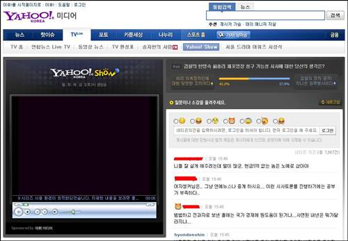

<!-- truncate -->

[야후! 코리아](http://yahoo.co.kr/ "[http://yahoo.co.kr/]로 이동합니다.")에서 생방송 컨텐츠를 오픈했네요. 제목은 [**Yahoo! Show**](http://kr.news.yahoo.com/webcast/play.html?idx=60 "[http://kr.news.yahoo.com/webcast/play.html?idx=60]로 이동합니다."). 매주 월, 화, 목, 금 오후 3시에 생방송으로 진행된다고 하는군요.

한 5분 들어봤는데, 여러 가지 의미로 상상과는 많이 다르더군요. 예를 들어 이런 식입니다.

수자원공사의 수도세 인상에 대한 뉴스를 소개하고 있었나봐요. 한참 기사를 소개하더니 여자 진행자가 자기는 목욕도 많이 하고 물을 많이 쓰고 싶으니 수도세를 안올리면 좋겠다는 식으로 멘트를 마무리 하더군요. 남자분은 어디 [아프리카](http://afreeca.com/ "[http://afreeca.com/]로 이동합니다.") 방송이나 아마추어 웹방송 하는 것처럼 언어를 매우 자유롭게 구사하고요. 외모는 선남선녀 컨셉인데 멘트들은 거의 게임방송 하는 것처럼 하네요. 본의 아니게 저렴한 컨셉이라는 느낌이 들어요;

* * *

그나저나 방송하면서 설문조사를 진행하나봐요. 주기적으로 질문이 바뀌면서 댓글을 올리고 전화 연결도 하는가 보네요. 전화는 02-2185-1385 이래요.

설문조사는 이슈가 되는 뉴스에 대한 생각을 묻는 건가봐요. 제가 접속할 때 나왔던 질문은 이건희 사면에 대한 의견이었습니다. 선택지가 '국가경쟁력 등을 고려해서 연내 사면해야 한다'와 '아직은 시기상조다' 중 하나였는데, 좀 웃기더군요. 결국 사면은 무조건 하는 거고, 연내 사면할지 내년에 사면할지를 고르라는 거잖아요.

그 다음 설문은 한명숙 전총리 체포영장 청구 가능성에 대한 질문인데, '비리 정치인에 대한 당연한 조치'와 '검찰의 정치공작이고 지나친 권력행사' 둘 중에 하나를 고르는 건데, 남자 진행자가 이런 멘트를 날리네요.

> "'한명숙씨 돈 받아 쳐먹었으니까 나와라-' 이런 식으로 댓글을 올리면 제가 소개해주고 싶어도 소개할 수가 없습니다-!"

분명히 뭔가 상당히 아방가르드한 느낌입니다;;;

* * *

이 방송은 야후! 코리아에서 자체적으로 진행하는 거겠죠. 보자마자 예전에 야후! (미국)에서 했던 방송이 생각나더군요. 쇼 제목이 9 이었던 것 같은데 기억이 가물거려 확실하지는 않아요. 지금은 구글링을 해봐도 나오지 않네요.

매일 인터넷에서 화제가 되었던 9개의 주제 (글, 동영상, 유머, 뉴스 등등)를 선정해서 MTV 스타일로 순위 발표 하듯이 읽어줬던 쇼였습니다. 야후!는 본사나 지사나 방송에 대한 욕구가 있나봐요?
