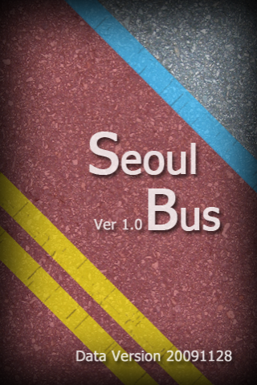
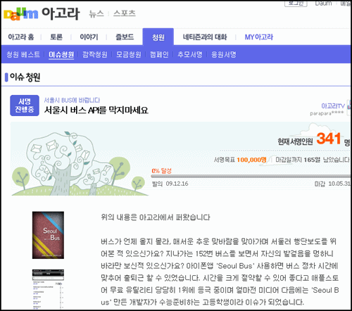

복잡한 서울, 경기 지역의 버스 체계를 잘 파악해서 노선도와 정류장마다의 버스 도착 시간 등의 정보를 알려주는 **[아이폰 앱 seoul bus](http://itunes.apple.com/kr/app/seoul-bus/id340701877?mt=8 "[http://itunes.apple.com/kr/app/seoul-bus/id340701877?mt=8]로 이동합니다.")** (이하 서울 버스 앱)가 있습니다.

<!-- truncate -->

 seoul bus

고등학생이 만들어서, 무료여서 그리고 무엇보다 편리해서 많은 사람들이 좋아하는 아이폰용 어플리케이션이죠.

그런데, 며칠 전 서울 버스 앱이 제대로 작동하지 않고 종료된다는 이야기가 들리더니 그 이유가 서울시에서 정보를 빼오지 못하게 막았기 때문이라는 소문이 들렸습니다. 나중에 알고보니 정보를 막은 것은 경기도 쪽이라고 하더군요. 결국에는 **[아고라 청원](http://agora.media.daum.net/petition/view?id=86748 "[http://agora.media.daum.net/petition/view?id=86748]로 이동합니다.")**까지 올라오게 됐고요.

 [다음 아고라 - 서울시 버스 API를 막지마세요.](http://agora.media.daum.net/petition/view?id=86748 "[http://agora.media.daum.net/petition/view?id=86748]로 이동합니다.")

트위터에서도 아고라에서도 비난 여론이 컸죠. 시민들이 편리하게 이용하던 것을 오히려 더 장려는 못할 망정 왜 막았냐는 거죠. 불을 붙인 건 다음 아고라 자유토론방에 올라온 **[필독 ★ 버스교통정보, 공익을 위한 개발에 수익이 왠 말이더냐?](http://bbs1.agora.media.daum.net/gaia/do/debate/read?bbsId=D003&articleId=3213239 "[http://bbs1.agora.media.daum.net/gaia/do/debate/read?bbsId=D003&articleId=3213239]로 이동합니다.")** 라는 글이었죠. 서울시 교통정보센터에 연락을 해봤더니 '실시간 교통 정보는 앞으로 수익형으로 전환되어 개인이 만든다고 하여도 곧 정보를 받아볼 수 없을 거라 한다'는 답변을 받았다는 거였죠.

위에서 이야기한 것처럼 정보를 막은 것은 서울시가 아니라 경기도 측이었고, 경기도 측은 사태가 커지자 다시 서비스 사용이 가능하도록 접근을 허가했다고 해요. 많은 사람들은 기뻐했죠.

이런 식으로 대충 정리가 되어가고 있는데, 여기서 제가 하고 싶은 말이 있습니다.

## 1. 경기도 측이 악의 집단은 아니라능

경기도 측에서 어플의 접속을 막은 이유는 갑자기 많은 트래픽이 몰려 서버가 다운되거나 과부하가 걸리기 때문이라고 했었죠. 적어도 '너네 서민들이 이런 고급 정보를 몰래 빼내서 쓰다니, 배가 아파서 못봐주겠다'면서 막은 게 아니라는 거죠.

게다가 이미 경기도 측은 나름대로 버스 정보를 무료로 서비스 중이었잖아요. 모바일 웹버전인 [**http://www.gbis.go.kr/pda/**](http://www.gbis.go.kr/pda/) 도 있었고, 일반 피처폰을 위한 wap 버전인 **4247 + 인터넷키**도 있었고, ARS **1688-8031** 도 운영을 하고 있었거든요.

※ 참고로 서울시의 모바일 웹 버전은 [**http://mobile.bus.go.kr/pda/**](http://mobile.bus.go.kr/pda/ "[http://mobile.bus.go.kr/pda/]로 이동합니다.") 입니다.

이렇게 공식적으로 운영되는 시스템을 옆으로 들어와서 갑자기 부하를 일으키면 이 모든 서비스들이 제대로 운영되지 않을 수 있죠. 그래서 막았을 거라 생각하고 그 조치가 충분히 이해가 됩니다.

그렇다고 어플을 만들기 전에 미리 물어봤다면? 분명히 경기도 측에서 "NO-!" 라고 했을 것 같긴 해요. 심지어 경기도 측에서는 이 건을 처음 대할 때 **[사법처리 운운](http://www.cbs.co.kr/nocut/show.asp?idx=1342935 "[http://www.cbs.co.kr/nocut/show.asp?idx=1342935]로 이동합니다.")**했으니까요.

어쨌든 제 생각으로는 몇 천명 혹은 몇 만명의 아이폰 서울 버스 앱 사용자들 때문에 기존 서비스가 지장을 받는 게 자연스러운 건 아니다는 겁니다. 시스템 부하를 해결할 때까지는 일단은 원치않는 접근이나 트래픽을 차단할 수 있는 건 서비스 관리자의 권한 및 판단이기도 하고요.

## 2. 모바일 환경이 급속도로 변화하고 있다능

경기도나 서울시가 각자 자신들의 체계를 별개로 구축시켜서 사용자들은 불편하고 햇갈려 하며 사용성이 굉장히 낮았죠. 사용성이 서울 버스 앱을 통해 드라마틱하게 높아진 것이죠. 여기에 크게 5가지 단계가 내포되어 있습니다.

1. 시스템 최초 구축 단계 : 경기도와 서울시는 wap 버전, 모바일 웹 버전의 정보 시스템을 예전에 만들었다.
2. 극악의 사용성 단계 : wap 사용을 하려면 데이터통화료가 엄청 나오기 때문에 사용자가 거의 없었다.
3. 낮은 사용성 단계 : LGT의 풀 브라우징 오즈폰과 오즈 무한자유 요금제 (월 6000원)와 같은 파격적인 서비스가 나오면서 그나마 사용성이 높아졌다.
4. 높아지는 사용성 단계 : 옴니아 등의 스마트폰이 나오기 시작하면서 사용자들이 더 많아졌다.
5. 시스템 변경 필요/요구 단계 : 누구나 서비스를 오픈 (어플리케이션을 제작)할 수 있는 아이폰이 등장하면서 사용성이 높아지다 못해 욕구를 직접 실현할 수 있는 단계에 이르게 되었다.

예전이라면 아무리 공공재 - 공공을 위한 정보라 하더라도 정해진 누군가가 정보를 독점하고 사업권을 독점하여 거기서 이득을 취하지만 서비스가 나아지는 속도는 굉장히 느렸을 겁니다.

하지만 이제는 그런 게 통하지 않는 시대가 되어가고 있는 거죠. 적어도 공공재를 사용한 무료 서비스에 대해서는 명분도 있고 말이죠.

## 3. 공공 정보에 대한 오픈 API 구축, 개방을 해주라능

그런 의미에서 위에서 서울시 교통정보센터가 향후 실시간 교통 정보를 수익사업화하겠다고 말한 건 참 안타깝습니다. 모든 시민을 위한 정보인 실시간 교통 정보를 누군가에게 독점 혹은 과점시켜 수익을 발생시키겠다고 생각하는 발상은 흡사 전기, 가스, 수도를 민영화 한다든지 의료보험을 민영화 하겠다는 발상을 떠오르게 합니다.

서울시나 경기도는 혹시라도 그런 이상한 마음 먹지 말고 공공의 정보로 사용될 수 있는 정보들을 선별하여 누구나 자유롭게 열람할 수 있는 시스템을 만들어야 할 때입니다. 모든 시스템을 다 만들려면 돈도 많이 들고 시간도 많이 걸리겠지요. 그러니 API만 만들어서 오픈을 시키면 됩니다. 오픈 API 라는 게 그러라고 있는 거 잖아요. ^^ (물론 개인의 사생활이 침해될 수 있는 여지가 있는 정보들은 제외해야겠지요.) 시나 도는 돈 한푼 안들이고 멋진 서비스를 얻을 수 있으니 얼마나 좋아요.

실시간 버스 교통 정보처럼 또 오픈할 수 있는 정보가 뭐가 있을까요? 생각해 보면 정말 많을 듯 합니다. 시립/국립/공립 도서관의 책 소장/대여 정보도 API로 제공된다면 정말 재밌는 프로젝트가 많이 나올 것 같습니다. 미아 정보도 유용할 것 같고, 관광객을 위한 관광지 관련 정보도 당근 좋을 것이고요.

인터넷 속도 빠르다고 IT 강국이라고 자랑하던 시대는 갔죠. 특히 모바일 쪽은 엄청 뒤져 있잖아요. 서울시나 경기도 뿐만이 아니죠. 각 정부부처와 지방자치단체들이 앞으로 이런 쪽에 투자를 하면 정말 좋겠습니다.

물론 액티브엑스를 써야만 웹에서 자료가 열람된다거나 민원을 넣을 수 있는 현재의 시스템부터 고쳐야 하니 갈길이 좀 멀게 느껴지긴 합니다 OTL

**관련 링크**

- [에스티마의 인터넷이야기 - 트위터의 진정한 파워를 느끼다](http://estima.wordpress.com/2009/12/17/%ED%8A%B8%EC%9C%84%ED%84%B0%EC%9D%98-%EC%A7%84%EC%A0%95%ED%95%9C-%ED%8C%8C%EC%9B%8C%EB%A5%BC-%EB%8A%90%EB%81%BC%EB%8B%A4/ "[http://estima.wordpress.com/2009/12/17/%ED%8A%B8%EC%9C%84%ED%84%B0%EC%9D%98-%EC%A7%84%EC%A0%95%ED%95%9C-%ED%8C%8C%EC%9B%8C%EB%A5%BC-%EB%8A%90%EB%81%BC%EB%8B%A4/]로 이동합니다.")
- [미디어 한글로 - 경기도 버스, 서울에서 도착정보 알아내기 (ARS, 휴대폰 인터넷, OZ 등 활용)](http://media.hangulo.net/684 "[http://media.hangulo.net/684]로 이동합니다.")
- [매일매일 데일리 뉴스 - 애플 아이폰, '먹튀'논란과 황당한 고객 서비스](http://leedail.com/427 "[http://leedail.com/427]로 이동합니다.")
