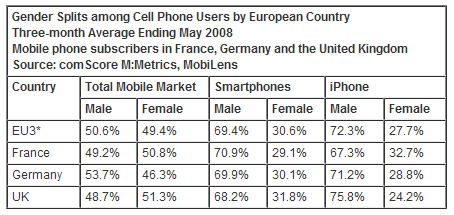
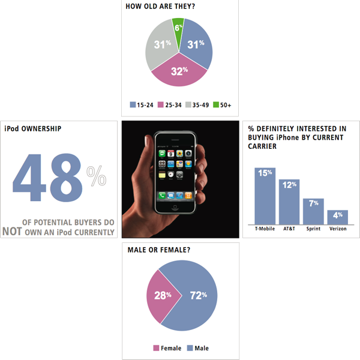

아이폰이라는 기기가 가진 상징성이 있어서인지 **"여자들이 아이폰을 더 많이 사용한다"**고 말하시는 분들이 의외로 많더군요. 물론 그 상징성이라는 게 예쁘다, 쓰기 좋다, 편리하다 등의 이미지겠죠.

<!-- truncate -->

정말 그럴까요?

## #1 [애틀러스 보도자료 - iPhone 판매량 심층 분석](http://www.slideshare.net/jung127/i-phone-2708690 "[http://www.slideshare.net/jung127/i-phone-2708690]로 이동합니다.")

제가 지난번에 올렸던 [**아이폰 판매량 심층 분석 보도자료 요약**](http://blog.summerz.pe.kr/1489 "[http://blog.summerz.pe.kr/1489]로 이동합니다.") 에서도 보면 일반폰은 남녀 사용자 비율이 55:45 정도 되죠.

그에 비하면 아이폰의 남성 구매자수가 훨씬 많다는 걸 알 수 있습니다. 대중적인 광고 집행을 많이 하기도 하고 기존 제품군을 가지고 있는 T옴니아2에 비해서도 더 많아요. 5% 정도가 많다고 한다면 분명 의미있는 숫자겠지요.

이건 12월 1주차까지의 자료이니 지금은 결과가 달라졌을 수도 있으려나요? 최근 판매량까지 합산된 자료가 있으면 좋겠군요. 저는 별로 달라질 것 같지 않은데 말이죠.

그럼 다른 나라의 경우를 보시죠.

## #2 [컴스코어 - METRICS: 80 percent of iPhone Users in France, Germany and the UK Browse the Mobile Web](http://www.comscore.com/Press_Events/Press_Releases/2008/07/iPhone_Users_in_Europe_Browse_the_Web "[http://www.comscore.com/Press_Events/Press_Releases/2008/07/iPhone_Users_in_Europe_Browse_the_Web]로 이동합니다.")

유럽의 빅3 - 프랑스, 독일, 영국의 전체 모바일폰 사용자는 남녀 사용자 비율이 거의 5:5 입니다.

그리고, 스마트폰 사용자는 대략 7:3 정도 되는 반면 아이폰 사용자들은 72:28 정도 되는군요. 일반 스마트폰 사용자들보다 남성들이 더 많이 아이폰을 사용한다는 거죠.

EU3 : 프랑스, 독일, 영국을 모두 합친 수입니다.
Smartphones : 윈도우즈, 팜, 심비안을 OS로 사용하는 폰들입니다.

물론 이 자료도 2008년도 자료이기 때문에 2009년도 자료가 있으면 또 다르다고 할 수 있겠죠.

## #3 [Solutions Research Group 설문조사 결과](http://www.appleinsider.com/articles/07/06/06/apple_att_neophytes_to_define_iphone_audience_report.html "[http://www.appleinsider.com/articles/07/06/06/apple_att_neophytes_to_define_iphone_audience_report.html]로 이동합니다.")

이건 더 오래된 자료이긴 합니다. 2007년도 조사니까요. 그리고, 실제로 구입한 사람들 숫자는 아니고, 구입할 의사가 있는 사람들 조사결과인데요, 역시 남자들이 압도적으로 더 구매의사를 밝히고 있습니다.

자세한 건 소제목의 링크에 가면 나와 있으니 확인하시면 되고요.

한 마디로 하자면 애플의 매니아층 하면 떠오르는 층과 아이폰 구매 욕구를 느끼는 층이 크게 다르지 않는다는 거죠.

* * *

제가 생각할 때 아이폰은 예쁜 제품임에는 틀림없지만 사용하기 쉬운 제품은 절대 아닙니다. 특히 애플의 제품군을 다뤄본 적이 없는 사용자들에게는 더욱 사용하기 쉬운 제품이 아니고, 자세한 설명서 (혹은 설명해주는 사람) 없이는 제 기능을 다 알아가면서 사용하기 어려운 제품이죠.

**'자세한 설명서 혹은 자세하게 설명해주는 사람'**이라는 이라는 개념이라면 다른 스마트폰도 별반 다르지 않을 것입니다. [아이폰 사용자들의 절반 이상이 애플리케이션 설치 없이 순정 그대로 사용하고 있었다는 설문조사 결과](http://2ndfinger.com/1001 "[http://2ndfinger.com/1001]로 이동합니다.")를 놀랍게 받아들이시는 분들이 많던데, 옴니아 사용자 대상으로 조사를 해보면 어떨까요? 모르긴 몰라도 비슷할 겁니다. 스마트폰이라는 게 누구나 예전부터 쉽게 접하던 개념이 아니니 말이죠. 그건 옴니아든 아이폰이든 모든 스마트폰이 비슷할 거예요.

제 주위 여성들에게 아이팟 터치를 보여주거나 아이폰 이야기를 해주다가 **'이거 사용하려면 아이튠스랑 동기를 해줘야 하고, 컴퓨터랑 연결시켜도 usb 메모리처럼 하드드라이브로 잡히지도 않고...'** 이렇게 이야기하면 대부분 **'그래? 뭔가 어렵네. 아이튠스라는 거 꼭 배워야 이거 쓰는 거야? 그냥 파일 갖다 넣으면 안돼?'** 라는 말이 돌아오던데 말이죠.

왜 아이폰은 다른 스마트폰에 비해 월등하게 여성들이 많이 쓴다는 미신이 생겨났을까요? (혹시 이거 우리나라에만 있는 미신인가요? -\_-)
