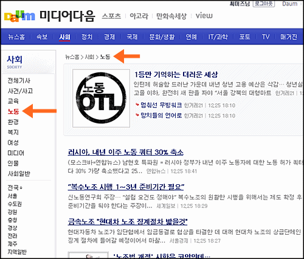

<!-- truncate -->

  

전혀 별게 아닐 수도 있지만 **[미디어 다음](http://media.daum.net/ "[http://media.daum.net/]로 이동합니다.")**을 보다가 카테고리가 눈에 들어와 캡쳐 한 장.

문득 착하고 착한 생각만 하는 우리나라의 각종 인터넷 서비스 매체에서 노동이라는 단어를 카테고리에 넣는 매체가 몇 개나 있을까 싶어서요. 인터넷 서비스 매체 뿐만이 아니죠. 전체 매체를 다 뒤져봐도 말이예요.

\*                                   \*                                   \*

참고로 우리나라가 어떤 나라인 줄 아십니까? 2mb 시대의 우리나라 노동부 장관이 어떤 인간인지 아십니까?

> 임태희 노동부 장관은 6일 "내년부터 노동부의 부처 이름을 고용노동부로 바꾸는 방안을 준비하고 있다"고 말했다.
>
> (중략)
>
> 그는 "부처명을 바꾸고 거기에 따라 업무의 중점도 고용 문제에 두는 체제를 준비하고 있다. 추구해야 할 상위 목표를 명확하게 하려는 조치"라고 설명했다.
>
> (중략)
>
> 임 장관은 "오늘 집회에 나온 대형노조는 이미 근로조건이 괜찮고 국민의 기대도 받기 때문에 사회적 책임을 느껴야 한다. 자신들보다 훨씬 불리한 조건에서 일자리 걱정을 하는 기간제 근무자, 구직자 등을 생각하면 노조도 염치가 있어야 한다"고 지적했다.
>
> 출처 : [연합뉴스 - 노동부→고용노동부 개명 추진 (via 미디어 다음)](http://media.daum.net/society/others/view.html?cateid=1067&newsid=20091106171605426&p=yonhap "[http://media.daum.net/society/others/view.html?cateid=1067&newsid=20091106171605426&p=yonhap]로 이동합니다.")

저런 인간입니다. 참 염치없는 인간이군요. 국가기관 중에서 유일하게 노동자의 편을 지지해야 할 부서의 수장이 저런 말을 대놓고 이야기하고 그에 대해 별다른 일도 벌어지지 않고 있는 나라가 바로 대한민국입니다.

[南無님](http://studioxga.net/ "[http://studioxga.net/]로 이동합니다.") 말마따나 조만간 [고용착취부라고 할 날이 멀지 않았](http://studioxga.net/1187 "[http://studioxga.net/1187]로 이동합니다.")는지도 몰라요.
