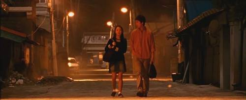

아래 내용 전체에 영화의 줄거리가 들어있습니다. 영화의 내용을 미리 알기 원치 않는 분들은 아래 내용을 읽지 않는 것이 좋습니다.

<!-- truncate -->

영화의 초반 1/3을 보는 내내 이창동 감독의 <초록물고기>가 떠올랐습니다. 다들 아시겠지만 <초록물고기>는 1997년도에 만들어진 작품으로 개발제일주의를 상징하는 공간 일산을 배경으로 하고 있죠.

영화 <파주>는 90년대 초반의 일산이 개발 논리에 정복당하고 그 이후에도 지리적으로 그 위쪽인 파주까지 같은 이유로 밀려 올라가고 있는 상황을 보여주고 있습니다. 단지 차이가 있다면 <초록물고기>는 이미 자신의 설 땅을 잃어버린 정서를 보여주고 있다면 <파주>의 경우는 현재 '개발 당하고 있는' 사람들의 상황을 보여주고 있습니다.

> "30년 동안 우리에게는 ‘잘살아보세’라는 단 한 가지 목표만이 주어졌습니다. 그 목표의 가시적 성과물이 바로 신도시지요. 마치 무대의 세트처럼 뚝딱뚝딱 순식간에 만들어진 이 공간은 30년간 우리가 소망했던, 아니 소망하기를 강요받았던 멋진 신세계인 겁니다."
>
> "낯선 이들에 의해 삶의 터전에서 밀려난 원주민들은 전통이나 기억 같은 보이지 않는 삶의 토대까지 빼앗겨버렸습니다. 일견 가해자처럼 보이는 신도시민들도 사정은 마찬가지지요. 신도시 아파트에 입성하는 과정에서 이들도 조상에게 물려받은 기억과 크고작은 삶의 의미들을 지불했습니다. 이런 의미에서 한국 사람은 모두 밀려난 원주민이 아닐까요?"
>
> "얼핏 평화로워 보이는 일상이지만 깊은 상실감이 배어 있는 이런 삶이 정말 잘 사는 건가, 우리는 다만 행복한 척하고 있는 게 아닌가 질문하고 싶었습니다."
>
> (위는 기사 내에서 이창동 감독이 이야기한 내용입니다)
>
> 출처 : [한겨레21 - 욕망에 지쳐 그늘진 자리](http://www.hani.co.kr/h21/data/L000214/1pbc2e02.html "[http://www.hani.co.kr/h21/data/L000214/1pbc2e02.html]로 이동합니다.")

영화는 은행이 미처 들어서기도 전에 나이트클럽이 성행하고, 철거민들이 용역깡패들과 싸우는 동안에도 교회 십자가가 빛나는 현실을 담담히 보여줍니다.

* * *

하지만 <파주>는 중반으로 접어들면서 주인공 자매와 한 남자의 관계에 집중하며 이야기의 방향을 선회합니다. (여자 선배와의 관계가 드러나기도 하지만요) 윤리적인 압박감, 의도하지 않았던 실수로 인한 회한이 섞여들어가죠. 본격적으로 미스터리의 형태를 띄기 시작하기도 하죠.

중반이 넘어가기 시작하면서 초반부에 남자가 했던 실수가 더욱 의도치 않게 무거워지면서 이 영화가 철거민이나 개발 중심의 이야기, 운동권에 대한 이야기가 아니라는 게 분명해집니다. 죄의식과 관련된 이야기인 듯 해보입니다. 슬쩍슬쩍 흐르던 죄의식이 영화 내에서 강물처럼 흐르기 시작합니다.

* * *

그리고 남자는 죽어버린 부인이 남겨둔 처제에게 '너를 사랑하지 않았던 순간은 단 한번도 없었다'는 고백을 하고, 사기죄로 잡혀들어가고, 용역깡패와 대항하던 철거민대책위원회 사람들은 분열하기 시작합니다. 그동안 고민하던 것에 비교하면 이 모든 것들은 너무도 빠른 시간에 이루어져버립니다.

죄의식을 가지고 있는 사람도, 죄를 저지른 사람도, 그 밖에 있는 사람도 시간이 갈수록 무너져갈 것이 분명해 보입니다. 물론 영화는 아무런 결말도 내지 않죠. 암시를 통해 악화되는 상황들을 천천히 보여줄 뿐입니다. 영화를 보고 있자면 그것들이 악화되는 것이 아닌지도 모르겠다는 생각이 들 정도입니다. 이러지도 저러지도 못하지만 상황은 어떻게든 진행되어 가겠죠. 그게 파주의 운명인 걸까요? 영화는 끝내 안개 속에서 끝이 납니다.

의도한 것인지 모르겠지만 영화 속 음악은 때론 감성적으로 흐르기도 하고 때론 관조적으로 화면을 압도하기도 하여 영화를 더욱 미스터리하게 만드는 역할을 합니다. 이건 장점인지 단점인지 잘 모르겠어요. 만약 전체적으로 더욱 감성적인 멜로디가 쓰였다면 영화는 '사랑 이야기'로 압축되었을지도 몰라요. 하지만 아닙니다. 영화는 숨겨진 사실들을 많이 가지고 있고, 음악은 영화 내내 그걸 절대 드러내는 법이 없어요.

**관련링크**

[DAUM 영화 - 파주](http://movie.daum.net/moviedetail/moviedetailStory.do?movieId=50256 "[http://movie.daum.net/moviedetail/moviedetailStory.do?movieId=50256]로 이동합니다.")

[씨네21 - [나의 친구 그의 영화] 이거야말로 인간의 종말이로구나](http://www.cine21.com/Article/article_view.php?mm=005004009&article_id=58688 "[http://www.cine21.com/Article/article_view.php?mm=005004009&article_id=58688]로 이동합니다.")

[씨네21 - 눈먼 자들의 도시, 파주](http://www.cine21.com/Article/article_view.php?mm=005001001&article_id=58429 "[http://www.cine21.com/Article/article_view.php?mm=005001001&article_id=58429]로 이동합니다.")
