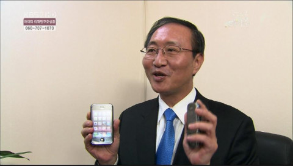

어제 [유저스토리랩](http://userstorylab.net/ "[http://userstorylab.net/]로 이동합니다.")의 ~~유노~~[윤호님](http://www.jungyunho.com/ "[http://www.jungyunho.com/]로 이동합니다.")이 링크를 하나 보내주셨는데 보면서 한참을 웃었습니다. 박진영이 KBS의 스마트폰 관련 방송에 나와 스마트폰의 웹프라우저를 사용하는 장면인데요, 플짤을 퍼왔습니다. 한번 보시죠.

<!-- truncate -->

박진영은 왜 옴니아에서 멀티터치를 시도하고 있을까 (보기)

출처 : [1Q81의 헛소리들 - 아버지를 아버지라 부르지 못하고....](http://iq81.egloos.com/5176517 "[http://iq81.egloos.com/5176517]로 이동합니다.")

여기까지 보고도 뭔가 이상하다는 느낌을 받지 못하는 사용자들이 엄청 많을 것 같다는 생각이 들었습니다. 이에 대한 제 생각을 요약하면 이렇습니다.

**아이폰(터치) 사용자들 대상으로 설문조사하면 옴니아에서 (당연히) 멀티터치가된다고 생각하는 사람이 50% 넘을 듯.**

**and / or**

**아이폰(터치) 써본 사람들은 옴니아에서 멀티터치 안된다는 거 알면 까무라칠 듯.**

위의 플짤 속에서 박진영이 들고 시연하는 폰은 분명히 삼성 T옴니아2인데, [옴니아 시리즈는 멀티터치가 안되거든요.](http://news.nate.com/view/20081216n13114 "[http://news.nate.com/view/20081216n13114]로 이동합니다.") 그런데, 박진영은 자꾸 손가락 두 개를 이용해서 멀티터치를 시도하고 있어요.

즉, 박진영이 아이폰의 UI에 길들여져 있고, 저 방송분은 단순히 보여주기식 촬영이었다는 거죠. 실제로 박진영은 T옴니아 모델이기도 합니다.

[유튜브 - 박진영 & 닉쿤 - 옴니아폰 (jypark & nichkhun)](http://www.youtube.com/watch?v=pm7JGIRle1A "[http://www.youtube.com/watch?v=pm7JGIRle1A]로 이동합니다.")

뭐, 모르죠. [노회찬 대표](http://www.nanjoong.net/ "[http://www.nanjoong.net/]로 이동합니다.")가 [아이폰, 블랙베리의 쌍권총을 차고 다니는 것](http://www.nanjoong.net/g4/bbs/board.php?bo_table=nanjoong&wr_id=29402 "[http://www.nanjoong.net/g4/bbs/board.php?bo_table=nanjoong&wr_id=29402]로 이동합니다.")처럼 박진영도 아이폰, 옴니아 쌍권총을 차고 다닐지도요.

KBS 감성다큐 미지수 출연 중 - 왼손엔 블랙베리, 오른손엔 아이폰.

그렇다면, 똑똑한 사람이라는 평을 듣는 박진영이 옴니아에서 멀티터치가 안된다는 걸 모른 채 가지고 다닌다는 건 옴니아에게는 굴욕일까요? 모르죠, 광고 모델하면서 저렇게 TV 프로그램에까지 옴니아 들고 시연하는 걸 찍어주는 성의에 삼성에서는 감동했을지도.
