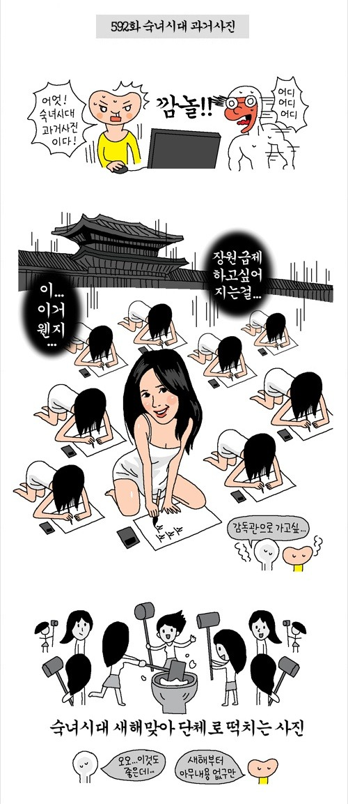
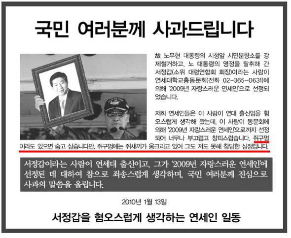
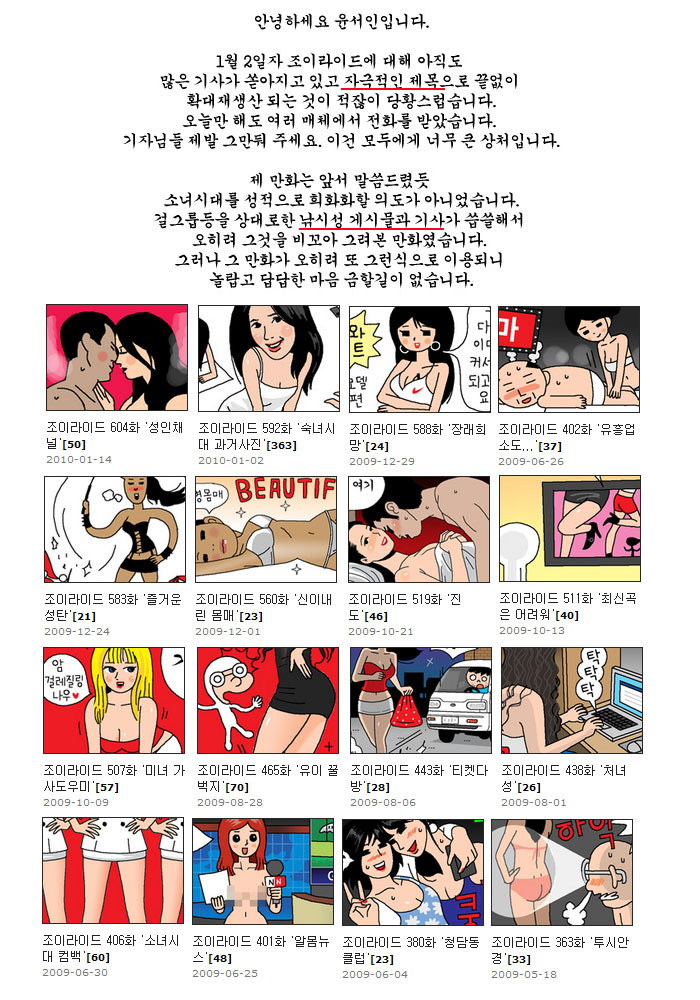

윤서인이라는 만화가가 연재하는 [야후!코리아](http://kr.news.yahoo.com/ "[http://kr.news.yahoo.com/]로 이동합니다.")의 [조이라이드](http://kr.news.yahoo.com/service/news/shelllist.htm?linkid=toon_series&work_idx=41 "[http://kr.news.yahoo.com/service/news/shelllist.htm?linkid=toon_series&work_idx=41]로 이동합니다.")는 논란이 많기로 유명하죠. **[원사운드와 붙어서 벌었던 키보드 배틀](http://cafe.naver.com/kisetsu.cafe?iframe_url=/ArticleRead.nhn%3Farticleid=16250 "[http://cafe.naver.com/kisetsu.cafe?iframe_url=/ArticleRead.nhn%3Farticleid=16250]로 이동합니다.")**이나 **[클리앙 자작 사건](http://karr.tistory.com/entry/%EC%9C%A4%EC%84%9C%EC%9D%B8%EC%9D%B4-%EC%9A%95%EB%A8%B9%EB%8A%94-%EC%9D%B4%EC%9C%A0-%EB%91%90%EB%B2%88%EC%A7%B8-%EC%9D%B4%EC%95%BC%EA%B8%B0 "[http://karr.tistory.com/entry/%EC%9C%A4%EC%84%9C%EC%9D%B8%EC%9D%B4-%EC%9A%95%EB%A8%B9%EB%8A%94-%EC%9D%B4%EC%9C%A0-%EB%91%90%EB%B2%88%EC%A7%B8-%EC%9D%B4%EC%95%BC%EA%B8%B0]로 이동합니다.")** 같은 경우는 아는 사람만 아는 그런 공공연한 비밀일 뿐이고, 대부분의 사람들은 친일논쟁, 성상품화 정도로 [**몇몇 논란**](http://nang01.cafe24.com/wiki/wiki.php/%EC%A1%B0%EC%9D%B4%EB%9D%BC%EC%9D%B4%EB%93%9C "[http://nang01.cafe24.com/wiki/wiki.php/%EC%A1%B0%EC%9D%B4%EB%9D%BC%EC%9D%B4%EB%93%9C]로 이동합니다.")만 있나 싶은 정도랄까요?

<!-- truncate -->

하지만 이번에 소녀시대를 패러디 대상으로 해서 "숙녀시대 과거사진" 이라는 제목으로 올렸던 592화의 경우에는 일이 좀 커지는 것 같습니다.

바로 [SM에서 윤서인을 고소할 것 같기 때문](http://sports.hankooki.com/lpage/music/201001/sp2010011822325295510.htm "[http://sports.hankooki.com/lpage/music/201001/sp2010011822325295510.htm]로 이동합니다.")이죠. 만화가 윤서인은 낌새를 챘는지 여타 친일논란, 성상품화 논란이 됐던 다른 만화에서와는 다르게 [592화가 올려져 있던 페이지에 사과문](http://kr.news.yahoo.com/service/cartoon/shellview2.htm?linkid=series_cartoon&sidx=7397&widx=41&page=1&seq=17&wdate=20080521&wtitle=%C1%B6%C0%CC%B6%F3%C0%CC%B5%E5 "[http://kr.news.yahoo.com/service/cartoon/shellview2.htm?linkid=series_cartoon&sidx=7397&widx=41&page=1&seq=17&wdate=20080521&wtitle=%C1%B6%C0%CC%B6%F3%C0%CC%B5%E5]로 이동합니다.")을 올립니다. 이미지 파일을 교체한 거죠.

하지만 그럼에도 SM 측의 공세가 꺾이지 않자 아예 [새로운 페이지 (609화가 올라올 공간)에 새로운, 장문의 사과문을 게재](http://kr.news.yahoo.com/service/cartoon/shellview2.htm?linkid=series_cartoon&sidx=7546&widx=41&page=1&seq=0&wdate=20080521&wtitle=%C1%B6%C0%CC%B6%F3%C0%CC%B5%E5 "[http://kr.news.yahoo.com/service/cartoon/shellview2.htm?linkid=series_cartoon&sidx=7546&widx=41&page=1&seq=0&wdate=20080521&wtitle=%C1%B6%C0%CC%B6%F3%C0%CC%B5%E5]로 이동합니다.")합니다.

뭐랄까... 상대가 어떻게 나오는지에 대해 잘 살펴보고 있다가 그 강도에 따라서 사과를 하는 일종의 맞춤형 사과랄까... 그런 생각이 들더군요. **(진상을 피워야 사용료 면제를 해주는 통신사들의 전략?)** 예전의 수많은 논란들에는 대부분 그냥 무시하고 '억울한 건 나다'라는 포지션을 견지했었거든요.

개인적으로 만화가 윤서인이 사과를 하지 않거나 짧막한 사과로 넘어가려고 할 수 있었던 이유는 '과거 사진', '떡치는 사진'이라는 표현이 중의적이기 때문이라고 생각해요. 그리고 사과문에서 밝혔듯이 (사과문에서 조차 사과보다는 자신의 상처를 먼저 언급하는 센스를 보이긴 했지만) **낚시성 게시물과 기사가 씁쓸해서 그것을 비꼬아 그려본 만화**인데 그게 제대로 전달되지 않았다고 하는 거죠.

하지만 이미 수많은 네티즌 혹은 오프라인의 사람들 머리 속에는 [떡친다는 표현](http://krdic.daum.net/dickr/search.do?q=%EB%96%A1%EC%9D%84%EC%B9%98%EB%8B%A4 "[http://krdic.daum.net/dickr/search.do?q=%EB%96%A1%EC%9D%84%EC%B9%98%EB%8B%A4]로 이동합니다.")이 성적인 의미를 가장 크게 내포하고 있다고 여기는 시대가 된 듯 합니다. 실제로 각종 유머 사이트에서 [떡치는 소리](http://www.google.co.kr/search?complete=1&hl=ko&q=%EB%96%A1%EC%B9%98%EB%8A%94+%EC%86%8C%EB%A6%AC&btnG=Google+%EA%B2%80%EC%83%89&lr=&aq=1&oq=%EB%96%A1%EC%B9%98 "[http://www.google.co.kr/search?complete=1&hl=ko&q=%EB%96%A1%EC%B9%98%EB%8A%94+%EC%86%8C%EB%A6%AC&btnG=Google+%EA%B2%80%EC%83%89&lr=&aq=1&oq=%EB%96%A1%EC%B9%98]로 이동합니다.")라는 소재를 유머로, 유머의 제목으로 삼는 경우가 많죠. 맞습니다. 지금은 성적인(sexual) 감수성이 넘쳐나는 시대죠.

'떡친다'는 표현이 성적인 의미가 강하다는 건 윤서인도 당연히 알았을 거예요. 제가 궁금한 건 이겁니다 - 얼굴도 비슷하게 그리고 섹시한 면을 의도적으로 드러내고 조이라이드의 주인공 캐릭터가 부러워하는 대사를 날리는데도 불구하고 과연 저 만화가 진정 낚시성 기사를 풍자하기 위한 의도로 읽히길 원한 건가... 하는 거죠. 저는 이해가 잘 안되요. 스스로 빠져 나갈 수 있는 통로를 모두 막아버린 거죠.

* * *

문득 저는 mb 치하에서의 쥐 혹은 쥐새끼라는 표현 방식이 이번 표현 논란과 정반대에 있다는 생각이 들었습니다. 최근의 예를 들어보죠.

얼마 전 고 노무현 대통령의 시청 앞 시민분향소를 강제철거하고 노 대통령의 영정을 탈추한 서정갑이 연세대학교총동문회에 의해 "2009년 자랑스러운 연세인"으로 뽑혔을 때 [서정갑을 혐오스럽게 생각하는 연세인 일동은 한겨레에 광고를 냈습니다.](http://www.hani.co.kr/arti/society/society_general/398643.html "[http://www.hani.co.kr/arti/society/society_general/398643.html]로 이동합니다.")

거기에는 이런 표현이 있어요. **쥐구멍이라도 있으면 숨고 싶습니다만, 쥐구멍에는 쥐새끼가 웅크리고 있어 그도 저도 못해 참담한 심정입니다.**

저 쥐새끼는 무엇을 가리키는 걸까요? 아니 누굴 가리키는 걸까요? 공공연한 비밀인가요? 아니면 비밀도 아닌가요? 시대가 시대인지라 대놓고 이야기를 하지는 못하더라도 사람들은 모두 공감대를 형성하고 있죠.

어떤 편에 있는 사람들은 저 표현을 통쾌하게 생각하고 어떤 편에 있는 사람들은 저 표현을 불쾌하게 생각합니다. 그냥 쥐새끼라는 단순한 표현일 뿐인데 말이죠.

신기하죠. 누구도 말하지 않았는데 많은 사람들이 알고 있는 그런 현실이요. 이 경우는 의도도 분명하고 효과도 분명하죠. 하지만 '분명한 표현'이란 존재하지 않죠. 심지어 주어도 없어요.

* * *

윤서인의 경우 본인 스스로는 딱 잡아떼고 '나는 그냥 낚시성 게시물과 기사가 싫었다. 풍자하고 싶었다'고 하면 넘어갈 수 있을 거라 생각했던 게 아닐까 싶어요. 중의적인 표현만 썼을 뿐이지 대사에 정확한 의미를 밝히지 않았으니까 말이죠. 이를테면 이런 거죠. "동작을 있는 그대로 표현해서 떡친다고 한 건데. 야한 놈들 머리 속에는 야한 생각 밖에 없지. 쯧쯧쯧"

하지만 가장 결정적으로 그 동안 윤서인이 그려온 만화들이 발목을 잡는 것 같습니다. 누군가 그가 그린 그림들의 썸네일을 편집한 것이 있더군요. 낚시성 기사를 풍자하고 싶었다는 말은 핑계에 불과하다는 거죠.

만약 592화가 정말 기존 게시물이나 기사의 낚시질을 풍자하고 싶었다면 조이라이드의 주인공 (흰색 후드티를 뒤집어 쓴 캐릭터)의 대사가 180도 달라야 하지 않을까요? 예를 들면,

이거 왠지 장원급제 하고 싶어지는 걸... => 이거 왠지 완전히 낚인 기분이 드는 걸...

감독관으로 가고 싶... => 나도 기자하고 싶...

오오... 이것도 좋은데... => 오오... 낚시실력 좋은데...

이 정도는 해줘야 할 것 같은데 말이죠. "창작자의 의도를 반영하는 만화의 주인공이 섹시함과 성적코드에 감탄하고 부러워하지만 창작자의 의도는 그것과는 정반대다..." 이렇게 해석해 달라고 요청하면 저 같은 수준 낮은 사람은 '뭥미?' 하는 수 밖에;

**관련 링크**

[민노씨.네 - 윤서인과 소녀시대, 그리고 표현의 자유](http://minoci.net/1055 "[http://minoci.net/1055]로 이동합니다.")
