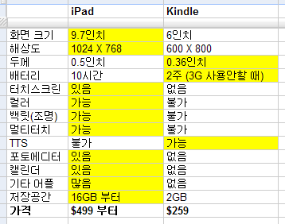

결국 수많은 루머들 중 맞은 게 거의 없군요. :(

<!-- truncate -->

심지어 바로 이전 포스트에서 떡밥 하나를 덥석 물게 만들었던 마할로 (mahalo.com)의 CEO [제이슨 칼라카니스](http://twitter.com/jason "[http://twitter.com/jason]로 이동합니다.")는 지금 그의 말을 믿었던 사람들에게 집중 포화를 당하고 있습니다. 하지만 그는 뻔뻔하게도(^^) 어제 자신이 한 말이 농담인 게 분명한데 뭐가 문제냐는 식으로 대응을 하고 있군요.

분에 못 이긴 사람들이 공격하는 방식이 재밌는데 하나 예를 들어 보면 미국증권거래위원회가 제이슨의 애플 주식 거래 내역을 조사해야 한다는 사람도 있습니다. :)

각설하고, 세 가지 제 느낌은 이렇습니다.

## 첫째. 이북 시장 장악

많은 팬보이들은 혁신적인 제품이 아니라고 실망들을 하지만, 제가 보기엔 이 제품은 혁신적인 것이 목표가 아니라 대중적인 것이 목표인 듯 합니다. 바로 이북이죠. 그리고, 그 시장은 아마존이 이미 보여준 것이기 때문에 어느 정도의 확신을 가지고 있는 것 같아요.

위의 표처럼 아이패드와 킨들과 기능을 비교해보면 아이패드가 압도적입니다. 여러분은 어떤 제품을 사겠습니까? 이렇게 표현하면 어떤게 땡기는지요.

1. 29만원짜리인데 흑백의 책만 읽을 수 있는 2GB 용량의 킨들
2. 57만원짜리인데 컬러는 기본이고, 멀티터치 되고, 일정 관리되고, 게임도 되고, 아이폰 (터치)에서 구입했던 어플 그대로 사용 가능하고, 저장공간도 16GB인 아이패드

물론 금액이 조금 부담이긴 하지만 후자입니다. 아무리 금액이 부담스럽더라도 290만원과 570만원을 비교하는 게 아니니까요. 그동안 시장을 개척했던 아마존은 배가 아플 듯 합니다.

## 둘째. 넷북 시장 참여

우리가 넷북으로 하는 일들이 뭡니까. 인터넷 서핑, 동영상 감상, 문서 작성. 간단한 게임... 그 외에 넷북으로 더 특별한 일을 하시는 분들이 있나요? 거의 없을 거예요.

발표 초기에 스티브 잡스가 애플이 만든 건 넷북이 아니라고 했지만 사실 아이패드는 넷북의 기능을 아주 충실히 수행합니다. 별도의 표를 올릴 필요도 없이 위의 표를 보세요.

게다가 아이폰으로 앱을 구매했던 사용자들은 왠지 넷북용으로 아이패드를 구매하면 기존 앱을 그대로 사용할 수 있기 때문에 오히려 비용이 절약된다고 느낄 겁니다.

아이패드가 넷북 시장을 장악하는 건 무리이지만 PC 시장에서 맥이 차지하는 비율 정도는 충분히 먹고 들어갈 수 있을 듯 합니다.

## 셋째. 맥 유저 확장

발표 내내 느낀 점 중 하나는 **"아이패드는 아이폰(터치)에서 사용하던 UI를 거의 그대로 사용한다"**는 점이었습니다. 각종 버튼과 아이콘 등은 물론이고 터치 방법 등 모든 게 아이폰과 똑같죠. (아이폰 OS를 사용했으니 그럴 수 밖에.)

아이폰과 터치를 써 본 사람들은 아이패드에 적응할 필요가 필요가 없습니다. 아이폰이나 터치**만** 썼던 사용자들은 조금은 확장된 MID에 관심이 생길 때 아이패드를 떠올릴 것입니다. 그들이 아이패드를 사용한다면 맥의 시스템을 조금씩 느끼겠죠. (예를 들어 iWorks) 그렇다면 다음 PC는 혹은 다음 노트북은 맥북이나 아이맥, 맥프로가 될 확률도 높아질 겁니다.

물론 이것은 아이폰이나 아이팟 터치가 현재 가장 뛰어난 사용성을 지닌 모바일 기기라는 전제 하에서죠. 아이폰이 맘에 들었던 사용자들이 애플 제품을 추가 소비할 수 있게 만들어 준 거라고 봐요. 당장 맥북이나 아이맥으로 스위칭하는 건 불안하지만 서브컴 개념으로 하나쯤 사는 건 위험 부담이 적다는 생각이 들테니까요.

## 작은 조각 하나 더

크게 주목받지는 않는 것 같으나 MLB.com 에서 준비한 어플리케이션 실행 데모를 보면 IPTV가 가야할 길을 미리 슬쩍 보는 것 같습니다.

야구게임을 생중계로 보면서 각종 기록들을 확인할 수도 있고, 리플레이도 확인할 수 있고, 뉴스도 확인하고 말이죠. 사실은 많은 시사점을 가지고 있으나 나중에 다시 이야기하죠.

스티브 잡스가 아이폰의 성공에 매우 고무되었나 봅니다. 보다 혁신적인 제품을 기대한 사람들도 많았지만 그는 굉장히 안정적인 형태로 무리하지 않는 방향을 택했습니다.

추측을 해보자면 아이팟 터치 2.5세대에 카메라 넣기를 실패하면서 스펙과 가격을 낮추며 게임기 시장을 두드렸는데 그게 제대로 먹혔기 때문에 이번에도 유사한 전략을 취하는 게 아닌가 싶어요.

하지만 애플 제품은 적어도 2, 3세대는 가야 쓸만해지기 때문에(^^), 저는 그 때까지 군침만 꼴딱꼴딱 삼키며 구매는 하지 않을 듯 합니다. 사실은 지름신이 오지 않기를 바랄 뿐이죠. :)

※ 참고로 스티브 잡스의 키노트 영상은 **[애플 홈페이지](http://www.apple.com/quicktime/qtv/specialevent0110/ "[http://www.apple.com/quicktime/qtv/specialevent0110/]로 이동합니다.")**에서 볼 수 있습니다.

## 관련 링크

- [Berlin Log - 아이패드(iPad), 절반의 성공: 산업별 영향 예측](http://npool.ktpage.net/entry/iPad "[http://npool.ktpage.net/entry/iPad]로 이동합니다.")
- [13월의 혁명자 로오나의 仙夜餘談 - 499달러 애플 태블릿 iPad에 대한 것들](http://atonal.egloos.com/2651193 "[http://atonal.egloos.com/2651193]로 이동합니다.")
- [빨간來福의 통기타 바이러스 - 애플 태블릿 정리 - iPad 드뎌 세상에 나오다](http://leebok.tistory.com/507 "[http://leebok.tistory.com/507]로 이동합니다.")
- [gatorLog - 스티브 잡스 2010 키노트 스피치 분석](http://gatorlog.com/?p=1893 "[http://gatorlog.com/?p=1893]로 이동합니다.")
