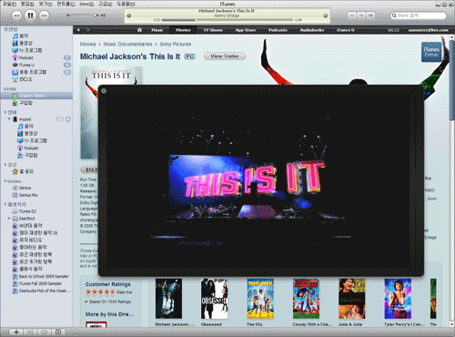
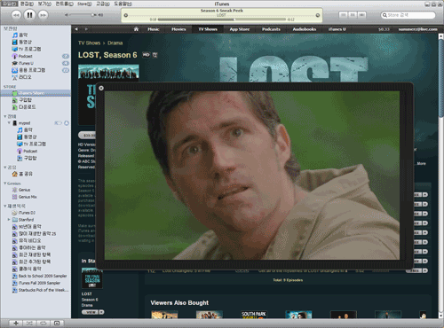
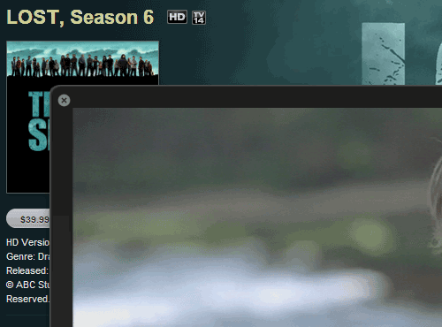
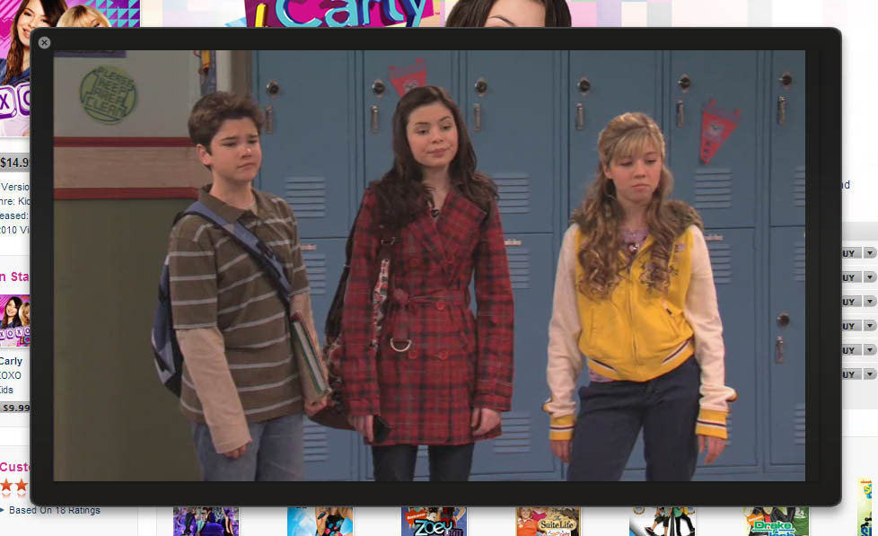

예전에는 아이튠스에서 미리보기 버튼을 누르면 전체 화면에 표시되었던 것 같은데, 아이패드 발표 이후에 프리뷰가 플레이되는 모습이 바뀌었군요.

<!-- truncate -->

이런 식입니다.

언뜻 봐도 뭔가 달라졌지요. 정확히 언제부터 달라진 건지 체크해보지 않아서 알 수는 없지만 확실히 아이패드 출시 후인 것 같아요. (※ [@pudidic](http://twitter.com/pudidic "[http://twitter.com/pudidic/status/8570942329]로 이동합니다.") 님에 [의하면](http://twitter.com/pudidic/status/8570942329 "[http://twitter.com/pudidic/status/8570942329]로 이동합니다.") 몇 달 전부터라고 하네요; )

자세히 보니 프리뷰 되는 화면 주위에 테두리... 아니, 베젤... 같은게 있군요.

베젤의 두께 등은 비율이 정확하게 맞지 않는다 하더라도 이 정도면 **[아이패드](http://www.apple.com/kr/ipad/ "[http://www.apple.com/kr/ipad/]로 이동합니다.")**라고 해도 되겠군요.

물아일치...는 아니고, 하소일치...? (하드웨어와 소프트웨어가 일치-\_-)

애플의 전략이 확실하게 드러나는 UI 입니다. **"앞으로는 큰 화면으로 동영상을 볼 때는 아이패드로 봐라..."** 라는 거겠죠. :)
