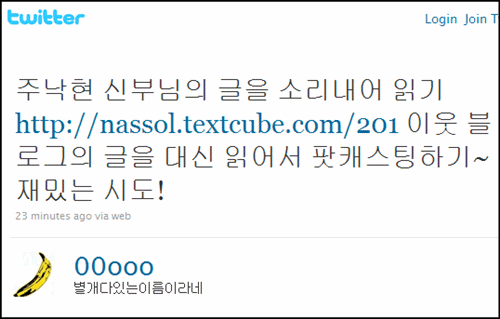

<!-- truncate -->

[너바나나님의 트윗](http://twitter.com/00ooo/statuses/10214638869 "[http://twitter.com/00ooo/statuses/10214638869]로 이동합니다.")을 통해 nassol님 블로그 글 ["주낙현 신부님의 글을 소리내어 읽기"](http://nassol.textcube.com/201 "[http://nassol.textcube.com/201]로 이동합니다.")을 읽고, [ustream에 올리신 음성](http://www.ustream.tv/recorded/5303858#utm_campaigne=synclickback&source=http://nassol.textcube.com/201&medium=5303858 "[http://www.ustream.tv/recorded/5303858#utm_campaigne=synclickback&source=http://nassol.textcube.com/201&medium=5303858]로 이동합니다.")을 들어봤는데 참 좋네요. :-)

[nassol님](http://nassol.textcube.com/ "[http://nassol.textcube.com/]로 이동합니다.")이 낭독한 [fr. joo님](http://viamedia.or.kr/ "[http://viamedia.or.kr/]로 이동합니다.")의 글 ["대화의 무대에서 넓혀가는 경계와 사이의 지평"](http://viamedia.or.kr/2010/03/08/843 "[http://viamedia.or.kr/2010/03/08/843]로 이동합니다.")

평상시 좋아하는 블로거의 글을 허락을 받아 녹음해서 차곡차곡 아카이빙을 한다면 그것만으로도 훌륭한 팟캐스팅 (or 팟캐스팅 서비스)이 될 것 같습니다. 만약 적절한 CCL 표기가 된 글이라면 굳이 허락을 받을 필요도 없을 것 같고요.

**장점**

1. 자신이 좋아하는 블로그 글 1개를 선정하니 추천의 효과가 있음
2. 자신의 음성을 덧입히기 때문에 자연스럽게 참여하는 효과 증대
3. 언어적으로 표현된 컨텐츠에 자신의 개인적인 해석를 비언어적인 형태로 녹여냄
4. 시각장애인들에게 유용한 컨텐츠가 될 수 있음

이미지, 동영상 등 멀티미디어 자료가 들어있는 포스트의 경우에는 적용하기가 어려운 단점이 있지만 재밌는 시도가 될 것 같아요.

마음 맞는 분들하고 작게 시도해볼까봐요. :-)
