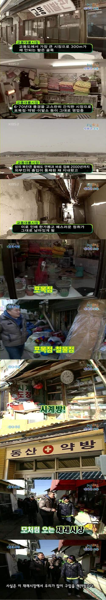

<!-- truncate -->

****사실은 이 재래시장에서 우리가 많이 구입을 해야 됩니다.****

**vs.**

**[매일매일 축제야-! 홈플러스~](http://www.youtube.com/watch?v=s-k_rVRjxLU "[http://www.youtube.com/watch?v=s-k_rVRjxLU]로 이동합니다.")**

**and**

지난 2월 8일 강원 춘천시 온의동에 롯데마트가 들어선 데 이어 18일 인근 퇴계동에 홈플러스가 문을 열면서 재래시장 등 중소상인들의 시름이 깊어지고 있다.

무엇보다 홈플러스가 퇴계동 옛 우시장 인근에 정식 개장, 인구 26만명에 불과한 춘천지역에 3천㎡ 이상 대형마트가 백화점을 포함, 모두 6곳으로 늘어나게 돼 더욱 설자리가 좁아졌기 때문이다.

특히 대형마트 등 대규모 점포마다 춘천지역 유통시장 선점을 위해 각종 할인행사로 업체간 치열한 각축전이 펼쳐지면서 재래시장들은 고객의 관심에서 멀어져 중소상인들은 `고래싸움에 새우등 터지는 꼴'이라며 울상을 짓고 있다.

출처 : [연합뉴스 - 고래싸움에 등 터지는 춘천 재래시장 상인들](http://www.yonhapnews.co.kr/local/2010/03/18/0809000000AKR20100318158000062.HTML "[http://www.yonhapnews.co.kr/local/2010/03/18/0809000000AKR20100318158000062.HTML]로 이동합니다.")

**so what?**

**이것이 버라이어티 정신!**
