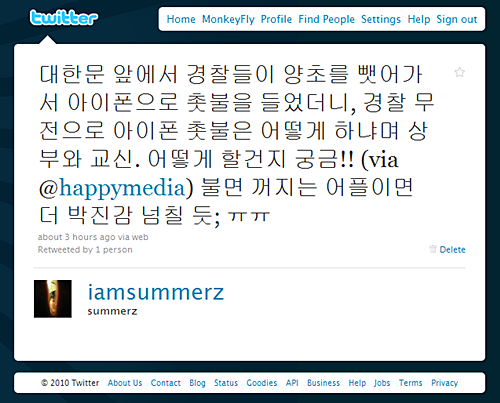
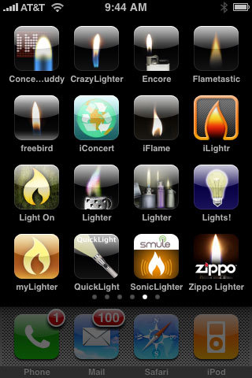

<!-- truncate -->

[**http://twitter.com/iamsummerz/status/11363072880**](http://twitter.com/iamsummerz/status/11363072880)

이 정부는 웃음, 눈물, 분노를 동시에 주네요. 탁월한 재능인 듯.

경찰이 아이폰에 들어있는 촛불을 후- 불어서 끄려고 하는 영상도 있습니다. ㄷㄷㄷ

[**http://img9.yfrog.com/i/m39.mp4/**](http://img9.yfrog.com/i/m39.mp4/)

5월이 되기 전에 아이폰 구매하신 분들은 모두 촛불 어플 하나씩 다운 받아야 할 듯;;;

출처 : **[iLounge - iPhone Gems: 16 Virtual Lighter Apps, Reviewed](http://www.ilounge.com/index.php/articles/comments/iphone-gems-16-virtual-lighter-apps-reviewed/ "[http://www.ilounge.com/index.php/articles/comments/iphone-gems-16-virtual-lighter-apps-reviewed/]로 이동합니다.")**

아무래도 불어서 꺼지는 기능은 없는 어플로 다운을 받아야겠죠;;;

이러다가 한국인은 촛불 어플 업로드/다운로드 금지 + 트위터 차단 + 한국 앱스토어 차단 + 아이폰 수입 금지 + 스마트폰 규제 해지안 모두 원상 복귀... 로 이어지는 거 아닌지 모르겠어요. :-|

빨리 아이폰을 사라는 계시...? -\_-a
