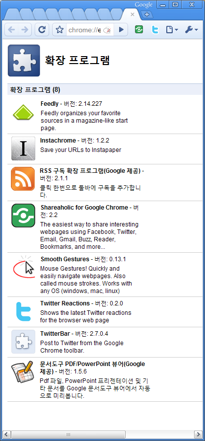

저는 현재 구글이 만든 [크롬 브라우저](http://www.google.com/chrome "[http://www.google.com/chrome]로 이동합니다.")를 사용하고 있습니다. 오랫동안 모질라 재단의 [파이어폭스](http://www.mozilla.or.kr/ko/firefox/ "[http://www.google.com/chrome]로 이동합니다.")를 썼었는데, 언젠가부터 (3.0 초기 버전 때던가?) 훌륭한 확장 기능에 비해 초기 구동 속도도 그렇고 전반적으로 좀 느려지던 차에 크롬으로 갈아탔죠. (파이어폭스는 버전이 많이 올라간 지금도 느려요 ㅠ.ㅠ)

<!-- truncate -->

크롬에도 파이어폭스의 [부가 기능 (플러그인)](https://addons.mozilla.org/ko/firefox/ "[https://addons.mozilla.org/ko/firefox/]로 이동합니다.")과 같은 기능이 있는데, 바로 [확장 기능 (확장 프로그램, 익스텐션, extesion)](https://chrome.google.com/extensions "[https://chrome.google.com/extensions]로 이동합니다.") 입니다.

오늘 갑자기 크롬이 다운되고 난 후 재실행하니 제가 사용하던 확장 기능이 모두 사라졌더군요. 그래서, 겸사겸사 제가 유용하게 사용하는 확장 기능을 기록해 둡니다.

각각 간단한 설명을 해보자면,

**[Feedly](https://chrome.google.com/extensions/detail/ndhinffkekpekljifjkkkkkhopnjodja "[https://chrome.google.com/extensions/detail/ndhinffkekpekljifjkkkkkhopnjodja]로 이동합니다.")**

RSS 리더기로 구글 리더를 사용하는 분들이라면 유용할 수 있는 확장 기능입니다. 구독하는 RSS들을 여러 레이아웃으로 보여주기도 하고, 단축키를 포함한 구글 리더의 기본 기능은 물론 트위터, 딜리셔스로 보내기 등 추가된 기능도 있습니다.

다만 제 아이팟 터치의 구글 리더인 Byline은 다 읽고 싱크를 비동기적으로 하기 때문에 조금씩 겹치는 부분이 있어서 살짝 불편한 점이 있긴 하지만 이건 Feedly의 단점은 아니니까요.

**[Instachrome](https://chrome.google.com/extensions/detail/fldildgghjoohccppflaohodcnmlacpb "[https://chrome.google.com/extensions/detail/fldildgghjoohccppflaohodcnmlacpb]로 이동합니다.")**

뭔가 유용한 웹페이지를 발견했지만 나중에 읽기 위해 저장하는 서비스인 [Instapaper](http://www.instapaper.com/ "[http://www.instapaper.com/]로 이동합니다.") 의 크롬 확장 버전입니다. [아이폰 앱 (무료)](http://www.instapaper.com/iphone "[http://www.instapaper.com/iphone]로 이동합니다.")까지 함께 사용하면 아주 편리합니다. :)

**[RSS 구독 확장 프로그램(Google 제공)](https://chrome.google.com/extensions/detail/nlbjncdgjeocebhnmkbbbdekmmmcbfjd "[https://chrome.google.com/extensions/detail/nlbjncdgjeocebhnmkbbbdekmmmcbfjd]로 이동합니다.")**

RSS를 지원하는 페이지에 가면 주소창 우측 끝에 RSS 버튼이 생기고 그걸 누르면 바로 RSS 정보가 보이고 이를 다시 쉽게 구글 리더 등으로 구독할 수 있게 하는 확장 기능입니다. 단순한 기능이지만 여러 모로 편리하죠.

파이어폭스에는 기본으로 있는 기능이지요?

**[Shareaholic for Google Chrome](https://chrome.google.com/extensions/detail/kbmipnjdeifmobkhgogdnomkihhgojep "[https://chrome.google.com/extensions/detail/kbmipnjdeifmobkhgogdnomkihhgojep]로 이동합니다.")**

지금 보고 있는 페이지를 손쉽게 각종 인터넷 서비스 - SNS, RSS 리더, 북마크 서비스 등으로 전달하는 역할을 하는 확장 기능입니다. 이름부터 셰어홀릭. :-) 클릭 한방으로 단축 주소가 만들어 지고 또 그걸 쉽게 다른 곳으로 전달할 수 있는 확장 기능입니다. ([구글에서 자체적으로 만든 것](https://chrome.google.com/extensions/detail/idaeealfhcijmeigljaopafdapgijdcb "[https://chrome.google.com/extensions/detail/idaeealfhcijmeigljaopafdapgijdcb]로 이동합니다.")도 있던데 차이를 잘 모르겠네요. 구글표 짝퉁인가;; )

**[Smooth Gestures](https://chrome.google.com/extensions/detail/lfkgmnnajiljnolcgolmmgnecgldgeld "[https://chrome.google.com/extensions/detail/lfkgmnnajiljnolcgolmmgnecgldgeld]로 이동합니다.")**

마우스 제스쳐 프로그램입니다. 한 때는 파이어폭스에서 크롬으로 옮기지 못하는 이유 중의 하나가 마우스 제스쳐 프로그램이었죠.

이 확장 기능은 기본적인 제스쳐에 추가로 마우스 버튼 + 휠 등의 콤보 등 보다 확장된 액션을 제공합니다.

**[Twitter Reactions](https://chrome.google.com/extensions/detail/ebipjbfcgphjbnkhbijmnpnpcgjolked "[https://chrome.google.com/extensions/detail/ebipjbfcgphjbnkhbijmnpnpcgjolked]로 이동합니다.")**

현재 보고 있는 페이지가 얼마나 많이 트위터에서 회자되었는지를 빠르고 간편하게 보여주는 확장 기능입니다. 트위터를 페이지에 대한 원격 댓글로 사용하는 좋은 예지요.

**[TwitterBar](https://chrome.google.com/extensions/detail/pbadgdglepgngpoeijdgicjccomadekm "[https://chrome.google.com/extensions/detail/pbadgdglepgngpoeijdgicjccomadekm]로 이동합니다.")**

현재 보고 있는 페이지에 코멘트를 달아서 바로 트위터로 전송해 주는 확장 기능입니다. 간단해서 쓰기 편한 확장 기능 중 하나죠. :-)

**[문서도구 PDF/PowerPoint 뷰어(Google 제공)](https://chrome.google.com/extensions/detail/nnbmlagghjjcbdhgmkedmbmedengocbn "[https://chrome.google.com/extensions/detail/nnbmlagghjjcbdhgmkedmbmedengocbn]로 이동합니다.")**

구글에서 제공하는 PDF, PowerPoint 뷰어입니다. pdf 는 사실 다운로드 받아서 [Foxit Reader](http://www.foxitsoftware.com/pdf/reader/ "[http://www.foxitsoftware.com/pdf/reader/]로 이동합니다.") 로 보는 게 더 편하고, 파워포인트도 [구글 닥스](http://docs.google.com/ "[http://docs.google.com/]로 이동합니다.")에 연결시켜서 보는 게 저장도 되니 좋을 수도 있지만 그냥 바로바로 볼 수 있어서 설치해 사용하는 중입니다.

p.s. 몇 개 더 깔았던 것 같은데, 기억이 잘 안나네요. =.= 아... 생각났다. **[Firebug Lite](https://chrome.google.com/extensions/detail/bnbbfjbeaefgipfjpdabmpadaacmafkj "[https://chrome.google.com/extensions/detail/bnbbfjbeaefgipfjpdabmpadaacmafkj]로 이동합니다.")**! 또 뭐가 있더라;;;

p.s.2. 링크를 따려고 크롬 확장 페이지에 들어가다 보니 어느덧 위에 적은 것 말고도 다른 확장 기능들을 추가로 깔고 있는 저를 발견했습니다;;;
