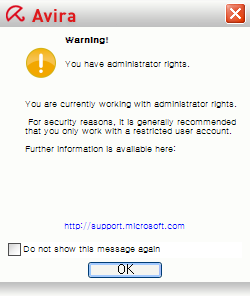

바이러스 백신 프로그램으로 **[Avira AntiVir](http://www.free-av.com/en/index.html "[http://www.free-av.com/en/index.html]로 이동합니다.")** 를 사용하고 있습니다. 물론(?) 무료인 **[개인 버전](http://www.free-av.com/en/products/1/avira_antivir_personal__free_antivirus.html "[http://www.free-av.com/en/products/1/avira_antivir_personal__free_antivirus.html]로 이동합니다.")**을 사용하고 있죠. AntiVir는 제 PC가 부팅을 마치면 이런 창을 띄워줍니다.

<!-- truncate -->

글씨가 작죠;;; 다시 타이핑 해보면 다음과 같습니다.

> Warning!
>
> 경고!
>
> You have administrator rights.
>
> 당신은 관리자 권한을 가지고 있습니다.
>
> You are currently working with administrator rights.
>
> 당신은 현재 관리자 권한으로 일하고 있습니다.
>
> For security reasons, it is generally recommended that you only work with a restricted user account.
>
> 여러 보안적인 이유 때문에 보통은 제한된 기능의 사용자 계정으로 일하는 것이 추천됩니다.
>
> Further information is available here:
>
> 더 자세한 정보는 아래에 있습니다:
>
> [http://support.microsoft.com](http://support.microsoft.com "[http://support.microsoft.com]로 이동합니다.")

Avira 를 독일 회사로 알고 있는데, 아마도 한국의 개인 PC환경에 대해 잘 모르기 때문에 저런 경고를 띄워주나 봅니다.

우리나라에서는 은행 및 각종 금융기관, 쇼핑몰에서 액티브엑스를 설치하지 못하면 거래 자체가 되지 않잖아요. 심지어 공공기관 홈페이지들도 액티브엑스를 깔라고 강요하는 곳이 태반이고요.

문득 운영체제로 윈도를 쓰면서 관리자 계정이 아닌 일반 사용자 계정으로 사용하는 분들이 얼마나 있는지 궁금해집니다. (회사에서 사용하는 것 제외하고요.)

보안 교육이 단순히 백신이나 잘 깔고, 이상한 사이트 들어가지 말라고 하는 걸로 그치는 게 아니라 아예 저렇게 기능이 제한된 사용자 계정을 사용하라고 이야기해주고 그러면서도 각종 업무를 볼 수 있는 환경을 구축해주어야 하는 게 아닌가 하는 생각을 해 봅니다.
