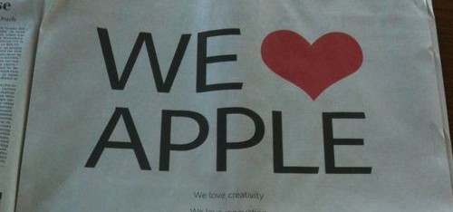

  

<!-- truncate -->

iHate Flash by [Wise\_photo](http://www.flickr.com/photos/47724978@N06) 

잡스의 막가파적인 공세로 끝나버릴 것 같은 애플과 어도비의 싸움이 어도비가 수줍은 반격을 시작하면서 흥미진진해지고 있습니다.

(출처 : appleinsider.com)

스티브 잡스는 **[아이패드를 처음 소개하는 자리](http://www.youtube.com/watch?v=YkvCR3aAl1U "[http://www.youtube.com/watch?v=YkvCR3aAl1U]로 이동합니다.")**에서 대놓고 플래시가 떠 있어야 할 자리에 [**조그만 선물박스가 보이는 화면을 보여주며**](http://www.youtube.com/watch?v=RGPdv7dr_cI "[http://www.youtube.com/watch?v=RGPdv7dr_cI]로 이동합니다.") 어도비를 긁기 시작했죠.

그러더니 아예 대놓고 **[Thoughts on Flash](http://www.apple.com/hotnews/thoughts-on-flash/ "[http://www.apple.com/hotnews/thoughts-on-flash/]로 이동합니다.")** 라는 공개 편지를 스티브 잡스의 이름으로 띄웠지요. 번역문은 **[여기](http://blog.thinkarchive.com/69 "[http://blog.thinkarchive.com/69]로 이동합니다.")**에서 확인하실 수 있습니다.

\*                               \*                               \*

어도비가 이렇게 속절없이 두드려 맞고 끝날 줄 알았는데, 반격을 시작했죠. 어도비 CEO가 **[월스트리트 저널과 독점 인터뷰](http://blogs.wsj.com/digits/2010/04/29/live-blogging-the-journals-interview-with-adobe-ceo/ "[http://blogs.wsj.com/digits/2010/04/29/live-blogging-the-journals-interview-with-adobe-ceo/]로 이동합니다.")**를 했어요. 컨텐츠를 여러 플랫폼에서 만들 수 있으면 개발자도 좋고 결국 소비자들에게도 좋지 않냐는 거죠.

그러더니 월스트리트 저널에 전면광고를 하죠. 가장 큰 타이틀은 **WE ♥ APPLE** 이니 두손 두발 다 든 백기 투항처럼 보이지만 하고 싶은 말은 따로 있죠.

바로 **[WE ♥ CHOICE](http://www.adobe.com/choice/ "[http://www.adobe.com/choice/]로 이동합니다.")** 캠페인의 전개입니다. 위의 어도비 CEO가 이야기한 것과 같은 맥락이죠. 게다가 이번에는 아예 어도비의 창업자들이 지원 사격을 합니다. **[Our thoughts on open markets](http://www.adobe.com/choice/openmarkets.html "[http://www.adobe.com/choice/openmarkets.html]로 이동합니다.")** 라는 공개편지를 올리죠. 변역문은 **[여기](http://chocoberry.pe.kr/105535118 "[http://chocoberry.pe.kr/105535118]로 이동합니다.")**서 확인 가능합니다.

간단하게 요약하면 '오픈마켓이란 개발자, 컨텐츠 소유자, 소비자 모두를 위한 것이어야 하는데, 애플 너네는 왜 플래시를 배척하느냐' 이런 거죠.

\*                               \*                               \*

애플과 어도비의 HTML5, 플래시 싸움이 많은 생각을 하게 해줍니다.

**"플래시라는 기술은 웹의 표준이 아닌데 어도비가 그 기술을 독점하고 있다"**는 애플의 말에도 일리가 있고, **"왜 오픈마켓 (앱스토어)을 모두에게 오픈하지 않고 기술을 선별해서 채택하느냐"**는 어도비의 말도 일견 일리가 있습니다.

일단 애플의 규제는 일종의 '물관리'적인 요소가 있습니다. 플래시는 아직도 여전히 모바일 기기에 적합하지 않습니다. (많은 배터리 소비, 많은 버그, 보안 문제 등등) 잡스가 ['어도비는 게을러'](http://blog.hankyung.com/kim215/339488 "[http://blog.hankyung.com/kim215/339488]로 이동합니다.")라고 타박을 해도 어도비는 사실 할 말이 없죠. 심지어 [최근 시애틀에서 열린 안드로이드 개발자 컨퍼런스에서의 플래시 데모에서도 제대로 작동이 안되서 데모를 접었다](http://jeffcroft.com/blog/2010/may/08/android-flash-demo-flashcamp-seattle/ "[http://jeffcroft.com/blog/2010/may/08/android-flash-demo-flashcamp-seattle/]로 이동합니다.")고 합니다. 클럽에서 물관리를 위해 아저씨들 입장을 불허하는 것과 비슷하죠.

사용자들에게 최적의 사용감을 주기 위해서 원하는 기술을 받아들이는 것은 일견 당연한 욕심입니다. '사용자들에게 최적의 사용감을 주기 위해서' 라는 건 애플의 주장일 뿐이지만 현재 최고의 사용성을 보여주는 애플이 하는 말이기에 쉽게 무시할 수가 없습니다.

반면 어도비의 주장 자체 (선택의 자유, 오픈마켓에 대한 철학)는 틀린 게 없지만 그 속 내용에는 사실 좀 웃긴 면이 있습니다. 어도비가 자신들의 사업영역도 아닌 오픈마켓 (앱스토어)에 대해 주장하는 것은 좀 뜬금없어 보이기까지 하죠. 게다가 이러한 주장이 개발자와 소비자들의 행복을 위해서라고 주장을 하지만 잡스의 주장 (플래시는 어도비만의 기술, 모바일 기기에 부적합, 낮은 퍼포먼스, 보안 구멍 등등)에 반박할 내용은 별로 없어 보입니다. 사실 그래서 처음부터 잡스의 공개편지에 대한 반박을 하지 못한 것이죠. 그래서 지금도 정면으로 반박은 못하고 에둘러 반격을 하는 거죠. 게다가 명분이 부족하다는 건 치명적인 약점입니다.

애플의 독점이 문제가 된다고 우려를 하지만 또 현실은 그렇지도 않습니다. 스마트폰 시장에서 여전히 세계 1위의 점유율을 자랑하고 있는 기업은 [애플이 아니라 노키아](http://www.dt.co.kr/contents.html?article_no=2010051202010331673001 "[http://www.dt.co.kr/contents.html?article_no=2010051202010331673001]로 이동합니다.")이고, [안드로이드폰들이 아이폰의 점유율을 앞서고](http://www.hani.co.kr/arti/economy/it/420225.html "[http://www.hani.co.kr/arti/economy/it/420225.html]로 이동합니다.") 있으니까요. 애플은 단지 적절한 폐쇄성과 뛰어난 사용성을 바탕으로 [최고의 수익율을 올리는 기업들 중 하나](http://cubix.kr/1043 "[http://cubix.kr/1043]로 이동합니다.")일 뿐이죠.

생각해 보면 애플의 이러한 폐쇄성은 예나 지금이나 똑같은 것 같습니다. 다만 예전에는 대중의 지지를 받지 못했고, 지금은 대중의 지지를 받는다는 것이 차이점이겠지요. 여러 기업들도 예전에는 폐쇄적인 애플을 무시해도 상관이 없었겠으나 지금은 애플이 아주 오래 전부터 친 울타리 안의 정원 (walled garden)에 비집고 들어가보려고 다들 찔러보는 것 같아요. 멀리서 바라보니 저기 담 너머 정원에 각종 과일이 풍성하다는 걸 알게 되었으니, 이제 우리도 좀 참여시켜 달라는 거겠죠.

물론 애플이 여러 회사들을 위해 순순히 선의로 참여를 허락해 줄 일은 앞으로도 없을 것 같습니다. 어도비는 한동안 고전을 하겠죠. 안드로이드용 플래시라도 제대로 개발하면 모르겠으나 이것도 현재로서는 비관적입니다. (그러게 CS라도 좀 코코아로 포팅을 해두지, 애플에 미운털까지 박혀서...), 구글의 전략에 빠져들어 안드로이드에 목을 매단 몇몇 이통사들과 핸드폰 제조사들 역시 한참을 허우적거리겠죠.

어쨌든 이렇게 논리적인 공방이 오가며 그에 바탕을 둔 기술의 발전이 실생활에 적용되는 걸 보는 건 즐거운 일입니다. :-)
