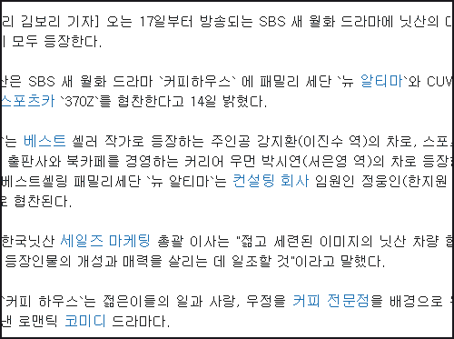
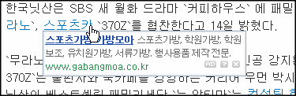
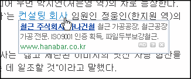
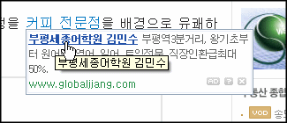
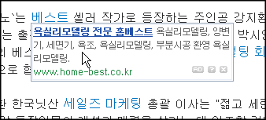

좀 다르게 이야기 하면 언론사들은 지금 스스로 자신들의 인터넷 사이트를 유해사이트로 만들고 있습니다. 제가 최근에 제일 싫어하는 것, 그건 바로 링크의 오용입니다.

<!-- truncate -->

자신들의 기사 페이지에 광고 링크를 덕지덕지 달고 있는데요, 기사 외곽에 수많은 광고가 도배된 건 이제 어느 정도 면역이 되서 그런가 보다 하는데, 요즘엔 기사 안에 되지도 않는 키워드광고를 붙여놔서 정말 정신을 산만하게 만들더군요. 예를 들어보죠.

위는 한 인터넷신문사의 기사 일부입니다. 기사 내에 링크들이 달려있습니다. 본문의 링크는보통 본문의 내용을 보충하기 위해 다른 페이지나 다른 사이트로 연결을 해놓는 기능을 합니다. 그게 바로 ['하이퍼링크'](http://ko.wikipedia.org/wiki/%ED%95%98%EC%9D%B4%ED%8D%BC%EB%A7%81%ED%81%AC "[http://ko.wikipedia.org/wiki/%ED%95%98%EC%9D%B4%ED%8D%BC%EB%A7%81%ED%81%AC]로 이동합니다.")라는 거죠.

그런데, 링크에 마우스를 올리면 이런 식입니다.

스포츠카와 스포츠가방이 무슨 관계가 있나요?

'컨설팅 회사'라는 키워드에 철근 주식회사 광고가 뜨는군요.

부평세종어학원 강사분이 커피 전문점을 운영하시나요?

베스트 셀러에서 베스트만 따로 빼더니 욕실리모델링 전문 업체 광고가 나갑니다.

저 광고들은 분명히 키워드당 노출이 몇 십만 건에 클릭당 비율이 몇십원 (CPC) 혹은 한달에 몇만원 (CPM)으로 계약을 하고 광고를 하는 걸텐데, 광고주들은 자신들의 광고비가 이렇게 지출되는지 알고 있을까요?

저렇게 해서 클릭되는 광고는 사실 대부분 실수로 클릭하는 것 아닌가요? 누가 스포츠카 키워드를 통해 스포츠가방 회사 링크로 가겠어요. 심지어는 검색봇도 토할 지경입니다.

앞에서도 말했지만 본문 주변의 덕지덕지 광고는 단순히 SEO (Search Engine Optimization)의 차원에서 그리고 독자들의 눈을 괴롭히는 정도에서 이해가 된다지만 저렇게 인터넷의 기본인 링크 자체를 망가뜨리는 광고를 다는 것에는 한숨이 나옵니다.

미디어 산업의 미래가 어쩌고 아이패드가 어쩐다고요? 으악-

저런 광고를 대행하는 광고회사들을 찾아봤습니다. 물론 더 많겠죠.

- [조인스닷컴 KeywordLink](http://corp.joins.com/subindex.asp?servcode=2731 "[http://corp.joins.com/subindex.asp?servcode=2731]로 이동합니다.")
- [다이렉트 키워드 링크](http://www.keywordsconnect.com/ "[http://www.keywordsconnect.com/]로 이동합니다.")
- [소나무미디어](http://www.sonamumedia.com/Product.html "[http://www.sonamumedia.com/Product.html]로 이동합니다.")
- [KeywordLink](http://www.keywordlink.co.kr/program/ "[http://www.keywordlink.co.kr/program/]로 이동합니다.")

저런 광고를 집행하는 언론사 홈페이지를 찾아봤습니다. 물론 더 많겠죠.

- [동아일보](http://donga.com/ "[http://donga.com/]로 이동합니다.")ㅌ
- [일간스포츠](http://isplus.joins.com/ "[http://isplus.joins.com/]로 이동합니다.")
- [스포츠조선](http://sports.chosun.com/ "[http://sports.chosun.com/]로 이동합니다.")
- [한국경제](http://www.hankyung.com/ "[http://www.hankyung.com/]로 이동합니다.")
- [파이낸셜뉴스](http://www.fnnews.com/ "[http://www.fnnews.com/]로 이동합니다.")
- [이데일리](http://www.edaily.co.kr/ "[http://www.edaily.co.kr/]로 이동합니다.")
- [소비자가 만드는 신문](http://www.consumernews.co.kr/ "[http://www.consumernews.co.kr/]로 이동합니다.")
- [프레시안](http://www.pressian.com/ "[http://www.pressian.com/]로 이동합니다.")
- [한겨레](http://hani.co.kr/ "[http://hani.co.kr/]로 이동합니다.")
- [한국아이닷컴](http://www.hankooki.com/ "[http://www.hankooki.com/]로 이동합니다.")
- [노컷뉴스](http://www.cbs.co.kr/nocut/ "[http://www.cbs.co.kr/nocut/]로 이동합니다.")
- [딴지일보](http://www.ddanzi.com/ "[http://www.ddanzi.com/]로 이동합니다.")

p.s. 사족을 달자면 제일 위에서 예로 든 기사는 기사 자체가 광고입니다. 자동차 회사나 드라마 제작사 혹은 방송사의 보도자료 정도 되겠죠.
