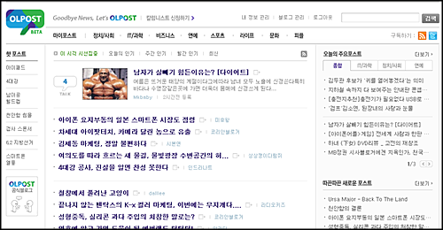
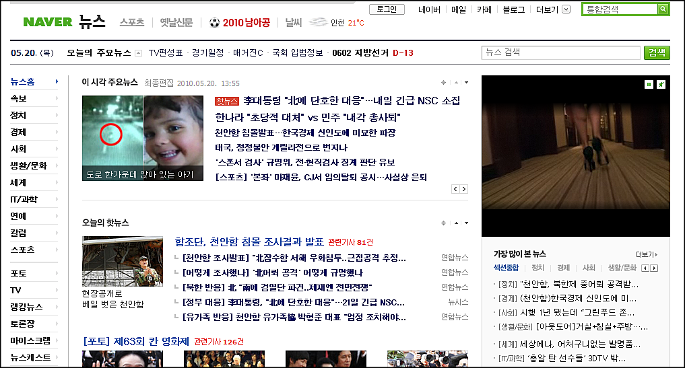
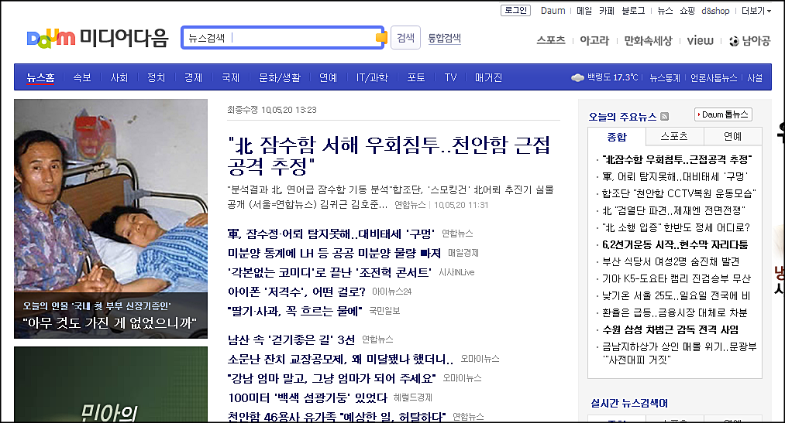

**올포스트 (**[**olpost.com**](http://olpost.com/ "[http://olpost.com/]로 이동합니다.")**)**은 믹시 (mixsh)로 잘 알려진 **[Endless9님](http://endless9.com/ "[http://endless9.com/]로 이동합니다.")**이 PM으로 진행하는 서비스입니다.

<!-- truncate -->

다양한 분야별 전문 블로거가 모여 한곳에 자신들의 글 전문을 송고하는거야. 함께 블로그 기반 종합 미디어를 만들어 가는거지. 세상에서 가장 큰 팀블로그랄까?  블로거는 자신의 블로그 정체성을 유지하면서 컨텐츠를 Multiuse 하는거니 전문 송고에 대한 거부감이 크지는 않을 것 같아. 물론 합리적인 보상이 전제 된다면.

생각대로 다양한 블로거들이 한곳에 모여 더 큰 미디어 파워를 가지게 되면 개인별로 블로그에 광고를 유치하거나 Adsense를 다는 것보다 훨씬 좋은 조건에 광고영업이 가능할꺼야. 이렇게 수익을 창출하고 그 중 70%를 블로거들에게 돌려주자. 수익 배분 기준은 우선은 조회수로 하고.. 운영하면서 더 좋은 방법을 찾아보면 되겠다.

출처 : [Endless9 - 블로거 여러분들께 보내는 올포스트의 생각.](http://endless9.com/8 "[http://endless9.com/8]로 이동합니다.")

Endless9님의 말씀에 따르면 위와 같은 생각으로 시작했던 게 믹시이고, 다시 새로운 서비스로 그 꿈을 키우려고 한다고 합니다. (※ 참고로 현재 믹시와 Endless9님은 관계가 없는 상태죠.)

* * *

서비스의 기본적인 구성은 여느 메타블로그 혹은 메타사이트와 크게 다르지 않습니다. 실제로 이전 프로젝트였던 믹시와도 서비스의 기본적인 흐름은 비슷해 보이고, 블로그의 글을 수집한다는 것 자체가 올블로그, 블로그코리아 등과도 크게 다르지 않죠.

하지만 [오픈 전 티져 광고(^^)](http://event.olpost.com/ "[http://event.olpost.com/]로 이동합니다.")를 통해 제가 흥미롭게 봤던 건 바로 **'미디어를 지향'**하는 서비스의 방향성이었습니다. Endless9님은 예전에 믹시 때도 메타 블로그라고 하지 말고 메타 미디어를 지향한다는 말씀을 하셨던 걸로 기억하는데, 올포스트는 여기서 한발 더 나아갑니다. 티져 광고에서 아예 **"뉴스와의 이별을 준비하세요."**, **"Goodbye News, Let's OLPOST"** 등의 문구를 사용해 가면 기존의 미디어를 대체해보겠다는 뜻을 적극적으로 밝히고 있으니 말이죠.

올포스트에 가보시면 깔끔한 레이아웃이 방문자들을 기다리고 있습니다. 깔끔하면서 어딘가 많이 익숙한 느낌이 들지 않나요? 제가 생각해 낸 건 바로 포털의 뉴스 페이지입니다.

깔끔한 레이아웃

이건 [네이버 뉴스 메인](http://news.naver.com/ "[http://news.naver.com/]로 이동합니다.")

이건 [다음 미디어 메인](http://media.daum.net/ "[http://media.daum.net/]로 이동합니다.") (뉴스홈이라고도 하는군요)

전형적인 디자인이면서 그래픽적인 요소를 최대한 배제하여 컨텐츠에 집중할 수 있게 하는 포털에서 오랫동안 유지해오고 있는 디자인이죠. 별 거 아닌 거 같지만 하나를 콕 집자면 우연인지 세 디자인 모두 상단 GNB 영역에 가늘고 긴 회색바를 가지고 있습니다. 즉, 화려한 디자인 대신에 소금 살짝 넣는 것 같은 컨텐츠 집중형 디자인을 하려고 했다는 거죠. 특히 네이버에서 우측 광고만 뺀다면 올포스트와 많이 비슷하게 보이는군요.

먼저 말씀드릴 사실은 올포스트가 포털들의 디자인을 베꼈다고 이야기하려는 게 아니라는 겁니다. 사실 이러한 3단구성은 흔한 구성이죠. 그리고, 오랫동안 봐왔고, 해외 포털이나 국내 신문사들 사이트의 구성도 대부분 이런 형식입니다.

그런데, 제가 위에서는 올포스트가 새로운 미디어를 지향한다고 하면서 왜 언론사닷컴과 비교를 하지도 않고 포털과 비교를 했을까요? 제가 **[바로 이전 글에서 썼듯이](http://blog.summerz.pe.kr/1534 "[http://blog.summerz.pe.kr/1534]로 이동합니다.")** 이미 국내 언론사들의 홈페이지는 기사를 보기 힘들 정도로 망가져 있기 때문입니다.

* * *

많은 사람들은 신문사 사이트에서 기사를 읽는 걸 싫어합니다. 포털에서 새창이 떠서 신문사 홈페이지가 열리는 것 자체를 싫어하는 게으른 사용자들도 있을테고, 덕지덕지 붙은 혐오스러운 광고, 섹시 광고, 기사 내 각종 단어에 걸려있는 링크 광고, 기사 페이지에서 다른 기사를 홍보하기 위해 (마치 몇몇 블로거들이 광고를 본문보다 더 잘보이게 배치하는 것처럼) 본문 위아래에 다른 기사를 눈에 더 잘 띄게 배치하는 무리수를 싫어하는 사용자들도 있을 겁니다. 툭하면 악성 사이트라고 뜨는 경고창이 싫은 사용자들도 많겠죠.

신문사 사이트에 가는 걸 싫어하는 우리는 어쨌든 뉴스를 소비합니다, 포털에서요. 이건 아주 오래 전부터 나온 이야기죠. 블로거들은 그 올드미디어발 뉴스를 (언론사 홈페이지가 아니라 포털에서) 소비하면서 자신의 블로그에 새로운 글을 작성합니다. 즉, 화제가 된 뉴스는 블로거들도 인용, 비평, 링크 등을 통해서 글을 생성하죠. 그리고 거기에 더해 광고주 때문에 언론사에서 빠진 뉴스에 관한 글, 정치적인 이유 때문에 포털에서 내려간 뉴스에 관한 글까지 적습니다.

또 한 가지가 더 있죠. 사람들은 자신이 보고 싶어하는 뉴스를 보려고 하는데, 포털에서도 언론사 홈페이지에서도 볼 수 없다면 어떻게 할까요? 많은 사람들이 각종 커뮤니티나 트위터 등에서 해당 링크를 알아내고 그 링크를 타고 뉴스를 소비합니다. 제 생각엔 그래요. :-)

그렇다고 볼 때, 올포스트의 깔끔한 디자인과 포털 뉴스 메인을 연상시키는 전형적인 레이아웃은 방문객으로 하여금 편안함과 함께 신뢰도를 줄 것 같습니다. 더욱 나아가 오히려 그것을 노리고 디자인을 하지 않았을까 하는 추측도 해봅니다. 적당히 포털스럽고, 여러 가지 뉴스를 볼 수 있으니 사람들은 한번 들어와서 많은 글을 소비할 것 같습니다.

* * *

그렇다면 예전 프로젝트인 믹시와 달라진 점은 무엇일까요? 바로 블로거들의 글이 올포스트 페이지 안에서 소비된다는 것입니다. 이건 다른 많은 메타 사이트와는 확실히 다른 접근입니다. 굳이 표현하자면 "블로거들의 오마이뉴스"라고나 할까요? 글의 직접 노출은 '컬럼니스트'라는 이름으로 개개인이 직접 허락을 했기 때문에 전혀 문제될 게 없습니다.

그렇다면 내 글 소중히 여기는 블로거들이 왜 올포스트에 그냥(?) 글을 줄까요? 물론 그냥은 아니죠. 크게 3가지 이유라고 생각됩니다.

1. 수익을 돌려받을 수 있다는 기대감
2. 단순한 메타 블로그가 아니라 미디어를 적극적으로 지향하며 기존의 뉴스를 버리게 만들겠다는 올포스트의 포지셔닝
3. 점점 치열해지는 노출 경쟁

(헉헉; 생각보다 글이 길어지고 있군요; 의도치 않았습니다;; ㅠ.ㅠ)

1번은 일종의 달콤한 설탕일테고요, 2번은 티져 광고 때부터 사람들에게 기존 뉴스에 대한 불만을 표출시키면서 자연스럽게 **"올포스트 = 대안 미디어"**라는 이미지를 심었기 때문에 가능했다고 봅니다. 3번은 각종 SNS를 써 본 사람들이 많아지면서 자연스럽게 '내 사이트로의 트래픽'만 중요한 게 아니라 '평판도 중요한 요소'라는 걸 느낀 사람들이 있기 때문이겠죠?

* * *

마지막으로 저는  미디어는 방향성을 가질 수 밖에 없다는 생각을 갖고 있습니다. 세상에 완전히 중립적인 언론이란, 미디어란 없습니다. 올포스트에는 앞으로 수없이 다양한 글들이 올라 가겠지만 기계적인 알고리즘만으로는 사람들이 열광하는 팬덤(^^)을 만들어내기 힘들다고 생각해요. 결국 그 방향은 올포스트를 만드시는 분들이 잡아야 할 것입니다. 몰래, 사람들 눈을 속여가면서 하라는 게 아니라 자연스럽게 소통하면서 해나가시면 참 좋겠다는 거죠.

앞으로 큰 기대하겠습니다. :-)

추가)

아쉬운 점이 2가지가 있습니다.

첫째, 글을 올리려고 컬럼니스트 등록을 해보니 실명을 요구하는군요. 주민등록번호와 함께 인증을 하는 방식은 아니지만 실명을 입력해 달라고 써있습니다. 왜 실명이 필요할까요?

둘째, 올포스트에 올라온 글을 RSS로 내보내고 있는데, 올포스트는 칼럼니스트 블로거들에게 전문 RSS 공개를 통해 글 (기사)를 수집하면서 정작 자신들은 RSS를 일부 공개만 하는군요.
