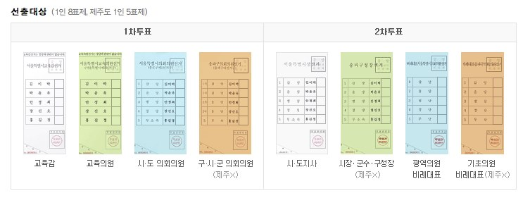
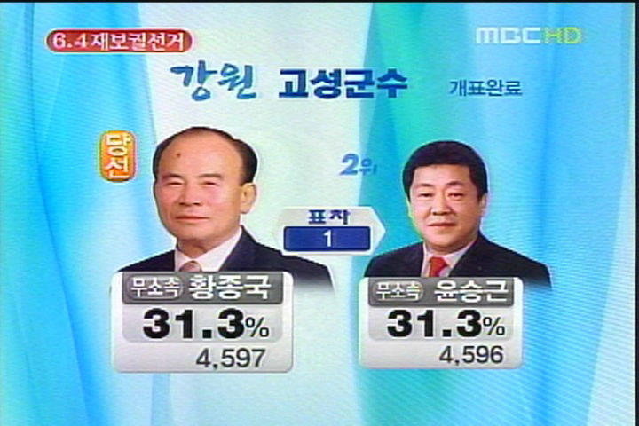

찾아보진 않았습니다만 이제까지 이렇게 많은 표를 행사해야 하는 선거가 있었던가요?

<!-- truncate -->

[다음(daum)에 소개된 그림](http://search.daum.net/search?w=tot&t__nil_searchbox=suggest&q=6.2%20%C1%F6%B9%E6%BC%B1%B0%C5 "[http://search.daum.net/search?w=tot&t__nil_searchbox=suggest&q=6.2%20%C1%F6%B9%E6%BC%B1%B0%C5]로 이동합니다.") 입니다.

간단하게 설명하는 것 자체가 불가능한 선거라고 생각해요. 그래도 저렇게 그림으로 요약하니 좀 낫군요. 어쨌거나 한 사람당 총 8개의 표를 행사해야 합니다. 교육감부터 도지사, 시장, 시의원까지...

문제는 제대로 대부분의 사람들이 이들을 제대로 알지 못한다는 겁니다. 정치란 더럽고 무서운 것이어서, 잘못하면 코렁탕을 먹는다든지, 매우 귀찮은 일이 생긴다는 인식이 강하죠. 말하지 않아도 그 절정은 바로 노무현 대통령의 죽음이겠죠. 전직 대통령까지 죽게 만드는 (반면 어느 군바리 출신 전직 대통령은 29만원 남았다는 핑계를 계속 유지시켜 주는) 그런 상상초월의 현장이기 때문에 사람들은 정치에 대해서는 이성을 정지시키고 그저 현상만 - 뉴스나 신문을 통해서, 포털기사를 통해서 읽혀지는 대로 보이는 대로 보고 욕을 하거나 한숨을 쉬거나 조롱을 합니다. 그 이상 끼어들었다가는 무섭고 더러운 일들이 벌어지니까요.

하지만 조금만 다르게 생각하면 투표는 세상을 변화시키는 가장 쉬운 행동 중의 하나입니다. **이번 선거에 투표권을 가진 국민의 수는 3천8만명이 넘는다고 해요. 정확하게는 38,841,909명이라죠. 한 사람에 8표씩 행사하니 표의 수는 무려 4억표가 넘습니다.** 이 4억표가 가야할 사람에게 간다면, 가야할 정당에게 간다면 어떻게 될까요. 조금은 나은 세상이 되지 않을까요?

지금부터라도 **[자신의 지역에 누가 나왔는지 어떤 사람인지 알아보면](http://vote.d2w.kr/ "[http://vote.d2w.kr/]로 이동합니다.")** 좋을 것 같아요. 혼자 8표나 행사해야 하니 당일이 되면 헷갈려 누가 누군지 알 수 없을테니까요.

 한 표 차이!

내 한 표가 얼마나 영향을 끼칠 수 있을까, 과연 이렇게 투표한다고 달라질까 걱정할 필요도 없습니다. 그래봐야 번거롭게 광화문 앞에 모이고, 목소리를 높이고, 소식을 듣고 꺼이꺼이 울거나 분노하는 것보다는 싼 비용이니까요. 모두가 투표를 하면 쉽게 이루어지겠죠.

한 가지 더 바란다면, 모두들 정말 자기가 원하는 대로 투표를 하면 좋겠습니다. MB를 막기 위해서, 사표를 방지하기 위해서, 이번만은 누구를 몰아주기 위해서...가 아니라 내가 원하는 세상을 위해 이기적으로 투표를 하는 거죠. 그런 이기적인 표들이 모이다 보면 세상을 조금 덜 이기적으로 살 수 있지 않을까 하는 생각을 합니다. 자꾸 눈치 보며 살지 말고, 눈치 보며 투표하지 말고, 자신을 위해 살고, 원래 생각했던 대로 투표를 하는 거죠.

1억개의 표들이 좋은 결과를 만들어 냈으면 좋겠습니다. 제발. ㅠ.ㅠ

p.s.

[딴지일보의 안희정 인터뷰](http://www.ddanzi.com/news/19680.html "[http://www.ddanzi.com/news/19680.html]로 이동합니다.")를 통해 깨달았습니다. 만약 이번 선거에서 노회찬, 유시민, 안희정, 김상곤, 곽노현 등의 인물들이 모두 당선되어  MB와 나란히 앉아 정기적으로 회의를 하는 모습을 떠올려 보니 정말 재밌겠더군요.

특히 노회찬 당선 후 MB와의 첫 만남이나 유시민 당선 후 MB 째려보기 등은 생각만 해도 두근두근 투머로우!

p.s.2

한 줄 요약 - 투표 안하면 골룸.
