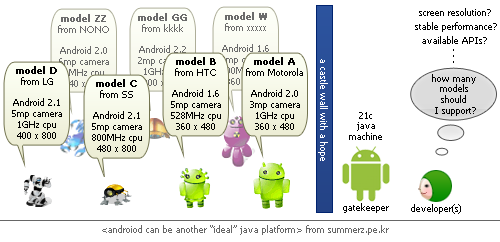
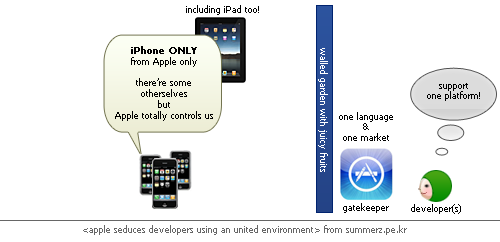

간단하게 쓰고 넘어갈(?) 글이 길이도, 시기도 묘하게 늘어졌습니다. 그래도 적어보렵니다. 최대한 짧게;

<!-- truncate -->

> **최소량의 법칙**
>
> 식물의 생산량은 생육에 필요한 최소한의 원소 또는 양분에 의하여 결정된다는 법칙. 어떤 원소가 최소량 이하인 경우 다른 원소가 아무리 많이 주어져도 생육할 수 없고, 원소 또는 양분 가운데 가장 소량으로 존재하는 것이 식물의 생육을 지배한다는 주장으로, 1843년에 독일의 리비히가 주장하였다.
>
> 출처 : [다음 사전](http://krdic.daum.net/dickr/contents.do?offset=A038052900&query1=A038052900#A038052900 "[http://krdic.daum.net/dickr/contents.do?offset=A038052900&query1=A038052900#A038052900]로 이동합니다.")

몇 학년 때 배우는지 정확히 기억이 안나지만 학교 다닐 때 최소량의 법칙이라는 것을 배웠습니다. 가장 소량으로 존재하는 양분이 식물의 성장에 결정적인 역할을 한다는 법칙이죠.

* * *

안드로이드가 **오픈 소스**라는 건 강력한 무기이자 상당한 약점입니다. 거기에 구글이 가진 특징들이 이 약점을 더욱 약하게 만드는 것 같아요. 그 중의 하나는 바로 **빠른 버전업**니다. 안드로이드는 완전한 오픈 소스이기 때문에 누구나 그 소스를 가져다가 핸드폰을 만들 수 있고 그렇기 때문에 순식간에 대세를 만들 수도 있죠. 거기까지는 좋은데, 문제는 바로 '버전업'에 있습니다.

저에게 구글 하면 떠오르는 건 검색, 웹, 광고, 베타입니다.  이중에서 **웹**과 **베타**를 생각해 보죠. 구글은 한 때 베타 서비스의 상징일 정도로 수많은 사람들이 쓰는 서비스를 베타 상태로 유지했습니다. 이전까지만 해도 베타란 대중에게 서비스를 내놓기 전에 소수의 사람들이 테스트를 하는 것을 의미했으나 구글은 그 고정관념을 깼죠. 지메일은 거의 10년 가까이 베타 딱지를 붙이고 있었습니다.

저는 이게 구글의 서비스가 **'웹 기반'**이기 때문에 가능했다고 생각해요. 만약 어플이었다면 구글은 지금처럼 지메일을, 구글 검색을 성공시킬 수 없었을 거예요. 왜냐면 그들은 버전업을 시도 때도 없이 하고, 버킷 테스트 또한 수시로 감행하기 때문이죠. 어느 평범한 사용자가 자신의 어플을 매번 업그레이드를 하며 버전 관리를 하겠어요!

안드로이드의 약점은 바로 이 **'웹 기반'**의 **'베타'** 서비스에 익숙한 구글이 만드는 플랫폼이라는데 있습니다. 핸드폰 제조사들은 구글의 업그레이드 속도를 도저히 따라갈 수가 없거든요. (게다가 구글은 **대중 서비스**에 약합니다. 이건 모두 아시잖아요?)

얼마 전의 옴니아1을 보세요. 윈도 모바일 6.1을 달고 나온 옴니아1은 한참 후에 나온 윈도 모바일 6.5 조차도 지원할 수 없어서 업그레이드를 포기했죠. 옴니아2 조차도 윈도 모바일 6.5로의 이전에 [회의적](http://www.neoearly.net/2463536 "[http://www.neoearly.net/2463536]로 이동합니다.")이다가 가까스로 [가능](http://cusee.net/2462334 "[http://cusee.net/2462334]로 이동합니다.")했을 정도죠.

* * *

그렇지 않아도 안드로이드폰들은 하드웨어 스펙이 제각각입니다. 안드로이드는 열려 있는 플랫폼이기 때문에 **최소 규격**만 만족하면 누구나 핸드폰을 만들 수 있죠.

자, 이렇게 최소 규격이라는 개념이 존재하며 여러 가지 스펙이 시장에 나와있는 경우 대다수의 안드로이드 어플리케이션 개발자들은 어떤 선택을 하게 될까요? **아무리 업그레이드가 적용되도 상용 어플을 만들어야 하는 개발자들은 결국 가장 성능이 낮은 안드로이드폰에서도 잘 돌아가는 어플을 만들려고 하겠죠**. 리비히의 법칙을 따를 수 밖에 없는 거죠.

* * *

반면 아이폰 진영은 어떨까요? 철저하게 통제된 이 시장은 단 하나의 단말기만 지원하면 됩니다. 바로 최신의 아이폰이죠. 일단 화면 크기나 기본 기능들은 모두 동일할 뿐더러 이전 버전의 폰들을 지원하느냐 마느냐는 애플이 OS차원에서 제어를 해주고 있기 때문이죠.

아이폰의 폭발적인 성장이 수많은 개인 개발자들이 부담없이 참여할 수 있는 앱스토어와 함께 시작되었다는 것을 떠올려 본다면 안드로이드는 개발자들이 접근할 수 있는 생태계를 만들어줘야만 할 겁니다. 하지만, 그런 생태계를 만들려면 조물주가 되어야 합니다. 욕을 먹으면서도 통일된 UX, 통일된 스펙을 유지하는 폐쇄적인 애플 정도의 정책을 펴지 않고서는 '거대한 시장'은 만들어지기 너무 힘이 드는 거죠.

* * *

저는 구글의 안드로이드가 어느 정도는 위피 (WIPI)의 길을 접어들었다고 생각해요. 이 문장에는 몇 가지 의미가 있습니다.

- 위피 (WIPI)는 사실 욕먹을 이유가 없었다. 오히려 표준을 무시하고 제각각의 기능을 추가한 플랫폼 개발사, 그걸 종용한 통신사가 문제라면 문제.
- 결국 **'의미만 하나의 플랫폼'**으로 가기 시작하면 개인 개발자, 소규모개발사들은 덤벼들 수가 없다. 테스트 및 최적화 해야 할 단말기들이 엄청나게 늘어나기 때문.
- 구글의 행보는 스마트폰계의 리눅스라 불릴만 하다. 이상적인 접근이라는 건 알지만 그로 인해 소비자들에게도, 개발자들에게도 최적화된 플랫폼이 되지 못한다.

구글의 이상적인 행보는 [넥서스원의 온라인 판매 중단](http://cusee.net/2462408 "[http://cusee.net/2462408]로 이동합니다.")으로 이어집니다. 의도 자체는 매력적이지만 그게 당위성을 가지지 못한다는 게 문제인 거죠. 결국 구글도 인류의 행복을 위해서라기 보다는 자사의 이익을 위해 이런 시도를 하는 것이기 때문이죠. 스스로 레퍼런스를 세우면서 가기에는 이통사와 단말기 제조사들의 견제를 받을 수 밖에 없고, 마냥 두기에는 그 큰 뜻을 펼치기에 얼마나 오랜 시간이 걸릴지 모르는 거죠.

* * *

저는 그래서 "아직까지는" 안드로이드의 선전에 회의적입니다. 조금 더 기다려야 할 것 같아요. 다만 빠른 시일내에 구글이 하지 않은 최적화에 대한 노력을 어느 특정 단말기 회사가 해줄 지 모릅니다. 어느 개인 개발자가 해줄 지 모르죠. 그게 오픈 소스의 매력일테고요. 누군가는 시간을 들여 더욱 매력적인 상품으로 만들어내야 하는 거죠.

다만 단말기 제조사들은, 이통사들은, 개인 개발자와 소규모 개발사들은 누구나 사용할 수 있는 플랫폼에 뛰어들었기 때문에 최적화된 퍼포먼스를 보여주는 (소비자들을 위한) 상품을 만들 수 없다는 걸 자각하고 범용적인 제품을, 범용적인 서비스를 만들어야만 한다는 사실을 깨달아야 할 듯 합니다.

그런데, 그렇게 해서 아이폰 진영과 대결할 수 있는 무기로 뭘 택할 수 있을까요? 싼 단말기? 무료 위주의 앱 마켓? 포르노? 아직까지는 답이 없는 듯 합니다.
