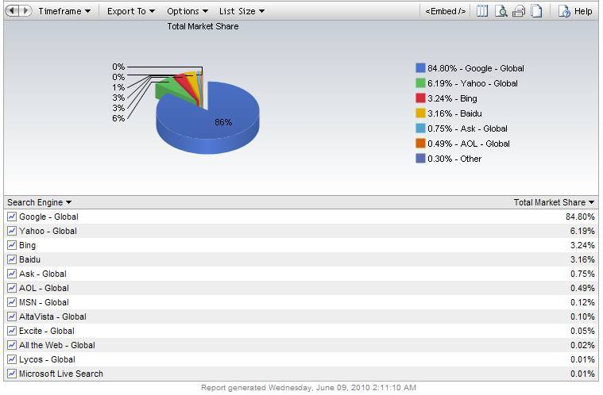

사람들은 흔히 혁신과 개방, 진보와 개혁을 헷갈려하는 것 같습니다. 또한 그 두 가지가 동일한 것으로 알기도 하고요. 이걸 구분하고 스탠스를 정하는 것 자체가 중요한 것 같다는 생각이 듭니다. 요즘 이슈가 되는 걸로 예를 들어보죠.

<!-- truncate -->

## 애플 - the biggest startup on the planet

많은 사람들이 알다시피 애플은 굉장히 혁신적인 회사입니다. 매년 자사의 라인업 제품들을 기가 막히게 업그레이드 해가며 기술과 유행을 선도하는 대표적인 회사죠. 최근 있었던 [D8 (All Things Digital Conference 8)](http://allthingsd.com/d/ "[http://allthingsd.com/d/]로 이동합니다.")에서 그는 어도비를 향한 공격적인 내용의 공개 편지에 대한 질문에 대해 이런 요지의 답변을 합니다.

> 애플은 세계에서 가장 많은 리소스를 가지고 있는 회사가 아닙니다. 우리가 성공한 방식은 기술적으로 어떤 것이 가장 적합한지를 매우 조심스럽게 선택하는 것입니다. 우리는 미래지향적인 기술 요소를 찾습니다. 기술은 그만의 주기가 있습니다. 태동기, 성장기, 절정기를 거쳐 폐기처분되죠. (주: 사계절과 무덤에 비유를 하고 있습니다) 기술의 태동기 때 잘 선택하면 많은 노력을 줄일 수 있습니다... (답변 계속)
>
> [스티브 잡스 @ D8](http://video.allthingsd.com/video/d8-steve-jobs-onstage-full-length-video/70F7CC1D-FFBF-4BE0-BFF1-08C300E31E11 "[http://video.allthingsd.com/video/d8-steve-jobs-onstage-full-length-video/70F7CC1D-FFBF-4BE0-BFF1-08C300E31E11]로 이동합니다.") 중에서

(약 4분 18초 정도부터 해당 답변이 나옵니다)

그는 애플이 지구상에서 가장 큰 벤처회사라는 얘기 (We are the biggest startup on the planet) 도 하죠.

실제로 애플을 가만히 보면 벤처회사와 크게 다르지 않습니다. 다양한 포트폴리오가 회사를 안정시킬 수 있다는 걸 모를리 없을텐데 미국에서 2번째로 시가총액이 큰 회사임에도 불구하고 제품의 라인업은 (상대적으로) 많지 않습니다. 신제품이 나오면 예전 제품들을 단종시키며 제품의 수를 조절해 나갑니다. 애플이 발표하는 제품들은 하드웨어적인 스펙이나 소프트웨어의 기능이 큰 회사에 어울리지 않게 그야말로 혁신적이고 유행을 앞서나가죠. 예전의 애플과 잡스는 '너무' 앞서나가서 어려운 적이 있을 정도니까요.

하지만 애플과 잡스는 이 혁신을 위해 모든 걸 철저하게 통제하고 싶어합니다. 최근의 [기즈모도 사건](http://www.zdnet.co.kr/ArticleView.asp?artice_id=20100427073413 "[http://www.zdnet.co.kr/ArticleView.asp?artice_id=20100427073413]로 이동합니다.")을 보세요. 논란의 여지는 있지만 그들은 제품이 나오기 전에 모든 걸 통제하고 싶어합니다. 앱스토어도 통제하고 있지요

공유? 오픈? 과거에도, 현재도 애플에게 이런 건 어울린 적이 한번도 없습니다. 심지어 마이크로소프트에 밀려서 시장 점유율 2%에 허덕일 때도 그들은 자신들의 기술을 통제하고 라인업을 고도화시키기만 했으니까요.

## 구글 - evil or not

제 생각에 최근 애플의 대척점에 서 있는 회사는 바로 구글입니다. 구글은 우리나라와 일본, 중국 등 몇몇 비영어권 나라에서 고전을 할 뿐이지 [전세계 검색 시장에서는 80%가 넘는 점유율](http://marketshare.hitslink.com/search-engine-market-share.aspx?qprid=4 "[http://marketshare.hitslink.com/search-engine-market-share.aspx?qprid=4]로 이동합니다.")을 보여주고 있죠.

이렇게 시장을 장악하고 있으면서도 구글의 행보는 놀라우리만치 '자유'와 '공개'라는 프로파간다를 설파하고 있습니다. 모토가 'Don't be evil' 인 세계에서 가장 큰 검색 서비스를 운영하는 회사라니 천성이 애플과 반대인 건가요?

> 구글은 자체 콘텐츠 정책이든 정부 요구에 대한 저항의 정도이든 구글이 취해야 할 올바른 행동방향에 대해 활발한 토론을 하고 있습니다. 결국, 우리는 우리의 마음 속에 자리잡고 있는 핵심 원칙에 의존합니다. 그것은 이전에도 말씀 드렸지만 특히 지금과 같은 도전적인 시기에는 재차 반복할 필요가 있습니다: 구글은 표현의 자유에 대한 권리를 우선시합니다. 보다 많은 정보는 보다 많은 선택과 자유를 의미하며, 궁극적으로 개인에게 더 큰 힘을 준다는 것이 저희 믿음입니다.
>
> [Google 한국 블로그 - 논란성 콘텐츠와 웹에서의 표현의 자유에 대해: 업데이트](http://googlekoreablog.blogspot.com/2010/04/blog-post_20.html "[http://googlekoreablog.blogspot.com/2010/04/blog-post_20.html]로 이동합니다.") 중에서

구글은 중국 정부의 검색 결과 통제에 맞서 [중국 서비스를 철수](http://www.hani.co.kr/arti/international/china/411849.html "[http://www.hani.co.kr/arti/international/china/411849.html]로 이동합니다.")시켰습니다. 또한 한국의 제한적 본인 확인제를 거부하며 [유튜브의 한국어 서비스에서 동영상 업로드와 댓글을 막아버렸죠](http://youtubekrblog.blogspot.com/2009/04/blog-post_08.html "[http://youtubekrblog.blogspot.com/2009/04/blog-post_08.html]로 이동합니다."). 또한 그들은 많은 회사들을 합병하여 일반 인터넷 사용자들에게 무료로 안정적인 서비스를 제공하는 가장 큰 회사 중의 하나이며 최근에는 급기야 한 소프트웨어 회사를 인수하여 이 회사의 스마트폰 OS를 무료로 공개해 버리죠. 그게 바로 [안드로이드](http://ko.wikipedia.org/wiki/%EA%B5%AC%EA%B8%80_%EC%95%88%EB%93%9C%EB%A1%9C%EC%9D%B4%EB%93%9C "[http://ko.wikipedia.org/wiki/%EA%B5%AC%EA%B8%80_%EC%95%88%EB%93%9C%EB%A1%9C%EC%9D%B4%EB%93%9C]로 이동합니다.")입니다.

구글의 전략은 크게 몇 가지로 대표됩니다. 웹, 검색, 광고, 오픈, 베타가 그것이라고 할까요? 이 단어들을 사용해서 말을 만들어 본다면 이 정도쯤 되겠죠.

- 구글은 웹 서비스를 베타 때부터 오픈하고 검색을 기반으로 하는 광고 회사이다.
- 그들은 검색을 통해 데이터의 유통을 자유롭게 한다. 그리고, 그 틈에 검색을 집어넣어 광고로 돈을 번다.
- 각종 서비스/데이터를 무료로 오픈시키며 기존 산업/시장이 확보한 가치를 무너뜨린다.

즉, 구글은 자신들의 주무기인 검색과 광고, 혹은 검색 광고를 위해 기존 시장의 컨텐츠가 가지고 있던 가치를 자신들의 검색 결과로 옮겨놓습니다. 그러는 동안 많은 회사들은 어려워지죠. (예: 포털, 신문사닷컴 등) 창조적인 파괴라고나 할까요? 게다가 그들이 그렇게 기존의 가치를 부러뜨려가며 새로운 서비스에 도전하고는 있지만 결국 그들의 수입원은 지금은 전혀 새롭지 않은 형태인 "디지털 광고"일 뿐이죠.

## 혁신과 개방

즉, 혁신과 개방은 둘 다 좋은 의미를 지니고 있을 수는 있지만 그 의미는 전혀 다릅니다. 이 두 가치는 양립할 수도 있고, 양립하지 않을 수도 있죠. 어느 것이 절대적으로 좋다고 이야기할 수도 없을 겁니다.

제가 보기에 애플은 기술적인 접근은 굉장히 혁신적이지만 컨텐츠의 유통이나 사업적인 접근에는 보수적인 마인드를 가진 기업이고, 구글은 자유와 개방에 대해 프로파간다를 설파하지만 결국 오래 전부터 안정적으로 해오던 검색과 광고로 수익을 내는 회사입니다.

이와 비슷한 맥락으로 얼마 전 CC 아시아 컨퍼런스에 온 로렌스 레식 교수의 말을 떠올려 보죠.

> 트위터와 페이스북, 애플을 봅시다. 이들 플랫폼에선 혁신이 많이 일어나고 있지만, 자신들 플랫폼 위에서 개발된 혁신을 소유합니다. 이들은 다른 규칙과 도덕성을 따릅니다. 통제할 권한을 갖는 겁니다. 혁신 이론이 바뀌어야 할 때입니다.
>
> [블로터닷넷 - 로렌스 레식, “오픈은 정말 혁신을 위한 필수 요소인가”](http://www.bloter.net/archives/32583 "[http://www.bloter.net/archives/32583]로 이동합니다.") 중에서

즉, 혁신의 필수 조건이 개방이 아니라는 거죠. 혁신을 위한 자세가 되어 있다면 때로 문을 걸어 잠그고 그 정당한 결과를 향해 매진을 할 수도 있습니다. 반대로 기존의 질서를 뒤집고 새로운 가치를 만들어 나가기 위해 기술의 발전, 정보의 공유를 이용할 수도 있는 거죠. 이는 선택의 문제입니다.

이 글을 보는 분들은 어떤 선택이 더 좋아보이나요?

그리고 더 하고 싶은 말...

## 그리고 진보와 개혁

**이제부터의 이야기는 완전한 사족일 수도 있지만 사실 이 글은 이번 총선 후 혁신,개방 ↔ 개혁, 진보라는 구도에 대해 한번쯤 이야기를 하고 싶어서 쓴 것입니다. 이해해 주시길. :-)**

요즘 우리나라 정치를 보면 진보라는 말과 개혁이라는 말이 혼동되어 쓰이는 것 같습니다. 흔히 진보개혁 세력이라고 하기도 하고 수구보수라는 말도 쓰이고, 민주라는 말까지 섞이고 해서 더욱 그러는 것 같아요. 이런 질문을 해보죠.

- 모든 진보 세력은 개혁적인가?
- 모든 개혁 세력은 진보여야 하는가?
- 모든 민주 세력은 진보여야 하는가?

현재의 정치 구도를 대상으로 제 생각을 이야기하자면 민주당 혹은 국민참여당은 진보인 척을 하지 말아야 한다고 생각합니다. 그들은 성공적인 정권 교체를 이뤄냈던 민주 세력으로서 저는 그들이 억지로 힘들게 진보라는 옷을 입으려 하지 말고 멋지게 개혁의 역할을 해내면 좋겠다고 생각해요.

한마디로 FTA에 찬성하고 파병에 찬성하는 역사와 정체성을 가진 그들이 진보 세력이라고 하면 안된다는 거죠. 저는 그들이 진보라는 어울리지 않는 가면 대신 '우리가 진짜 민주 세력이(었)고, 중산층을 위한 제대로된 보수 세력이니, 이제 우리가 자신들의 이익만 추구하고 부패를 일삼는 수구 세력을 대신하겠다' 이런 메시지를 전달해야 하는 게 아닌가 싶어요.

사실 민주당 (과 국민참여당)에게 파격적인 정책이나 진보적인 구호를 기대하는 사람들은 많지 않을 듯 합니다. 그들은 기존 정치 세력의 일부이지만 삽질이나 일삼고 국민 말도 안듣고 자신들의 이득만 추구하는 세력을 막아세우고 (사람을 위해야 하는) 정치를 깨끗하게 만들기를 요구받을 뿐이죠.

하지만 그들이 자꾸 진보라는 이름을 써가며 헷갈리게 하니까 사람들이 매번 진보 쪽에 대고 '이번에도 나쁜 놈들 막기 위해 너네가 양보 좀 해줘라', '우리 진보 세력끼리 힘을 합쳐야 하는데 왜 도와주지 않는 거냐', '자꾸 사표나 만들고 말야, 진보는 분열로 망한다더니...' 이런 말을 하는 것 아닐까요? 자연스럽게 우파의 자리에 안착해야 할 사람들이 자유당, 민주공화당의 후신들이 오른쪽에 자리를 잡았다고 자꾸 왼쪽에 가 앉는 척하지는 말아야 한다는 거죠.

사실 우리나라에서 진보는 아직 망할 만큼 커진 적이 한번도 없다고 생각해요. 매번 중도보수들이 진보 쪽에 대고 '최악을 막기 위해' 자신들을 지지해 달라고 하며 비판적 지지론과 사표론을 꺼낸 적이 있을 뿐 아닌가요? 그나마 지금의 민노당, 진보신당과 함께 이것들을 있게 한 게 국민승리21 정도였으니까요. (그러고 보면 민중당은 이재오, 김문수로 살아남았다고 해야 하는 걸까요? 안습 민중당)

그럼에도 불구하고 심상정이 이제 진보신당은 광장으로 나와야 한다며 [진보대연합을 제안](http://minsim.or.kr/blog/194 "[http://minsim.or.kr/blog/194]로 이동합니다.")했는데 (민주노동당, 친노세력, 시민사회를 아우르는) 이렇게만 된다면야 좋겠지만 서로 경쟁하며 독자노선도 유지하는 그런 연합에 참여할 세력이 있을지 현실적으로는 어렵다고 생각을 해요.

그래도 심정적으로 지지를 하기 때문에 이 제안을 제 방식대로 해석한다면 이런 거죠.

> 최악을 막기 위해 연대해야 한다면 차악보다는 최선을 중심으로 모이는 것이 좋지 않겠나!
>
> \- 써머즈

이것이 바로 애플의 혁신성과 구글의 개방성에 열광하는 사람들이 가져야 할 자세가 아닐까요? :)
