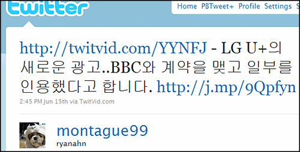

https://www.youtube.com/watch?v=_KfD49mDVN8
**2010년 LG U+ 런칭 광고**

<!-- truncate -->

https://www.youtube.com/watch?v=9dfWzp7rYR4
**2008년 BBC Penguins (BBC 다큐 만우절 광고)**

펭귄이 날아오르고 그걸 다른 펭귄들이 멀찌감치 쳐다보는 장면이 똑같은 걸로 보아 모르고 우연히 비슷하게 나온 건 아닌 것 같고...

라이센스를 받아서 만들었다고 생각하기엔 만우절 광고를 받아다 중요한 런칭 광고를 만들었을리는 만무하고... (LG U플러스 런칭은 뻥이야- 이런 건 아닐테니 말이죠...)

광고 제작사에 BBC를 너무 좋아하거나 테리 존스를 흠모하는 사람이 있어서...도 아닐테고;

혹시 이유를 아시는 분...?

* * *

**추가**

pureRED님 댓글을 보고 찾아보니 일단 이런 트윗이 있네요; 보도자료 같은 공식 정보나 제작하신 분의 글은 아직 못 찾았습니다;

사실이라는 전제 하에 기업의 아이덴티티를 알리는 광고를 왜 다른 기업의 광고에서 인용할까요? 광고 제작사에서 자기네 실력으로는 클라이언트를 도저히 만족시킬 수 없었다는 인증인가요; 여전히 이해불가;;

**추가 2**

> 이상철 부회장은 사명 변경을 위한 이사회가 끝난 다음날인 14일 아침 사내 인트라넷에 “이제부터 LG U+, 버림의 미학으로 새로운 전설을 만듭시다”라는 제목으로 메시지를 올렸다.
>
> 출처 : [뉴스와이어 - “이제부터 LG U+, 버림의 미학으로 새로운 전설 만들자”](http://www.newswire.co.kr/irnews/?job=newsView&no=474098 "[http://www.newswire.co.kr/irnews/?job=newsView&no=474098]로 이동합니다.")

위와 같은 기사도 있군요. 부회장의 멘트도 재밌어요. 버림의 미학으로 만들 LG U플러스라니... 역설의 미학이로군요. LG의 것을 버려서 (마이너스) 유저에게 준다는 (플러스) 건가요? ;;;

이것이야 말로 잡스가 말한 인문학과 기술의 교차점 센스? :p

**추가 3**

다시 찾아보니 클리앙의 [돈 주고 사온거겠죠?](http://clien.career.co.kr/cs2/bbs/board.php?bo_table=image&wr_id=3132488 "[http://clien.career.co.kr/cs2/bbs/board.php?bo_table=image&wr_id=3132488]로 이동합니다.") 라는 글에 해당 댓글이 달려 있군요.

> CHOHJHJ 2010-06-17 오후 1:40:00
>
> 광고제작자 입니다. BBC 만우절 영상을 활용한 광고가 맞습니다. 해당 영상을 BBC와의 계약을 통해 구입하였으며, 제작의도와 맞는 부분을 가지고 합성하여 만들었습니다. 광고제작 기법상 일종의 페러디 기법으로 보시면 됩니다. 잘 아시겠지만 표절은 원작자의 동의를 구하지 않고 하는 경우에 해당됩니다

그런데, 이 분도 퍼온 댓글이라 이 글이 어디에 달렸는지는 여전히 궁금; CHOHJHJ 로 검색해 봤더니 [myLG070의 『참 잘골랐다-신규광고』이벤트 당첨 공지](http://www.mylg070.com/cs/notice_view.php?seq=77&page=2 "[http://www.mylg070.com/cs/notice_view.php?seq=77&page=2]로 이동합니다.")에 당첨됐다는 글만 나오고요;;;
