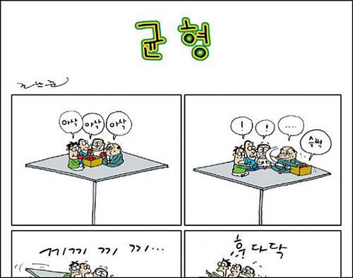

**[시사SF](http://h21.hani.co.kr/arti/SERIES/25/ "[http://h21.hani.co.kr/arti/SERIES/25/]로 이동합니다.")******(조남준 화백,******[한겨레21](http://h21.hani.co.kr/ "[http://h21.hani.co.kr/]로 이동합니다.")에서 1997-2004 동안 8년간 연재했었음)**

<!-- truncate -->

****

**그 중 [균형 연작 3편 보러가기 클릭](http://blog.daum.net/jnjoon/12311697 "[http://blog.daum.net/jnjoon/12311697]로 이동합니다.")****(참고로 조남준 화백의 블로그입니다. 트위터는 [@cnjoon](http://twitter.com/cnjoon "[http://twitter.com/cnjoon]로 이동합니다."))**

**연재물 중 114편을 추린 시사SF의 단행본도 나와있습니다. [예스24는 여기](http://www.yes24.com/24/goods/2382263?CategoryNumber=001001008003005&scode=033&srank=2 "[http://www.yes24.com/24/goods/2382263?CategoryNumber=001001008003005&scode=033&srank=2]로 이동합니다.")로, [알라딘은 여기](http://www.aladdin.co.kr/shop/wproduct.aspx?isbn=8972785458 "[http://www.aladdin.co.kr/shop/wproduct.aspx?isbn=8972785458]로 이동합니다.")로.**

[한겨레21 홈페이지](http://h21.hani.co.kr/arti/SERIES/25/?&cline=200 "[http://h21.hani.co.kr/arti/SERIES/25/?&cline=200]로 이동합니다.")에서는 현재 아쉽게도 200년 7월 27일 이전의 연재물은 확인할 수 없군요.

* * *

그리고, 1989년작 애니메이션 **[Balance](http://en.wikipedia.org/wiki/Balance_(film) "[http://en.wikipedia.org/wiki/Balance_(film)]로 이동합니다.")**. (감독 : 크리스토프 & 볼프강 라우엔슈타인)

****[Balance (1989)](http://www.youtube.com/watch?v=91bNp7HJolE "[http://www.youtube.com/watch?v=91bNp7HJolE]로 이동합니다.")****

쌍둥이 형제가 작업한 이 애니메이션은 1989년 아카데미 단편영화상을 수상했습니다.

참고로 <내셔널 트레져 2 (National Tresure 2: Book of Secrets)>에서도 이 애니메이션의 아이디어를 차용했다고 하죠.
