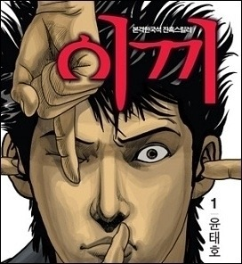

어떤 여성이 능력없는 남자 혹은 군대 다녀온 남자를 비하하는 글이나 영상이 인터넷에 돌기 시작하면 그 발언을 시작한 사람은 엄청나게 비난을 받습니다.

<!-- truncate -->

그냥 그 내용을 본 자리에서 욕 좀 하고 마는 사람들도 있지만, 싸이 미니홈피 주소를 알아내서 사람들에게 알린 후 욕 융단폭격을 종용하는 사람들도 있고, 과거에 했던 말을 일일이 찾아내서 그걸 다시 덧붙여 더 큰 욕을 먹게끔 세팅을 하는 사람들도 있죠. 심지어 싸이 계정을 해킹해서 더 뻔뻔한 반응을 보이게끔 조작을 하는 사람들까지 있습니다.

미녀들의 수다를 통해 '루저'라는 말을 유행어로 등극시킨 분이 저에겐 가장 최근 사례였는데 이번엔 ebs의 강사분이 (인터넷 상에서) 두들겨 맞고 있군요.

그 분의 발언에 동의한다 안한다를 떠나서 (굳이 이야기하라면 저는 동의 안하는 쪽이죠. 우리나라 군복무가 모병제도 아니고, 가서 2년 동안 죽이는 것만 배우고 오는 것도 아니고요.) 싸이 계정까지 해킹하고 쫒아가서 욕하는 그런 일들은 무슨 일만 나면 빨갱이 운운하며 가스통 들고 나오시는 분들이 슬쩍 연상되기도 하고요. 이런 일 쯤이야 이제 예삿일이 되어버린 것 같아 씁쓸해요.

이런 분노가 극대화 되고 테러 행위들이 자랑과 쾌감으로 표현되는 대부분의 공간이 바로 게시판, 커뮤니티죠.

* * *

저는 평상시 우리나라와 다른 나라 (특히 서양)의 인터넷 문화에 대한 차이점 중의 하나를 '커뮤니티 문화'라는 생각을 합니다. 이런 식의 '몰려가서 다구리 놓기'는 바로 이런 커뮤니티 문화에서 오는 게 아닐까 생각해요.

우리나라는 비교적 블로그도 활성화되지 않았고, 여러 개인화 서비스들이 인기를 얻은 적도 없죠. 말로는 웹2.0 의 열풍이 불었다고 하는데 그게 캐즘을 넘지 못하는 수준이었다고 생각합니다. 적어도 우리나라의 인터넷 문화에서는 사람들이 스스로를 개인으로 드러내고, 자신의 의견을 이야기하고, 서로 주체가 되어 다른 사람과 연대하는 것을 좋아하지 않는 것 같아요.

'커뮤니티 문화'는 정확히 그 반대에 있죠. 소속감을 가지고, 다른 사람이 쓴 글에 댓글을 달고, 무언가 부조리한 현실에 공분하고, 실수한 개체 (개인이든 단체든)에 대해 함께 욕을 합니다. 함께 돈을 모아 신문에 광고를 내고, 추천 많이 받은 좋은 글은 더 많은 사람이 볼 수 있도록 커뮤니티의 공지로 올라가야 하고 말이죠.

부조리한 힘의 질서, 인간 내면의 폭력성

예, 저는 '인터넷은 현실의 모사'라고 생각합니다. 이를테면 합법적인 시위를 해도 잡혀갈 수 있고, 부조리한 현실이나 단체를 사실만을 바탕으로 비판해도 '명예훼손죄'에 걸릴 수 있는 현실부터 해서 나이와 학력, 재력으로 자연스레 정리되는 서열 문화, 조직의 경험이 개인의 경험으로 쉽게 치환되는 공동체 문화까지 인터넷에 반영되는 거겠죠. 개인간의 연대는 쉽지 않고 힘을 가진 조직 간의 담합과 경쟁이 난무하는 오프라인에서의 경험이 자연스럽게 온라인 커뮤니티 문화의 뿌리를 튼튼하게 하는 게 아닐까요.

과거에 수많은 XX녀 사건, 폐륜아 사건들의 선정성이 대안 미디어를 자처하던 포털과 인터넷 신문사를 기반으로 재생산되고 확산되었다면 이제는 인터넷의 개인들이 스스로 커뮤니티를 만들어서 그런 외부 미디어를 거치지 않은 채 똑같은 행동들을 하고 있습니다. 게다가 테러를 당연시하고 자랑하는 스킬까지 업그레이드 했죠.

욕하면서 닮는다는 말이 씁쓸하게 다가옵니다. 우리는 이제 빅브라더를 욕하면서 스스로 스몰브라더스가 되어 내가 공격할 수 있는 사람들을 공격하는 문화를 이 시대의 자연스러운 현상이라고 봐야 하는 걸까요.
