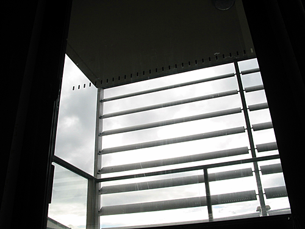

<!-- truncate -->

저답지 않게(!) 완성이 덜 되어 비공개로 놓여져 있는 글들이 하나 둘 늘고 있습니다. 물론 천천히 늘고 있어서 크게 티가 나지는 않지만요.

사실 쓰고 싶은 글이 많았고 써야 한다고 생각하는 글도 많았는데 그러지 못한 건, 제가 지금 하고 있는 일들이 (예상보다) 길어져서...ㅠ.ㅠ 나름의 부담감 때문에 제대로 적지를 못하겠더군요.

예전부터 하고 싶은 서비스를 하나씩 만들어야 한다는 생각도 있고, 그렇다고 돈은 안 벌면 안되겠고... 뭐 그래서 요절복통, 느리게 느리게 진행 중인 거죠.

* * *

보고 싶어 벼르는 영화는 보지 못하고 그냥 그런가보다 하며 흘려보낼 것 같던 영화를 봤습니다. 벼르는 영화는 토이스토리 3, 흘려보낼 줄 알았던 영화는 악마를 보았다.

토이스토리 3은 (주워들은 게 있어서) 본편 전에 시작하는 단편을 위해서라도 아이맥스 3D로 보려고 하는데 아이맥스 3D 극장으로 제일 선호하는 극장이 CGV 일산점이라... 좀 멀어서 못 봤지요.

* * *

악마를 보았다는 생각보다 잔인하거나 거북하지 않았습니다. (물론 전체적으로 잔인, 피 튀기고, 막 훼손하고... 그래요)

우리나라는 복수극의 컨텐츠가 나오는 정서가 익숙하지 않죠. 예전에 누가 그러더라고요. 서양 영화들은 누군가 뭔가 나쁜 일을 당하면 끝까지 찾아가 복수하는 영화들이 수두룩한데, 우리는 대신 복수해주거나, 결국 죽어서 귀신이 되어 복수하거나, 피해받은 자들이 한을 품고 살아남는 영화들 밖에 없다고. 그 이야기를 들을 때 무릎을 쳤죠.

제 생각에는 그게 검열 때문이었던 것 같아요. 그 검열이 음으로 양으로 지금도 여전히 유효한 것 같고요.

* * *

그래서, 인터넷으로 소식을 들었을 때 악마를 보았다가 전형적이면서도 좀 강한 복수극인 것 같아서 내심 반가웠는데 막상 보니 그게 아니더군요. 막 헤메는 복수, 하고 나서도 찝찝한 복수, 전혀 복수스럽지 못한 복수. 악마도 보이지 않고.

하긴, 김지운 감독이 의도하진 않았겠지만 그게 요즘 우리네 방식의 복수인 것 같아요. 뭔가 분노는 치밀어 오르고 막 뒤집어 보고 싶은 일도 있는데, 살면서 해본 적이 없어서, 배운 적도 없어서... 서투르고 어줍잖게 망설이다가... 결국 복수도 제대로 하지 못하는 그런 이상한 행위들.

* * *

일본의 2ch의 재밌는 글을 골라 번역하는 [전파만세 - 리라하우스 제3별관](http://newkoman.mireene.com/tt/ "[http://newkoman.mireene.com/tt/]로 이동합니다.")에서 예전에 읽었던 글 중의 [하나](http://newkoman.mireene.com/tt/3367 "[http://newkoman.mireene.com/tt/3367]로 이동합니다.")를 오랫동안 생각했던 적이 있었어요. 글이 짧아서 그냥 전문을 옮기면 이래요.

> 정의로운 아군의 특징
>
> 1. 자기 자신의 미래를 위한 구체적인 목표가 없다
> 2. 상대의 꿈을 저지하는 것이 삶의 보람
> 3. 단독으로 움직이거나 소수의 인원으로 행동
> 4. 항상 무슨 일이 일어난 이후에 행동
> 5. 수동적인 자세
> 6. 언제나 화가 난 상태
>
> 악인의 특징
>
> 1. 큰 꿈과 야망을 안고 있다
> 2. 목표 달성을 위해 연구 개발을 게을리하지 않는다
> 3. 날마다 노력을 거듭하며 꿈을 위해 모든 수단과 방법을 다해 최선을 다한다
> 4. 실패해도 기죽지 않는다
> 5. 조직적으로 행동한다
> 6. 잘 웃는다
>
> 너는 어느 쪽인지?

잘(?) 살고 싶다면 혹은 살아남으려면, 악인이 되어야 해요.

그래요, 우리 모두 악인이 됩시다!
