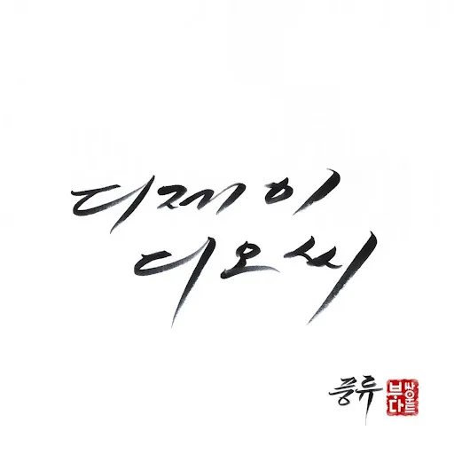

<!-- truncate -->

## 하늘이 입장에서 본 이번 앨범을 관통하는 가사

> (하늘이)
>
> Yo~ 넌 내 인생에 반을 함께 해준 친구
>
> 어두웠던 내 인생을 밝혀준 전구
>
> Thank you 치열한 정글
>
> 같은 인생의 숲에서 넌 내 인생의 전부
>
> (재용)
>
> Yo~ 넌 내 인생에 반을 함께 해준 친구
>
> 어두웠던 내 인생을 밝혀준 전구
>
> Thank you 치열한 정글
>
> 같은 인생의 숲에서 넌 내 인생의 전부
>
> (창렬)
>
> Hey DJ don't stop the music
>
> 그대가 원한다면 밤새 all night long
>
> Hey DJ don't stop the music
>
> 아직은 포기 못해 너만 있다면
>
> In To The Rain 중에서
>
> https://www.youtube.com/watch?v=NMhLvjbrYBQ

게다가 데뷔곡 ['슈퍼맨의 비애'](http://video.nate.com/clip/view?video_seq=67212575 "[http://video.nate.com/clip/view?video_seq=67212575]로 이동합니다.")에서는 '돈 싫어 명예 싫어 따분한 음악 우린 정말 싫어'라고 외치던 DOC들이 이제 '돈 좋아 명예 좋아 그래도 그래도 난 너와 함께 하는 것이 더욱 좋아' 라고 하다니... 세월이 흐르긴 흘렀나 봅니다.

* * *

## 이번 앨범의 귀여운 지점

> 의사 약사 변호사 검사 판사
>
> 차라리 그 정성으로 MP3 다운받지 말고 판사 (사사사)
>
> '나 이런 사람이야' 중 순결한 재용이 파트

순결한 재용과 댄서들의 퍼포먼스를 함께 봐야 더 귀엽습니다 (...)

* * *

## 하늘이의 보컬리스트 취향 변화?

이번 앨범은 거의 하늘이 혼자 만들었다고 하던데

- 혼자 만드느라 그런 건지
- 아님 확실히 예전보다 창렬이가 작업을 많이 안해서 그런 건지
- 아님 하늘이가 선호하는 보컬 스타일이 달라진 건지

창렬이 보컬이 많이 줄었더군요. 하긴 오랜만에 나오는데 보컬이 창렬이 스타일 하나만 두는 것도 만드는 사람 입장에서는 아쉽겠죠.

* * *

## 재용이의 순결한 시도?

아무래도 흥행 때문인지 이번 앨범에 용감한 형제의 곡인 '투게더'가 실려있는데, 재용이가 하이톤으로 랩하는 거 처음 봤네요. 뭐랄까, 작곡가/프로듀서 이기는 가수 없다...인 건가요;

처음 들을 때는 어색했는데 라이브에서도 곧잘 하이톤으로 하는 걸로 보아 그동안 하늘이와 톤을 맞추기 위해 하이톤을 안한 듯?

* * *

## 이번 앨범의 모순

> 함께 할래 옆에 누가 있다면 몰래
>
> 그런 건 상관 안해 I don’t care
>
> 널 귀찮게 안 할 테니까 걱정 안해도 돼
>
> 나 묻지도 따지지도 않아 I don’t care
>
> 아직 준비가 안됐어 그 말만은 차마
>
> 손길을 느끼며 살며시 두 눈을 감아
>
> 널 바라보는 눈빛이 부끄러워 차마
>
> 쑥쓰러워 못 보겠다면 날 꽉 안아
>
> 오늘밤 (feat. 아이비) 중에서

강원래가 자기 애인과 몰래 바람피운 걸 TV 나와서 개그 소재로 쓴 걸 [까는 노래 '부치지 못한 편지'를 실어놓고](http://www.tvdaily.co.kr/read.php3?aid=128116814678820002 "[http://www.tvdaily.co.kr/read.php3?aid=128116814678820002]로 이동합니다.") 왜 저 가사에서는 옆에 있어도 몰래 하겠다, 상관 안한다, 아돈캐어 라는 건지 모르겠더군요. (설마 옆에 있는 누군가가 동성 친구나 부모님은 아니겠죠 -\_-)

* * *

## DOC는 나이 들어도 DOC

보아에게 가요프로 1등 내주고 하늘이는 [꽃다발을 땅에 쳐박지 않나](http://www.hankyung.com/news/app/newsview.php?aid=201008148624k&sid=0107&nid=007&ltype=1 "[http://www.hankyung.com/news/app/newsview.php?aid=201008148624k&sid=0107&nid=007&ltype=1]로 이동합니다.") 창렬이는 트위터에 ['나도 우리음반 조금이나마 사러 다녀야지 ㅋㅋ 어차피 선물하면 되니까 ㅋㅋ' 라고 쓰질 않나](http://news.joins.com/article/201/4383201.html?ctg=15&cloc=home|star|star_index "[http://news.joins.com/article/201/4383201.html?ctg=15&cloc=home|star|star_index]로 이동합니다.") 이 팀은 데뷔 15년차인데 여전히 ~~양아치~~악동.

개인적으로 압권은 하늘이가 유재석, 김원희의 놀러와에 나온 [김C 유니폼의 등번호를 떼어버린 장면](http://www.wikitree.co.kr/main/news_view.php?id=15430 "[http://www.wikitree.co.kr/main/news_view.php?id=15430]로 이동합니다."). 사석이라면 쌍욕 좀 나오고 주먹 좀 오갔을 듯 싶더군요. 이건 뭐 완전 ~~양아~~철부지 악동.

* * *

## 그리고

누가 뭐래도 아직까지 DOC 명반은 그들의 5집 The Life... DOC Blues (2000년)이군요. 이번 앨범 풍류 (2008년)는 DOC의 양아스러운 느낌, 날 것의 느낌이 사라져서 좀 아쉽긴 합니다만 그래도 앨범을 내준 걸로 일단은 충분하달까요.

다음 앨범은 1-2년 이내에 내주고 좀 더 세게 갔으면 좋겠습니다. :-)
