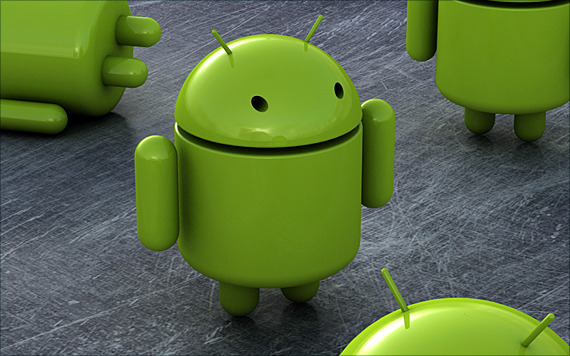

안드로이드폰들을 꼼지락 꼼지락 만져보고 받은 느낌입니다. 대부분 거의 첫인상을 중심으로 적었습니다. 그 중에서도 어플을 구동하고 메뉴를 탐색해가며 받은 시각 & 촉각적인 느낌입니다.

<!-- truncate -->

**htc 히어로**

* 만져본 지 조금 오래되었기 때문에 요즘 폰들과 직접적인 비교는 어려움
* 만져보고 안드로이드가 UI (를 포함한 UX) 면에서는 아직 좀 멀었구나라는 느낌을 준 바로 그 폰!
* 그립감이 약간 장난감을 잡은 것 같은 느낌이어서 의외로 놀람. (확실히 가벼운 느낌)

**삼성 갤럭시A**

* 예전 삼성 터치폰 (햅틱)을 생각하며 기대도 안했는데 의외로 괜찮다는 느낌, 즉 '많이 노력했구나...' 하는 느낌을 받음.
* UI 상의 각종 애니메이션의 어색함은 제조사의 문제가 아니라 OS 차원에서 해결해야 할 문제라는 느낌을 직관적으로 받음. (별다른 이유는 없고, htc 히어로와 거의 같은 느낌이었기 때문)

**삼성 갤럭시S**

* 수퍼 아몰레드로 보여주는 심도있는 블랙은 단박에 다른 모바일 단말기의 화면을 뿌옇다고 느끼게 만들 정도. 완전 멋진 블랙.
* 문제는 색감이 완전 꽝. 만약 주변에 색상에 민감해야 할 미술전공 학생이나 전문 디자이너들이 쓰려고 한다면 무조건 뜯어말릴 것. 잘못된 것에 길들여지면 나중에 고치기 힘들기 때문. 한마디로 눈버림. 특히 녹색과 빨강.
* 무인코딩 동영상 지원이라더니 지원 안되는 코덱들도 많고 자막 관련해서도 아쉬움이 많다는 걸 알고 살짝 놀람.

**htc 디자이어**

* 일단 여타 안드로이드 폰 중에서 반응속도가 빠른 편. 쾌적하고 좋은 느낌.
* 그리고, 역시 htc의 UI는 안드로이드 폰들 중에서 발군.
* 이 정도 되니 해외에서 자꾸 아이폰과 비교됐던거구나 하고 바로 이해가 됨.

**팬택 SKY 시리우스**

* 요즘 흔치 않게 감압식을 선택해서 터치감이 매우 좋지 않음. 힘줘서 눌러야 하기 때문에 사용하다 보면 액정을 고장내는 느낌.
* 다른 제조사들 (htc, 삼성 등)의 기본 UI가 쉽게 얻어진 것만은 아니라는 걸 확실하게 느낌.

\*                      \*                      \*

**사족**

* 당연히 개인적인 느낌일 뿐입니다. :-)
* 앞으로 또 만져볼 폰들은 다른 글에서 적겠습니다.
* 참, htc 히어로는 안드로이드 OS 버전이 1.5 (cupcake) 아니면 1.6 (donut)이었고, 나머지 폰들의 OS 버전은 모두 2.1 (eclair)이었습니다.
* 넥서스원도 분명히 많이 만져봤는데 그 느낌이 기억이 안나서 적지 못했습니;;;
