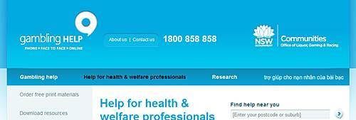
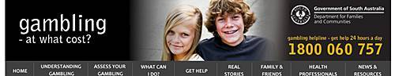

신정환의 철들지 않는 개그를 좋아하는 사람 중의 한명으로 신정환이 도박 때문에 주간지에 이름을 올리는 게 안타깝습니다. ~~더불어 신정환 보다도 훨씬 더 중요한 정치인들, 국가 고위 공무원들의 비리나 범죄 사실은 나몰라라 하고 신정환(과 MC몽) 이야기에 열을 올리는 신문들도 참 꼴갑한다 싶고요;~~

<!-- truncate -->

이승환 수령의 [신정환은 죄인일까, 환자일까?](http://realfactory.net/1282 "[http://realfactory.net/1282]로 이동합니다.") 라는 글을 읽고 문득 호주에서 봤던 각종 도박 관련 경고 및 안내 메시지 등이 떠올랐습니다. 지금 찾으려니 그 때 봤던 것들과 똑같은 것들을 찾을 수는 없고, 그 때 제가 봤던 메시지들과 그 메시지들을 보며 당시 깨닫게 된 지식의 요지는 이렇죠.

- 도박은 중독이다.
- 도박에는 누구라도 중독될 수 있다.
- 도박에 중독된 사람은 혼자 해결하지 말고 주위에 도움을 요청하라.
- 우리 (호주 or NSW 정부)는 언제나 상담실을 운영하니 주저말고 연락하라.

호주는 도박이 합법이죠. 펍 (호프집)에 슬롯머신도 있고, 카지노도 출입이 아주 편합니다. 저도 해봤어요 (저는 땄어요!). 물론 무제한 합법은 아니죠. 규정이 있는 것으로 압니다. 예전에 어느 박물관의 전시회를 갔는데 도박과 관련된 전시물들이 있더군요. 그 때 느낀 건 이렇습니다.

- 왜 얘네는 도박을 합법으로 규정하면서 이런 걸 운영하느라 헛돈을 쓰나.
- 그래도 이런 것들을 인정한 다음 교육을 하는 게 아예 안하는 것보다 낫네.
- 음주운전이나 도박이나 거의 비슷한 강도로 교육 (홍보)을 하네? 신기하다.

(굳이 덧붙이자면 외부인이 보기에 그랬다는 정도입니다)

우리나라는 도박이 불법으로 규정되어 있지만 도박 때문에 괴로워하는 사람들이 적지 않을 것이란 건 쉽게 알 것 같아요. 지금도 극렬 스팸을 보내는 바다이야기류로 대표되는 성인게임과 정선 카지노에서 가산을 탕진한 사람들, 원정 도박으로 걸리는 돈많은 유명인들을 보면 말이죠. 심지어 합법인 경마와 경륜에 심각하게 빠진 사람들부터 굴지의 국내 IT기업들이 운영하는 온라인 고스톱과 포커 서비스에 빠진 사람들 수도 엄청나잖아요.

도박 때문에 괴로워하는 사람들을 위해 정부에서 클리닉 같은 거 열고 정기적으로 연구도 하고 그러면 좋을 것 같은데 말이죠. 지금이라면 그럴 수가 없겠죠. 도박은 불법이니까 말이죠. 불법인 것을 대상으로 클리닉을 열면 안되잖아요. 이미 그게 사회에 만연하고 있다는 걸 인정하는 것이니 말이죠.

이런 현실이 참 웃깁니다. 현실에는 존재하지만 법상으로는 아예 불법이거나 너무 마이너한 개념들이어서 존재하지 않는 것으로 평가되는 사람들과 개념들 말이죠. 그냥 욕 한번 하고 넘어가고, 나나 우리 가족이 아닌 걸 다행으로 여기고, 우리가 주류인 걸 안심하고 지나가고 있는 거죠.

씁쓸합니다.

 [**Australasian Gaming Council**](http://www.austgamingcouncil.org.au/ "[http://www.austgamingcouncil.org.au/]로 이동합니다.")

 [**Gambling Help**](http://www.gamblinghelp.nsw.gov.au/ "[http://www.gamblinghelp.nsw.gov.au/]로 이동합니다.")

 [**Gambling Research Australia**](http://www.gamblingresearch.org.au/ "[http://www.gamblingresearch.org.au/]로 이동합니다.")

 [**NSW Office of Liquor Gaming and Racing**](http://www.olgr.nsw.gov.au/ "[http://www.olgr.nsw.gov.au/]로 이동합니다.")

 [**Problem Gambling Help SA**](http://www.problemgambling.sa.gov.au/ "[http://www.problemgambling.sa.gov.au/]로 이동합니다.")
