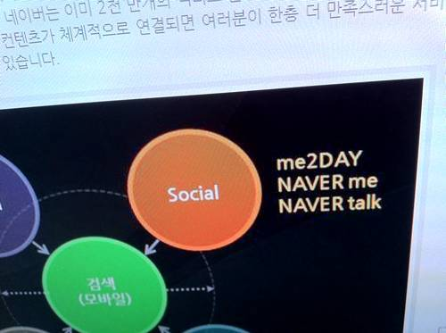
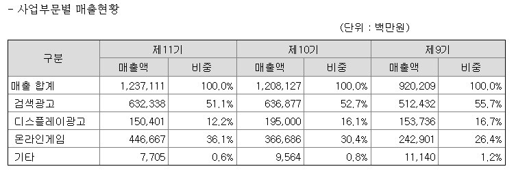

네이버가 이번에 소셜 전략을 공개했다고 합니다.

<!-- truncate -->

**관련 링크**

- [naver 다이어리 - 네이버 서비스 간담회 개최](http://diary.naver.com/150094584286 "[http://diary.naver.com/150094584286]로 이동합니다.")
- [Bloter.net - “네이버 제4원소는 소셜”…소셜홈·커뮤니케이터 12월 공개](http://www.bloter.net/archives/39537 "[http://www.bloter.net/archives/39537]로 이동합니다.")
- [베를린로그 - 네이버 소셜전략 비판: “That’s not what social is!”](http://www.berlinlog.com/?p=548 "[http://www.berlinlog.com/?p=548]로 이동합니다.")
- [칫솔\_초이의 IT 휴게실 - 네이버랜드, 잡상.](http://www.chitsol.com/entry/%EB%84%A4%EC%9D%B4%EB%B2%84%EB%9E%9C%EB%93%9C-%EC%9E%A1%EC%83%81 "[http://www.chitsol.com/entry/%EB%84%A4%EC%9D%B4%EB%B2%84%EB%9E%9C%EB%93%9C-%EC%9E%A1%EC%83%81]로 이동합니다.")
- [광파리의 글로벌 IT 이야기 - 네이버는 페이스북을 벤치마킹한다](http://blog.hankyung.com/kim215/2973926 "[http://blog.hankyung.com/kim215/2973926]로 이동합니다.")
- [디지털타임스 - 네이버, `소셜` 서비스 대폭 강화](http://www.dt.co.kr/contents.html?article_no=2010092902019922752025 "[http://www.dt.co.kr/contents.html?article_no=2010092902019922752025]로 이동합니다.")

위의 링크들을 읽고 제가 요약해봤더니 대충 이런 것이더군요.

- 네이버가 기존 서비스에 소셜 (social) 이라는 요소를 도입한다
- 소셜 요소를 이끌어가는 서비스는 네이버Me, 네이버Talk, 미투데이이다.
- 소셜은 소셜인데 네이버 안의 서비스들하고만 소셜할 예정이다.

그래서 저도 한번 생각해 봤습니다.

## 한국은 갈라파고스, 네이버는 갈라파고스의 지배자

일본의 휴대폰 산업을 [갈라파고스에 비유](http://www.nytimes.com/2009/07/20/technology/20cell.html "[http://www.nytimes.com/2009/07/20/technology/20cell.html]로 이동합니다.")하고들 하죠. 세계화와 동떨어진 채로 발전을 하는 바람에 일본 내에서만 팔리는 상품을 만들고 해외 시장 (북미, 유럽 등)에 나서지 못하는 현실을 빗댄 거죠.

저는 한국의 온라인 (웹)도 갈라파고스라고 생각해요. 한글을 쓰는 나라는 세계에서 우리 밖에 없고 그 인구수라고 해봐야 끽해야 오천만이죠. 정규교육에서 어떤 외국어도 제대로 배우지 못하니 일반 국민들은 외국어로 된 서비스나 컨텐츠를 즐기지 못하고 있고요. 게다가 정보통신부부터 방송통신위원회, 게임물등급위원회 등등 합심해서 산업이 활발하게 돌아가는데 태클을 걸고 있으니 외국 서비스들, 가젯들을 이용하는 것조차도 쉽지 않죠. (액티브엑스, IE 위주, 플래시 난무, 공인인증서 등은 생략하도록 하죠)

현재 이 갈라파고스에 사는 대부분의 사람들은 영어로 된 컨텐츠의 혜택을 받지 못하고 있고 (단적인 예를 들어 아이튠즈 팟캐스팅이나 아이튠즈 U, 위키피디아, TED.com 등 영어로 된 컨텐츠는 널려있지만 많은 사람들에게는 그림의 떡이죠) 앞으로는 중국어로 쏟아져 나올 컨텐츠의 혜택을 받지 못하겠죠.

이러한, 한국 온라인이라는 갈라파고스를 지배하는 서비스는 누가 뭐래도 네이버입니다. 네이버는 그동안 오픈을 하지 않는다는 비판을 많이 들어왔죠. 하지만 이미 가두리양식장을 만들어버린 상태를 전제로 광고와 게임을 통해 수익을 내는 구조 (광고 수익이 전체 수익의 60%를 넘고, 게임이 차지하는 비율도 30% 이상) 이다 보니 무엇하나 개방하는 것이 쉽지 않았을 겁니다. 지금의 수익은 갈라파고스를 최대한 이용한 시장이기 때문에 열 수 없는 거죠.

 출처 : [전자공시시스템](http://dart.fss.or.kr/ "[http://dart.fss.or.kr/]로 이동합니다.") nhn 검색 결과 중 사업보고서 (2009.12)

인기가 있어도 돈이 안되는 [동영상 서비스 같은 경우 과감하게 치워버릴 생각](http://video.naver.com/ "[http://video.naver.com/]로 이동합니다.")을 하는 네이버 입장에서는 별로 돈이 안되는 뉴스 같은 거나 언론사의 자율권을 존중한다는 명분을 들어 [외부 링크로 돌리고](http://news.naver.com/main/presscenter/subject.nhn "[http://news.naver.com/main/presscenter/subject.nhn]로 이동합니다.") 하는 액션 정도를 보일 수 밖에 없는 거죠.

## 페이스북의 성공 vs. 네이버의 가짜 구름

페이스북은 전세계 소셜 네트워크 서비스의 대표 중의 대표입니다. [서비스 체류시간은 구글을 앞지른지](http://www.yonhapnews.co.kr/economy/2010/07/07/0303000000AKR20100707196300017.HTML "[http://www.yonhapnews.co.kr/economy/2010/07/07/0303000000AKR20100707196300017.HTML]로 이동합니다.") 오래 전이고, 트래픽도 종종 구글을 앞지르고 있죠. ([알렉사 순위](http://www.alexa.com/topsites "[http://www.alexa.com/topsites]로 이동합니다.")로는 아직 구글이 1위군요)

아이러니한 사실은 이 SNS계의 최고 서비스인 페이스북은 상당히 폐쇄적이라는 겁니다. 모든 걸 페이스북 안으로 빨아들이고 있죠. 그러니까, 공유와 개방이라는 웹2.0의 수혜를 받아 태어난 서비스가 남들이 공개한 것들을 바탕으로 회원들 간의 소셜 액티비티를 일구어내고 있는 거죠.

반면 페이스북이 외부에 공개한 건 무엇일까요? 그러니까, 로그인을 하지 않고 외부에 있는 사람들이 페이스북으로부터 얻을 수 있는 건 무엇일까요? 페이스북 라이크 버튼 정도나 될까요? 스스로를 플랫폼으로 포지셔닝하면서 각종 서비스에 발을 걸쳐 놓을 뿐이죠. 페이스북을 열려있다고 표현한다면 아마 그건 API와 같은 기술적인 부분을 뜻하는 것일 겁니다.

네이버는 약간 다르죠. 네이버는 이미 지켜야 할 게 너무나 많습니다. 그냥 단순한 커뮤니케이션 자료들 뿐만 아니라 수많은 블로거들과 카페 구성원들, 지식인(KIN)들이 스스로 생성하고 외부로부터 퍼온 자료들이 엄청나죠. 그리고, 그 자료들은 링크와 임베디드 가능한 코드들처럼 가볍지 않고 돈을 들여 운영해야만 하는 무거운 서버 안에 가득차 있습니다. (저는 네이버의 소셜 전략 이전부터 종종 이걸 가짜 구름 (cloud)이라 부르곤 했죠.)

그런데, 네이버가 이걸 쉽게 개방할 수 있을까요?

그러니까, 개방해야 한다는 당위가 아니라, 어떻게든 피땀흘려 곡식을 모았는데 곳간을 열 용자 (勇子)는 흔치 않다는 거죠. 그리고 슬프지만, 모두 알다시피 네이버는 용자가 아닙니다. 우리나라 인터넷 기업의 선두주자가 용자가 아니라 서운해할 순 있어도 등 떠밀 순 없겠죠. 비난할 순 있어도 비난을 받는 서비스는 곧 망한다는 걸 뜻하는 것도 아니고요.

그런 의미에서, 네이버는 페이스북의 성공으로부터 '자신들과 어울리는 소셜'의 의미를 찾은 게 아닐까요? 페이스북은 사람들과의 관계를 핑계 삼아, 그리고 여러 API를 통해 플랫폼이 되어 시야에서 숨으려 하고 있지만, 네이버는 이미 한국 시장에서 인터넷 그 자체입니다. 티를 낼 수 있는 여건이 훨씬 더 좋죠.

**인터넷 = 네이버**로 알고 있는 사람들이 적지 않고, 브라우저 첫 페이지가 다음이나 구글로 되어 있으면 일단 네이버로 이동한 후 서핑을 시작하는 사람들이 적지 않죠. 그런 네이버가 다음 카페나 네이트 싸이월드나 각종 블로그 서비스, 유튜브 등등 외부 서비스들을 좀 모른 척 할 유혹을 느끼는 건 당연하다고 생각해요. 그리고 그 유혹을 실천했으면서도 아닌 척 하는 가식으로 인해 비난을 받는 것도 당연하다고 생각하고요.

## 구글은 검색, 페이스북은 소셜. 그렇다면 네이버는?

우연찮게도 몇 달 전에 구글에서도 페이스북의 대항마(!)로 구글 미 (Google Me) 라는 프로젝트를 준비 중이라는 루머가 돌았었죠. 디그닷컴의 [케빈 로즈](http://twitter.com/kevinrose "[http://twitter.com/kevinrose]로 이동합니다.")가 언급해서 널리 알려진 이 프로젝트는 사실 아직 아무 것도 밝혀진 바가 없습니다만 (케빈 로즈는 이 트윗을 삭제했습니다) 페이스북의 전 CTO인 애덤 디안젤로는 Quora.com 에서 이게 [사실임을 밝혔죠](http://www.quora.com/Is-Google-Me-a-fake-rumor-a-misleading-evolutionary-product-update-or-really-a-new-social-network-from-Google "[http://www.quora.com/Is-Google-Me-a-fake-rumor-a-misleading-evolutionary-product-update-or-really-a-new-social-network-from-Google]로 이동합니다.").

곰곰히 생각해 보면 페이스북과 구글은 닮은 점이 있습니다. 구글은 검색이라는 도구를 통해 플랫폼이 되었습니다. 세계인들은 구글링 (googling)을 하죠. (반면 야후잉, 빙잉, 페이스부킹 같은 건 없습니다.) 그리고 유튜빙과 지메일도 하고요. 우리는 공짜로 검색을 하지만 구글은 이 검색 플랫폼에 노출되기 원하는 광고주들로부터 돈을 받습니다. 페이스북도 똑같죠. 역시 소셜 네트워크를 핑계 삼아 스스로를 플랫폼화 하고 있고, 커뮤니티와 엔터테인먼트를 제공합니다. 그 플랫폼을 원하는 광고주들에게 광고를 받고 있죠. 그 플랫폼을 원하는 게임 회사들에게 게임 머니의 수수료를 받고 있고요.

네이버도 비슷합니다. 네이버는 이미, 매우 플랫폼이 되었지만 그걸 조금 더 요즘 유행하는 개념으로 포장해보고, 자사 서비스간 유동성을 높여보겠다는 정도의 차이겠지요.

트위터에도 적었지만 네이버의 소셜 전략이 발표되던 날 (어제) 문득 이런 질문이 떠오르더군요.

- Q: 구글이 동사로 쓰이는 것처럼 (I google it) 네이버도 동사로 쓰인다면 무슨 뜻이 어울릴까? 타동사여서 **I naver you** 라고 쓰인다면?
- A1: 너를 광고했어
- A2 : 네 정보를 펌질했어
- A3 : 널 가뒀어

네이버를 통해 이 정도 밖에 떠오르지 않는 제가 이상한 건지도 모르죠.

그렇다면 우리나라 네티즌들에게 혹은 우리나라 IT geek 들에게 네이버 하면 떠오르는 건 뭘까요? 그리고, 이번 소셜 정책이 거기에 변화를 주는 정책일까요? 아니면 더욱 공고히 하는 정책일까요?
