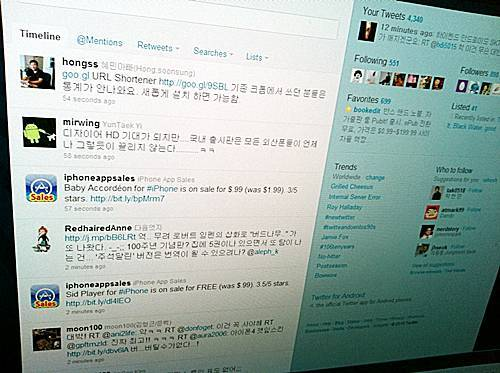

얼마 전에 **[트위터 웹의 UI가 변경](http://twitter.com/newtwitter "[http://twitter.com/newtwitter]로 이동합니다.")**되었죠. 굉장히 심플한 형태에서 마치 **[아이패드 트위터 앱](http://itunes.apple.com/kr/app/twitter/id333903271?mt=8 "[http://itunes.apple.com/kr/app/twitter/id333903271?mt=8]로 이동합니다.")**을 모사한 것과 같은 형태로 변경이 되었습니다.

<!-- truncate -->

그런데, 바뀐 UI를 좋아하지 않는 분들이 종종 계시더군요.

저는 이제까지 데스크탑에서 이용할 때는 별다른 클라이언트 없이 [크롬](http://www.google.com/chrome?hl=ko "[http://www.google.com/chrome?hl=ko]로 이동합니다.") + [트위터 웹](http://twitter.com/ "[http://twitter.com/]로 이동합니다.") + [PBTweet+ (크롬 익스텐션 버전)](https://chrome.google.com/extensions/detail/bgilpachmloimelohcimoljjgengbgop "[https://chrome.google.com/extensions/detail/bgilpachmloimelohcimoljjgengbgop]로 이동합니다.") 의 조합으로 써 왔는데, 저 역시 새로 바뀐 트위터 웹의 UI가 별로 맘에 들지 않습니다.

맘에 들지 않는 이유는 딱 2가지 입니다.

1. 여전히 트윗할 때 단축 주소를 만들 수 없다. (PBTweet+ 을 쓰면 단축 주소를 쉽게 만들 수 있어요)
2. 각종 공식 리트윗 관련 (Retweets by Others, Retweets by You, Your Tweets, Retweeted)하여 누가 리트윗을 했는지 알 수가 없다.

1번은 뭐 크롬의 shareholic 같은 별도의 익스텐션을 사용하면 그나마 괜찮은데, 2번은 예전에 있던 게 빠진 건데, 별다른 대체제가 없군요. 다행히도 아직은 일괄적으로 이전이 끝난 게 아니고 일종의 프리뷰 기간이라 그런지 예전 UI를 사용할 수 있더군요.

**바뀐 트위터 UI를 기존 UI로 사용하는 방법**

일단 트위터 로그인을 하고,

예전 UI를 사용하고 싶으면 아래 링크 클릭

**[http://twitter.com/account/use\_phx?setting=false&format=html](http://twitter.com/account/use_phx?setting=false&format=html "[http://twitter.com/account/use_phx?setting=false&format=html]로 이동합니다.")**

다시 새 UI를 사용하고 싶으면 아래 링크 클릭

**[http://twitter.com/account/use\_phx?setting=true&format=html](http://twitter.com/account/use_phx?setting=true&format=html "[http://twitter.com/account/use_phx?setting=true&format=html]로 이동합니다.")**

저는 가끔 심심할 때나 새 UI를 써보고 기본적으로는 예전 UI + PBTweet+ 상태로 남아있을 예정입니다;

p.s.

아마 모든 사용자에 대해 웹 UI 이전이 끝나면 위의 세팅이 먹지 않을 것 같아요.
