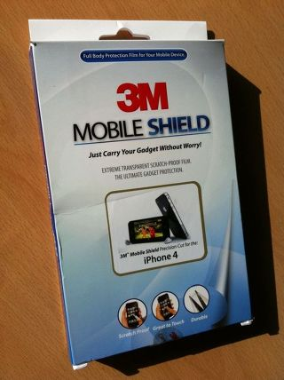
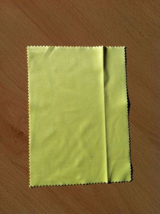

아이폰4를 사고 그 어떤 케이스나 보호 필름을 붙이지 않고 다녔습니다. '이 폰을 무슨 천년 만년 쓰겠다고! 흠집 좀 나면 어때! 작은 흠집들이야 말로 나와 함께한 시간을 증명하는 거야!' 라는 말도 안되는 생각을 하면서 말이죠. 게다가 아이폰4의 앞면은 튼튼하기로 유명한 고릴라 글래스이잖아요! (물론 고릴라 글래스가 아닌 것 같다는 추측들도 많습니다. 애플은 비밀을 좋아하는 기업.)

<!-- truncate -->

하지만, 제가 직접 써보고 또 인터넷의 여러 글들도 확인해 보니 앞면은 튼튼한 게 맞는데, 뒷면은 확실히 고릴라 글래스급이 아닌 것 같더군요. 뒷면이 많이 약하고, 깨지기도 잘 깨진다는 글을 종종 봤어요. 저도 산지 1주일 정도 지나니 아이폰4의 뒷면 유리에 실금이 몇 개 생기더군요. 주머니에 동전이나 열쇠 같은 걸 넣지 않았는데도 말이죠. (아, 깨질 것 같이 불안한 정도의 갈라짐 같은 게 아니라, 그냥 얇은 흠집이죠.)

그래서, 내심 불안해하던 차에 ~~드림~~[리얼팩토리](http://realfactory.net/ "[http://realfactory.net/]로 이동합니다.")의 위대한 리승환 수령이 자기는 [Disaster but Beauty한 소니 X10](http://www.realfactory.net/1309 "[http://www.realfactory.net/1309]로 이동합니다.")을 쓰기 때문에 필요없다며 쿨하고 시크하게 박스 하나를 선물하더군요. 그것은 바로 [3M Mobile Shield](http://mobileshield.co.kr/ "[http://mobileshield.co.kr/]로 이동합니다.").

제가 관련 지식이 없어서 그런지 몰라도 - 이런 보호 필름들 볼 때마다 좀 웃기는 게 있는데, 제품마다 정말 별의별 첨단 공법을 다 사용하고 있다는 겁니다. 이깟 필름 하나에! (물론 관련 계열 종사자분들은 화내시겠죠;; ) 이 제품만 하더라도 3M Paint Protection Film (PPF) 제조기술과 3M Scotch 접착기술을 사용했다고 하죠.

박스 뒷면을 보면 3M PPF 기술의 역사라고 하면서 1960년대부터 미 육군과 함께 헬기 프로펠러의 손상을 막기 위해 폴리우레탄 PPF 기술을 발명했고, 1970년대부터 미 해군과 함께 전투기 F-14의 앞부분 (nose cone)과 기타 여러 부위 보호를 위해 PPF 기술을 공급했으며 1980년대부터는 전미 스톡 자동차 경주 협회 (NASCAR)의 차들을 위해 PPF 기술을 제공했다고 합니다.

이쯤되면 이 3M 모바일 실드를 붙이지 않으면 안될만한 상황인 거죠. 그래서, 붙였습니다만…

**.**

**.**

**.**

저는 이런 거 붙이는 거 정말 못해요. ㅠ.ㅠ 뒷면은 그나마 우둘투둘 잔 기포를 남긴 채 붙이는데 성공했으나 앞면은 10차례도 더 넘게 시도한 끝에 결국 실패 ㅠ.ㅠ 결국 처음 이야기한 것처럼 아이폰4의 약한 뒷면 유리에 놀라운 PPF의 은총을 내려준 것에 만족하게 되었습니다.

붙여보니 이제 뒷면의 흠집이나 깨짐에 대해 신경을 덜 써도 되니 좋더군요. 두께감이 살짝 느껴지지만 그래서 더 안심이 된달까요? 게다가 신기하게도 붙이고 나니 뒷면의 실금이 보이지 않더군요. 오호-

참, 패키지 내에 극세사 천이 들어있더군요. 평상시 모니터나 핸드폰 액정을 닦으려고 찾아보면 없어서 아쉬운 극세사 천을 얻었다는 것에 한번 더 만족;

**3줄 요약)**

아이폰4용 3M Mobile Shield 보호 필름을 선물 받았다.

앞면은 부착 실패, 뒷면만 (가까스로) 붙였는데도 좋다. 만족.

다음부터는 잘 붙이는 사람에게 부탁해야겠다.
