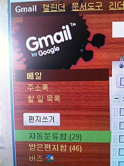

[페이스북이 이메일 서비스에 진출](http://www.etnews.co.kr/news/detail.html?id=201011130034 "[http://www.etnews.co.kr/news/detail.html?id=201011130034]로 이동합니다.")한다고 합니다. 새로운 형태의 이메일 서비스가 나올 것 같아 많은 사람들이 기대를 하고 있죠. 이쯤해서 제가 예전부터 많은 분들과 이야기하면서 생각해온 새로운(?) 이메일 서비스에 대해서 간단하게 이야기를 해볼게요.

<!-- truncate -->

**그러기 전에, 은행의 온라인 서비스에 대해 생각해보죠.**

은행의 온라인 사이트에 들어가서 이체를 할 때, 통장에 기록할 수 있는 정보들은 대게 8자 이내입니다. (별다른 정보를 적지 않으면 예금주의 이름이 적히죠) 그 이외에는 뭔가 추가 정보를 넣을 수 있는 방법이 없습니다. 뭔가 구체적 정보를 기록할 수 있는 방법은 없죠. 카테고리, 태그, 필터링, 계좌 모아보기 등 사용자에게 유용할 수 있는 서비스들은 생각해 보면 차고 넘치지만 단순히 상세한 메모를 적을 수 있는 서비스는 기대조차 힘듭니다.

금융과 관련된 각종 서비스들을 제공하는 가계부 프로그램이 다수 존재하는 지금까지도 은행 서비스는 크게 달라지는 게 없죠. 은행의 온라인 서비스는 이미 90년대에 시작되었음에도 불구하고 말이죠.

저로서는 이해하기 힘든 서비스의 발전 양상이예요. 그 동안 은행 수수료는 점점 높아지고, 제 PC는 날이 갈수록 (수많은 액티브엑스로 인해) 더럽혀졌지만 뭔가 나아지는 건 없다는 거죠. 고작해봐야 공과금 납부가 가능해졌다는 것 정도? 각종 금융상품 소개를 빙자한 광고 노출 정도?

물론 실제 돈이 왔다갔다 하는 서비스이기 때문에 보수적으로 운영된다는 것을 어느 정도는 이해하겠지만, 온라인 사이트는 매년 거의 분기-반기별로 싸그리 뜯어고치는데, 그런 곳에 돈을 들이느니 사용자 (예금주)들을 위한 유용한 서비스들을 시도해보는 게 어떨까 싶은 생각이 드는 건 어쩔 수가 없는 거죠.

이메일 서비스도 마찬가지입니다. 오래 전에 시작된 서비스지만 예전이나 지금이나 크게 다르지 않죠. 물론 지메일을 비롯 몇몇 이메일 서비스들이 새로운 기능들을 추가해오긴 했지만 제한적인 성격의 기능 추가라고 생각하거든요.

**그럼 이제 제가 바라는 새로운 메일 서비스에 대해 말해볼게요.**

저는 구글 서비스들을 주로 사용하고 있는데, 현재 존재하고 있는 구글 서비스들의 개념을 빌려서 한 마디로 요약하면 [지메일](http://gmail.com/ "[http://gmail.com/]로 이동합니다.")과 [구글 리더](http://reader.google.com/ "[http://reader.google.com/]로 이동합니다.")를 합치는 겁니다.

물론 언뜻봐도 이메일과 RSS구독기는 상반된 성격을 가진 컨텐츠를 다루고 있습니다. 메일은 지극히 개인적인 컨텐츠를 구독, RSS구독기는 비교적 공개된 컨텐츠를 구독하는 기능을 담당하죠.

하지만 현재의 이메일은 예전만큼 개인적인 컨텐츠만을 취급하는 서비스가 아닙니다. 업무용 메일과 각종 뉴스레터에서 부터 각종 웹사이트의 정보를 나중에 확인하기 위한 용도로까지 사용을 하고 있죠. 그렇다면 어떤 기능이 유용할까요?

## 1. 자신이 받은 메일에 메모, 완료일 등 추가 정보 입력 기능

메일을 받고 내용을 확인한 후 나중에 일을 처리해야 하는 경우가 많습니다. 하지만, 기껏해야 별표를 치거나 메일함을 옮겨서 보관하거나 아니면 아예 다른 서비스를 사용을 하죠.

하지만 받은 메일에 바로 자신의 메모를 추가시킬 수 있다면 정말 편할 거예요. 완료일을 설정해서 다시 한번 SMS나 메일로 알람을 줄 수 있다면 굳이 다른 서비스를 사용할 필요가 없겠죠.

## 2. 메일의 진행 사항 기록 기능

업무용 메일일 경우 이제껏 업무들이 어떻게 진행된 것인지, 언제부터 시작된 것인지, 마일스톤은 뭐고 어떤 외부 정보(링크)를 참고해야 하는지 궁금할 때가 많습니다. 대부분은 별도로 기록을 하죠. 하지만, 메일 서비스 내에 이런 것들을 설정할 수 있으면 참 편할 것 같아요.

기존에 받고 보낸 메일들을 쉽게 그루핑을 하고, 관련자들을 태깅하고, 업무의 진행 기간, 완료 시점 등을 설정하고, 외부 링크 등을 추가시킬 수 있다면 일의 효율이 엄청나게 늘 것 같아요.

## 3. 받은 메일을 쉽게 외부로 퍼블리싱

자신이 받은 메일을 간단한 설정을 통해 외부의 웹페이지로 저장시키거나 [구글 문서](http://docs.google.com/ "[http://docs.google.com/]로 이동합니다.")로 저장해서 쉽게 외부의 다른 사람들과 공유를 할 수 있게 하는 겁니다.

이렇게 되면 뉴스레터 등의 정보성 메일들의 내용을 쉽게 다른 사람들과 공유할 수 있고, 다른 사람이 공유한 페이지를 다시 자신의 메일로 가져올 수 있겠죠. 정보의 흐름이 훨씬 유연해지는 겁니다. 후자는 각종 위젯을 사용하는 형태로 이미 유행하고 있죠.

사실 뉴스레터, 뉴스그룹을 통해 받는 메일이나 RSS 구독이나 다를 게 뭐가 있나요. 만약 RSS 구독기로부터 쏟아져 나오는 컨텐츠가 너무 많을 경우에는 요즘 지메일의 자동분류함처럼 RSS 컨텐츠를 위한 메일박스를 하나 추가해주면 간단히 해결될 수 있겠죠.

---

일단 여기까지가 제가 생각해온 기능들이예요. 기존의 이메일 프로토콜을 잘 준수하면서 좀 더 다양한 기능들이 적극적으로 붙으면 훨씬 사용하기 좋은 이메일 서비스가 되지 않을까요? :-)

그렇다면 페이스북의 새로운 메일 서비스로 알려진 타이탄 프로젝트는 어떤 기능들을 가지고 있을까요? 단순히 SNS의 인맥 정도를 편리하게 이용하는 정도의 서비스에 그치게 될까요, 아니면 새로운 형태의 이메일 서비스가 될까요? 개인적으로는 얼마 전 구글이 시도했다가 실패한(?) [구글 웨이브](http://wave.google.com/ "[http://wave.google.com/]로 이동합니다.")와 사뭇 비슷하지 않을까 추측해 봅니다.
