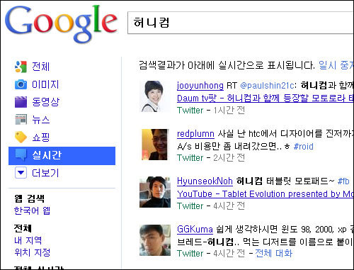
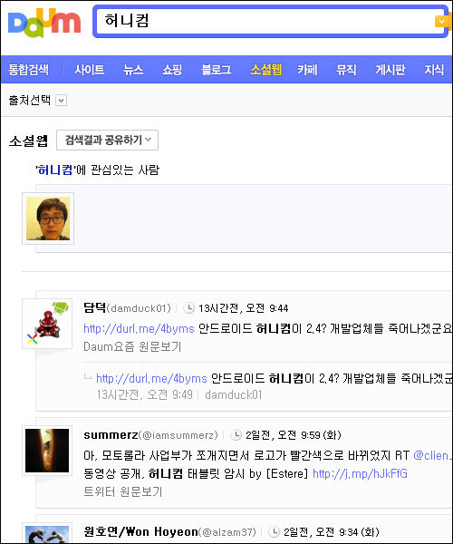
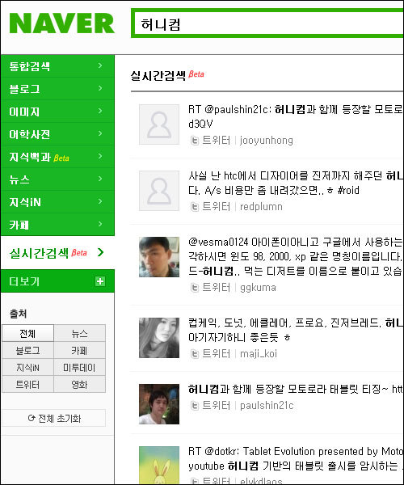
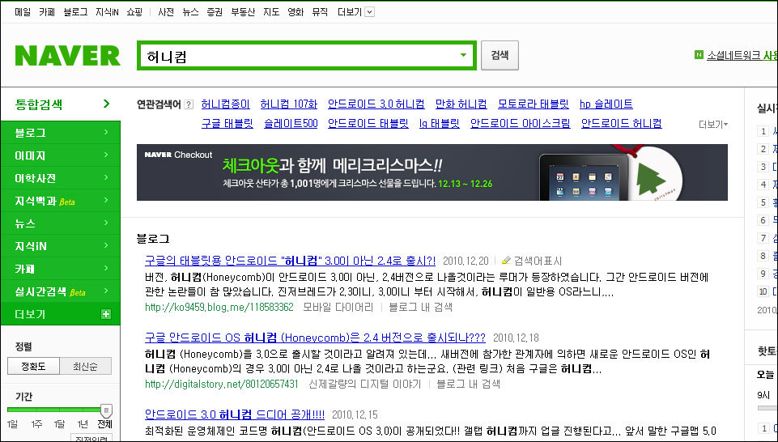

소셜 네트워크 서비스 (SNS)들이 인기를 얻는 만큼 각종 검색엔진, 포털들도 SNS를 검색 결과에 적극 반영하고 있습니다.

<!-- truncate -->

예를 들어 구글은 **실시간 검색 (Updates)**.

다음(DAUM)은 **소셜웹 검색**.

네이버는 **실시간검색beta**.

스크린샷을 보면 아시겠지만 두 가지 재밌는 사실이 있습니다. 눈치 채셨나요?

**첫째, 말은 실시간 검색이지만 사실상 트위터 검색?**

테스트해 본 결과 검색풀은 아래와 같습니다.

- 구글은 트위터만 검색(하는 듯)

- 다음은 트위터 + 자기네가 만든 요즘 (YOZM)

- 네이버는 트위터 + 미투데이 + 네이버블로그

국내 포털의 경우 자기네 서비스를 슬쩍 끼워넣었지만 실제 검색되는 대부분의 내용은 트위터의 글들입니다. 그런 점에서 좀 웃겨요. 아버지를 아버지라 부르지 못하는 트위터 검색이라니. :-(

물론 검색어에 따라 차이는 있어요. 네이버의 경우 미투데이가 선전하고 있기 때문에 몇몇 국내 전용 검색어 (예: 아이유, 시크릿가든 등)는 미투데이 글들이 꽤 표시됩니다. 하지만 대부분의 검색어에서는 요즘이나 미투데이, 네이버블로그 등은 그냥 끼워팔기 수준이죠.

가두리 포털 입장에서는 얼마나 싫을까요. 특정 검색을 통한 대부분의 검색 결과가 외부, 그것도 경쟁 서비스로 보내줘야 하는 현실이 말이죠. 그렇다고 요즘 트렌드를 모른 척 할 수도 없고. 고육지책이겠죠. 이 이야기는 나중에 다시 해보도록 하죠.

**둘째, 검색결과가 천차 만별 = 포털의 검색은 다 찾아주지 못해!**

트위터를 사실상의 검색풀로 사용하고 있으면서도 검색결과가 다 다릅니다. 글로벌 서비스를 하는 구글이나 빙 (Bing) 같은 경우는 [트위터와 계약](http://www.businessweek.com/technology/content/dec2009/tc20091220_549879.htm "[http://www.businessweek.com/technology/content/dec2009/tc20091220_549879.htm]로 이동합니다.")을 해서 트윗들을 가져온다고 하죠. 추측이지만 단순 로컬 서비스를 하는 다음이나 네이버는 그냥 자체 크롤링을 하는 게 아닌가 싶어요.

어쨌든 간에, 이런 단문 SNS의 등장으로 인해 포털이나 기존 검색엔진들은 실시간 검색류의 서비스를 고육지책으로 하고 있긴 하지만 결국은 그래봐야 '포털, 검색엔진의 검색이란 낮은 품질의 서비스구나', '제대로 검색해주지 못하는구나'라는 사용자 경험을 줄 뿐이죠. 광활한 네트를 검색하는 것도 아니고, 들어가서 보면 뻔히 보이는 (것 같은) 트위터 하나를 제대로 반영하지도 못하다니!

게다가 기껏해야 뒤늦은 반응일 뿐이지 진짜 실시간은 아니라는 거죠. 진짜 실시간을, 진짜 모든 정보를 얻고 싶으면 포털 대신 SNS를 사용하라는 메시지를 전달하고 있는 거죠. 실제로 위의 검색결과에서 보듯이 다들 제대로 검색해 주지도 못하잖아요. 포털과 검색엔진 입장에서는 이러지도 저러지도 못하는 아이러니한 상황이죠.  
  
그렇다고 포털이 소셜 검색, 실시간 검색의 품질에 대해 큰 신경을 쓸까요? 그동안의 행태를 보자면 자신들이 직접하는 서비스를 예쁘고 그럴 듯하게 보여주는 건 신경쓸지 몰라도 외부 서비스, 전체 웹에 대한 것들은 관심 조차 없을 거예요.

하지만 검색이라는 측면에서 어려운 게 트위터 뿐이겠습니까. 페이스북은 아예 외부에서 검색도 안되죠. 커다란 변화나 방향성 없이 당장의 수익에 급급한 폐쇄적인 포털 입장에서 볼 때는 제대로 임자를 만난 거겠죠.

사실 이 문제는 검색되느냐 안되느냐의 문제가 아니라 폐쇄적인 포털이 그동안 얼마나 혁신적인 서비스들을 추구하고 나아갔느냐에 대한 관점에서 보면 더욱 재밌는 것 같습니다.

즉, 제 생각에 소셜 검색이란 "기존 서비스 (포털, 검색엔진)가 새로운 서비스에 대항하여 자신들의 정체성을 지키기 위해 발버둥 치는 가짜 검색"이라고 생각합니다. 감상적인 평을 더하자면 뭔가 눈물겹죠.

p.s.

그나저나 네이버는 이제 문맥광고라든지, 검색어를 이용한 광고 같은 기법들도 무시하고 검색어와 전혀 상관없는 광고를 검색결과 화면 최상단에 뿌려주고 있더군요. 뭐, 국내 1등 업체니 '이 정도는 괜찮아' 이런 마음인 걸까요? 요즘 유행하는 표현을 쓰자면 **검색품질 X까!**

<허니컴으로 검색했는데 전혀 관계없는 체크아웃이 메리크리스마스를 외치는 장면>
