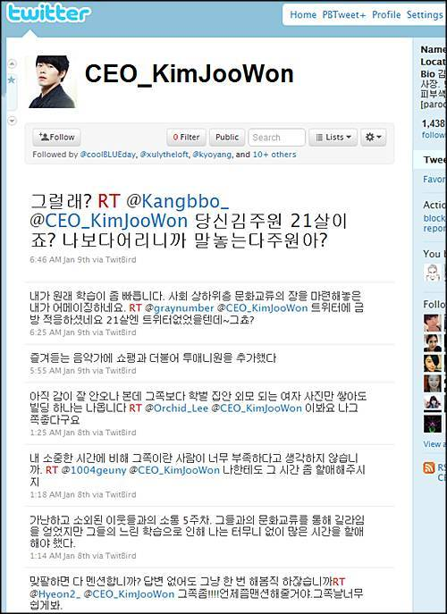

(묵혀둔지 한달은 더 지난 지각 포스팅입니다. 하지만 지금도 유효한 점이 있는 것 같아서, 내용을 보강해 이렇게 포스팅 합니다^^)

<!-- truncate -->

스티브 잡스는 "고객의 말에 귀를 기울이지 말라. 고객들은 자신이 무엇을 원하는지 모른다."는 요지의 말을 한 적이 있다고 하죠.

하지만 당연히(^^) 매번 그런 건 아니라고 생각해요. 면면이 다른 거겠죠. 즉, 사용자들이 무언가 스스로 알아서 해내고 있는 게 있다면, 그걸 편하게 만들어주면 더 많은 사용자들이 혹은 더 열혈 사용자들이 더 쉽고 더 즐겁게 사용할 수 있는 그런 서비스들이 가능하지 않을까요? 예를 들면 이렇습니다.

**온라인 커뮤니티와 실시간**

유심히 살펴보면 팬카페, 커뮤니티 게시판, 소셜 커뮤니티 등에서 TV를 보면서 계속 댓글 다는 사람들이 참 많습니다. 그게 댓글이든 메시지든 수많은 단발성 짧은 글이든 간에 마치 모여서 보는 듯한 느낌으로 거대한 글타레를 만드는 거죠. 쉽게 생각하면 2002년 월드컵 같은 이벤트를 보면서 서로 막 잡담하는 거죠. 요즘으로 따지자면 현빈과 하지원의 <시크릿 가든> 같은 인기 드라마도 해당 되겠군요.

실제로 일본에는 이미 **[ツイテレ twtv.jp](http://twtv.jp/ "[http://twtv.jp/]로 이동합니다.")**  같은 서비스가 있죠. 각 TV 방송 채널별로 실시간 반응들을 보여주는 서비스입니다.

우리나라 같은 경우는 (대부분의 서비스가 그렇지만) 포털에서 해주면 대중적인 확장이 이루어질 것 같고, 방송이라는 원천 소스를 가지고 있는 방송국 사이트에서 한다면 트래픽을 많이 가져올 수 있을 것 같아요.

단, 방송국의 경우 자기네 사이트에 로그인한 사용자들만 이용할 수 있다고 하면 정말 무의미한 서비스가 될 가능성이 높을 것 같고요. (^^)

**글제목에 확장자 표시**

제가 아는 한, 우리나라에서는 아마 디시인사이드 사용자들이 처음 했던 것 같아요. 사용자들이 알아서 "일종의 숏컷"을 만들어 낸 것입니다. 예를 들자면 제목이 이런 식입니다.

치킨\_종결자.swf

아이폰이\_갤럭시s보다\_좋은\_11가지\_이유.txt (스압)

이게\_사람이야\_여신이야.jpg

보시면 알겠지만 제목을 보면 그 글이 어떤 형식을 차용하고 있는지 알 수가 있죠. .swf로 끝나면 그건 플래시 (동영상)이 동작한다는 겁니다. .txt는 내용이 텍스트로 되어있다는 걸 의미하고, .jpg 는 이미지가 곧 내용이라는 뜻이겠죠. (.gif 는 움직이는 이미지겠죠)

부익부 빈익빈이라고 잘나가는 사이트의 경우 사용자들이 많기 때문에 글이 리프레시 되는 속도가 짧아지고 거기서 주목을 받으려면 제목에서부터 제대로 내용을 표현해야 하는 경우가 많죠. 또한 요즘 모바일 환경이 강화되면서 표현을 더욱 압축해야 하는 경우도 많아졌고요.

그렇다면 이런 류의 서비스에는 무엇이 있을까요? 자신이 발견한 무언가를 핵심적인 내용만 뽑아 기록, 공유하는 개념이 도입되었다는 측면에서 미국의 [텀블러](http://tumblr.com/ "[http://tumblr.com/]로 이동합니다.")가 있죠. 텀블러는 위의 것들을 표현하는 방식이 직접적이지는 않지만 front-end 단에서 충분히 표현할 수 있는 구조를 갖췄습니다.

그렇다면 우리나라는? **[kooo](http://kooo.net/ "[http://kooo.net/]로 이동합니다.")** 가 있습니다. :-)

이 서비스들의 특징은 사용자들의 인터넷 상에서의 글쓰기 패턴을 분류하여 가장 빠르고 간편하게 글을 작성할 수 있도록 UI를 구성했다는 거죠.

**역할놀이**

마지막으로, 이런 식으로 요즘 사용자들의 행동 패턴에서 읽을 수 있는 걸 하나 더 찾아본다면 무엇이 있을까요? 제가 먼저 하나를 이야기한다면 바로 SNS 상에서의 롤플레잉 (역할놀이)입니다.

트위터의 수많은 봇들을 보세요. 사람이 운영하는 계정인데 형식적으로는 봇 (로봇, 기계장치)를 의도하고 있는 개체들이 정말 많습니다.

[영화 정보를 알려주는 봇](http://twitter.com/cgvmovie "[http://twitter.com/cgvmovie]로 이동합니다.")부터 [쇼핑몰의 상품을 안내하는 봇](http://twitter.com/zirum "[http://twitter.com/zirum]로 이동합니다."), [신문사의 기사를 알려주는 봇](http://twitter.com/omybot "[http://twitter.com/omybot]로 이동합니다."), [날씨를 알려주는 봇](http://twitter.com/seoul_wt "[http://twitter.com/seoul_wt]로 이동합니다.") 정도는 기본이죠. 조금 더 사람냄새 나는 봇들이 있습니다. 사회적인 연대를 주장하는 [운동권 봇](http://twitter.com/movement_bot "[http://twitter.com/movement_bot]로 이동합니다."), 딴짓말고 논문쓰기를 장려하는 [논문 봇](http://twitter.com/paper_bot "[http://twitter.com/paper_bot]로 이동합니다."), 여자친구를 대신하는 [여친봇](http://twitter.com/Yeochin_Bot "[http://twitter.com/Yeochin_Bot]로 이동합니다.")까지 수많은 봇들이 있습니다.

> 개인적으로 가장 매력적인 봇은 [엄마코딩봇](http://twitter.com/umma_coding_bot "[http://twitter.com/umma_coding_bot]로 이동합니다.")입니다. 가장 인간적인 엄마라는 존재와 가장 기계적인 수단인 코딩이라는 정보가 뒤섞여 실존하는 무엇인가가 만들어졌기 때문입니다. 마치 sf영화의 한 장면을 보는 것 같달까요? 유희적인 관점에서도 아주 적절하죠.

그렇다면 이것들이 sf영화에 나오듯 자생적으로 활동하는 로봇 같은 것일까요? 아닙니다. 역할놀이를 하는 사람들이 운영하는 계정일 뿐입니다.

비슷한 예를 하나 더 든다면 각종 패러디 짤방 속에 등장하는 싸이월드 미니홈피가 있겠죠. 구체적인 사례라면 다음의 예를 들 수 있습니다.

[- 드라마 <꽃보다 남자> 패러디](http://pann.nate.com/talk/120117852 "[http://pann.nate.com/talk/120117852]로 이동합니다.")

[- 드라마 <크리스마스에 눈이 온다면> 패러디](http://blog.naver.com/PostView.nhn?blogId=moonjuda&logNo=10076679848&redirect=Dlog&widgetTypeCall=true "[http://blog.naver.com/PostView.nhn?blogId=moonjuda&logNo=10076679848&redirect=Dlog&widgetTypeCall=true]로 이동합니다.")

[- 드라마 <나쁜 남자> 패러디](http://gall.dcinside.com/list.php?id=badboy&no=2773&page=3360&bbs= "[http://gall.dcinside.com/list.php?id=badboy&no=2773&page=3360&bbs=]로 이동합니다.")

[- 드라마 <아내의 유혹> 패러디](https://www.bizplace.co.kr/biz_html/content/daum_content_view.html?seq_no=14971&page=1429&b_code=&code= "[https://www.bizplace.co.kr/biz_html/content/daum_content_view.html?seq_no=14971&page=1429&b_code=&code=]로 이동합니다.")

[- 시트콤 <거침없이 하이킥> 패러디](http://article.joinsmsn.com/news/article/article.asp?total_id=2613292 "[http://article.joinsmsn.com/news/article/article.asp?total_id=2613292]로 이동합니다.")

**왜 이런 서비스를 안만들고 있지?**

이쯤되면 SK컴즈 소속의 싸이월드가 충분히 해볼만한 비즈니스 모델이 보이지 않나요? 영화나 드라마를 찍을 때 단순히 홍보 블로그, 홍보용 미니홈피만 만들지 말고, 인기 추세를 살펴보며 아예 드라마/영화 속 인물의 가상 블로그, 가상 미니홈피를 만드는 겁니다.

이건 트위터에서도 가능하고, 블로그에서도 가능하지만, 제가 보기엔 싸이월드 미니홈피가 하면 제일 재밌을 것 같은 서비스입니다. 미니홈피는 완전한 실명기반이기 때문이죠. 하지만 요즘 미니홈피의 인기가 시들하고 있는 이럴 때 한번 리부트를 시도해 보는 것도 나쁘지 않을 것 같아요.

요즘 트위터에서 인기가 정말 많은 드라마 <시크릿가든>의 **[김주원봇](http://twitter.com/ceo_kimjoowon "[http://twitter.com/ceo_kimjoowon]로 이동합니다.")**을 보세요. 이 창의적인 **인터렉티브 팬픽**을 즐기는 사람들이 정말 많습니다. 싸이월드의 미니홈피는 개인의 사생활이 서비스에 녹아들어 있는 형태를 띄고 있기 때문에 쏠쏠한 재미가 더 크지 않을까요?

게다가 나름 우리나라의 연예 컨텐츠들은 공중파의 영향력도 세고, 연예인에 대한 팬덤도 강하고, 연애 위주 드라마에 대한 밀집도가 강하기 때문에 아주 좋은 컨텐츠가 될 수 있습니다.

**.**

**.**

**.**

하지만 **빌어먹을 인터넷 실명제** 때문에 국내 서비스 안에서는 이런 서비스도 힘들겠죠? 현재 상황이라면 그냥 지금처럼 트위터나 페이스북에나 만들어야 할 것 같습니다.

이런 식의 외전, 팬픽, 인터렉티브 성향의 컨텐츠에 익숙한 팬들은 그 의도를 십분 이해하며즐길 수 있을테니 부가적인 재미를 줘서 좋고, 그러다가 재밌는 거 하나 만들어져서 기사가 나면 흥행에 엄청 도움이 되겠죠.

참고로 이런 형태의 서비스를 만들 때 생각해볼 팁 하나가 있습니다. 추세를 살펴야 하기 때문에 제작진에서 적극적으로 드라이브를 한다는 생각을 하지 말고 팬들과 적극 소통하거나 이미 팬들에 의해 제작된 컨텐츠를 허락 받고 사용하는 형태로 가면 안정적일 것이라는 거죠.

물론 엄마코딩 봇이나 논문 봇, 남친 봇 등등 그런 매스미디어의 힘을 빌리지 않고도 공략할 수 있는 영역도 있지만 그건 운영자의 창의성이 상당히 많이 필요한 점이기도 하고, 비즈니스적인 측면하고는 살짝 다를 수 있는 것들이니까요.

자, 이런 것들 이외에 사용자들의 패턴이 머리 속에 떠오르는 게 있나요? 그게 재밌을 것 같나요? 생각나는 것들을 한번 해보면 어떨까요? :-)
