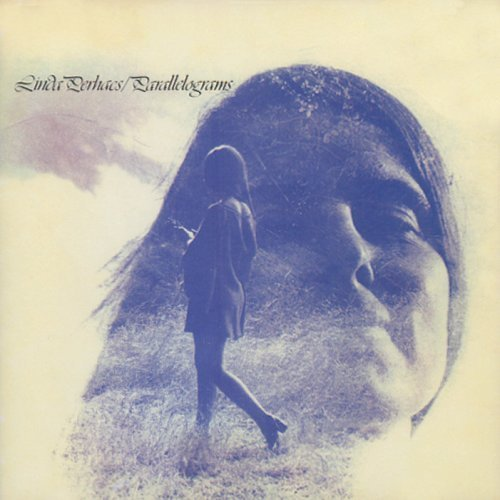

문득 예전 생각이 나서.

<!-- truncate -->

사운드 공부를 한 이후였는데, 공부를 하면 할수록 평상시에는 음악을 듣지 않았던 적이 있었습니다. 그렇다고 잘 아는 것도 아니었고 대단한 경지와는 거리가 멀면서도 말이죠. 어쨌든 관련된 일을 할 때만 듣고, 평상시에는 최대한 귀를 편안하게 두는 상태가 지속이 되었었죠.

그러던 중 아이팟 터치를 사게 됐습니다. 맥도 오래 전부터 써왔고, 아이팟도 예전에도 지인들 것을 잠깐 잠깐 써본 적은 있었으나 제가 구입한 아이팟으로는 첫번째였죠. 즉각적인 반응이 느껴지는 UI와 터치의 즐거움에 빠져 한참을 신나게 가지고 놀았습니다. 게임도 받고 RSS 리더 같은 것도 받고 하면서 재밌게 놀긴 했지만 저에게 아이팟 터치는 음악 플레이어로서가 아니라 포터블 PC 같은 개념이었죠.

* * *

그래도 기왕 산 아이팟이니 습관적으로 이어폰을 귀에 꼽고 서점에서 책을 고르고 있는데 갑자기 린다 퍼핵스 (Linda Perhacs)의 노래들이 연달아 흘러나오기 시작하는 겁니다.

http://www.youtube.com/watch?v=-6iRuav9DtE
Linda Perhacs - Hey, Who Really Cares?

http://www.youtube.com/watch?v=FamSGP1jKVg
Linda Perhacs - If You Were My Man

아, 얼음처럼 얼어서 몇 번이나 반복해가며 한참동안 [이 앨범](http://music.daum.net/album/album.do?albumId=31321 "[http://music.daum.net/album/album.do?albumId=31321]로 이동합니다.")을 들었습니다. 이 노래들에 특별한 경험이 있다거나 떠오르는 추억이 있던 건 전혀 아니었어요. 하지만, 그냥 음악 듣는 것 자체가 왠지 의무감처럼 느껴지고 지겨워진 때였는데 제가 오래 전부터 좋아했던 노래가 흘러나오면서 머리 속에서는 저절로 베이스라인을 따라가고, 아르페지오를 따라가고, 목소리를 느끼며 '아, 음악 듣는 즐거움이 이런 거였지.' 했던 거죠. 한창 60, 70년대 락들을 열심히 찾아 듣던 때도 생각나고 말이죠.

* * *

경험이란 건 참 신기한 것 같아요. 객관적으로 기억되지 않고 주관적으로 추억됩니다. 바로 직전에 사용하던 mp3 플레이어에 대해서는 왠지 불편하고, 귀찮고, 셔플 플레이도 항상 나오는 노래만 나온다고 생각하고 있었거든요. (실제로 나오는 노래만 나오는 건 사실이었습니다) 하지만, 이렇게 예상치 못한 순간에 예상치 못한 노래를 듣고 기분이 좋아지다니…

예상치 못한 경험을 준다는 건 참 어려운 일인 것 같아요. 위와 같은 경험은 정말 우연이었을테지만, 만약 서비스 제공자가 사용자에게 이런 우연을 가장한 즐거움이나 편리함 등을 선사할 수 있다면 얼마나 좋을까요? 드러내놓고 노골적으로 제시하는 서비스가 아니라 어느 순간엔가 즐거움이나 편리함이 자연스럽게 느껴지는. 힘든 일이겠죠. 하지만 저는 지금도 가끔 저 때 기억이 떠오릅니다. :-)
