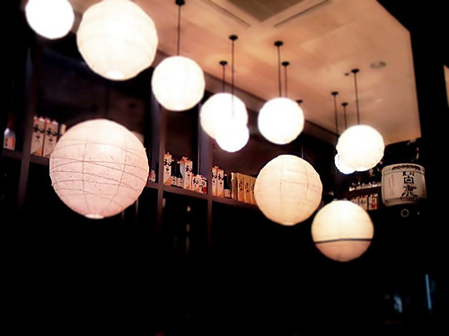

한 때 비유적인 글을 쓰는데 정신이 팔려 있던 적이 있었다. 가슴 속에는 하고 싶은 말들이 있는데, 그것들을 함께 나눌 마땅한 사람은 없고, 그렇다고 불특정 다수에게 마냥 장황하게 설명하고 싶지 않았으니 내가 택할 수 있는 선택은 그리 많지 않았던 것이다.

<!-- truncate -->

하고 싶은 이야기들이 대부분 우울하거나 답답한 것들일 경우 비유와 상징으로 이루어진 글을 쓰면서 내 감정을 더욱 증폭시키고 깊게 만들어 바닥을 치고 올라오는 효과가 있었기 때문에 그 방식을 택했다. 좋은 일인 경우에도 남들의 시선에 재단되기 싫을 뿐더러 즐겁고 흥겨운 비밀로 남겨두고 싶어 그런 방식을 택하기도 했다.

남들은 정확한 이야기를 알 수는 없지만 대략 내가 어떤 느낌인지 정도만 알 수 있었을테니 불공평하지만 아주 약간의 커뮤니케이션은 되었다고 볼 수도 있었겠지. 음악을 들으며 장조인지 단조인지 구분하는 것만으로도 그만큼 감상에 영향을 끼치는 것이니까.

하지만 나는 어느 순간 비유적인 글쓰기 혹은 설명을 하지 않으려 노력하게 되었다. 시간이 지날 수록 감정의 진폭은 줄어들고 비언어로 된 감정을 풀어내고자 하는 욕구도 예전 같지 않게 된 이유가 클 것이다. 글도 생활도 실제로 존재하는 것들에 대한 이야기에만 집중하고 존재는 하지만 쉽게 보이지 않는 것들에 대해서는 이야기하지 않으려 노력도 했다.

그렇게 더는 다른 일들이 없을 줄 알았던 내가 갑자기 어떤 상황으로 저벅저벅 들어가 이런 저런 생각이 드는 걸 보면 인생은 정말 타이밍으로 이루어진 것 같다. 어찌됐든 올해는 정말 잊지 못할 한 해가 될 듯. 그게 어떤 방향으로의 각인이 될지는 누구도 알 수 없으나 계속 떠올리고 싶은 쪽으로의 추억이 되도록 노력하는 내가 되길 진심으로 빌어본다.

