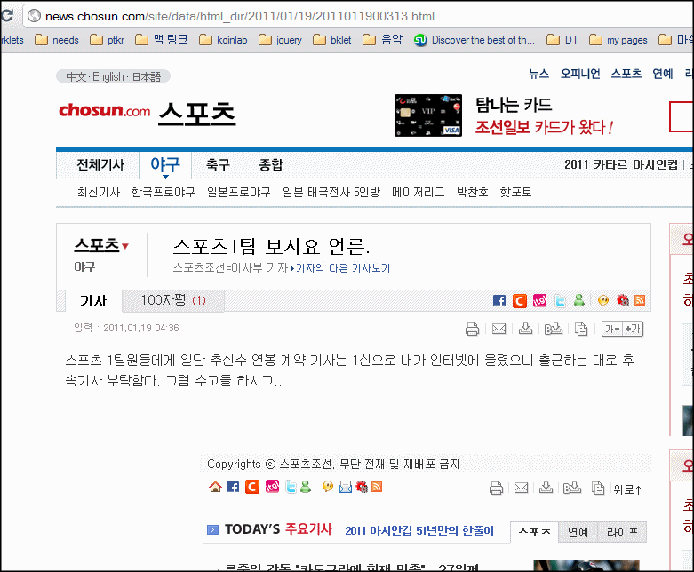

<!-- truncate -->

**[조선닷컴 - 스포츠1팀 보시요 언른](http://news.chosun.com/site/data/html_dir/2011/01/19/2011011900313.html "[http://news.chosun.com/site/data/html_dir/2011/01/19/2011011900313.html]로 이동합니다.")**.

이사부 기자가 후배 기자들에게 쓴 절절한 명령(?).

그래도 지금 한국에서 제일 잘나가는 메이저리거인 추신수 연봉 계약 기사를 썼으면 다 올릴 것이지 1신만 쓰고 퇴근해도 되는 건가;;; 쓸 거면 다 쓰던가;

그나저나 한 가지 알게 된 사실은 기자들도 내부 메시지 적을 때 '~함다' 라는 비문을 사용한다는 거;; 난 그거 초딩, 중딩들끼리나 쓰는 표현 혹은 사적으로 많이 친한 동등한 사이에서나 쓰는 말인 줄 알았는데 -\_-a

하지만 무엇보다 히트인 건 '언른' 이라는 표현. 아… 귀여움을 의도한 걸까? '얼른'도 아니고 '언른'이라는 건 나름 스스로 '언론인'이라 생각하기 때문에 쓴 X드립인 건가;;;
