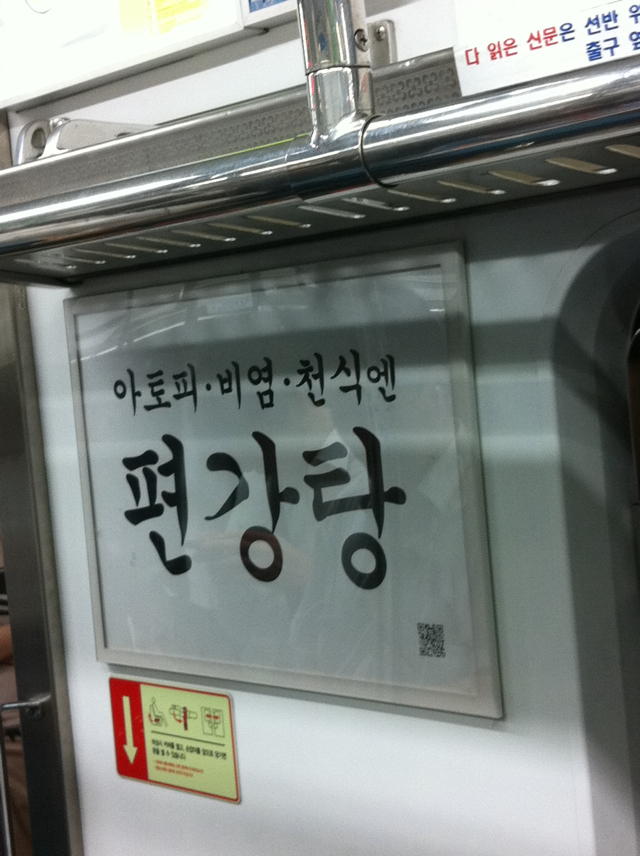

<!-- truncate -->

  
요즘 지하철 광고 중에 저렇게 별 정보없이 궁서체로만 크게 광고하는 광고를 종종 봤는데요,  
  
깨끗해서 좋긴 한데, 사람들이 저걸 보고 뭘 할 수 있을까요? 수첩에 이름을 적어가는 건가요?  
  
전화번호나 홈페이지, 이메일, 업체명, 제품명 등 그래도 바로 직관적인 정보를 하나 넣어주면 좋을텐데 사용하기 귀찮은 QR코드 하나 달랑 넣어두다니…  
  
너무 멋내다 굶어죽는 건 아닌지 모르겠어요.  
  
p.s. 그러면서 아래와 같은 보도자료성 기사(라 쓰고 광고라 읽는다) 를 내는 걸 보면 마케팅 포인트가 신비주의를 가장한 어르신 공략인 건가 싶기도 하군요.  
  
링크 : http://news.sportsseoul.com/read/health/903226.htm  
  
iPhone 에서 작성된 글입니다.
