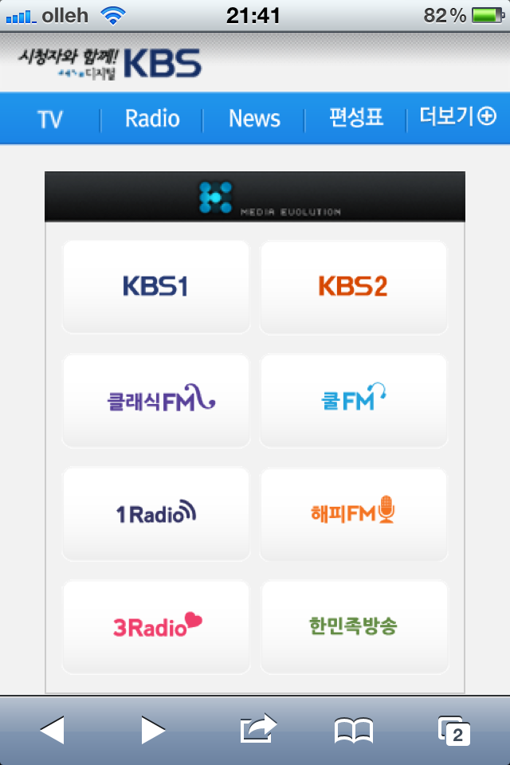

KBS가 드디어 인터넷이 연결되는 곳이라면 어느 곳에서라도 (생)방송을 쉽게 볼 수 있는 플랫폼을 열었습니다.  

<!-- truncate -->

이름하야 **K Player**. **[http://k.kbs.co.kr/](http://k.kbs.co.kr/ "[http://k.kbs.co.kr/]로 이동합니다.")**  
  
아이폰, 안드로이드폰 등 각종 스마트폰과 각종 아이패드, 갤럭시 탭 등 각종 태블릿에서는 물론이고 맥에서도 볼 수 있습니다.  
  
  

데스크탑에서는 이렇게 보이고

  
  

스마트폰에서는 이렇게 보입니다

  
  
KBS 회원 로그인만 하면 상당히 고해상도로 볼 수 있네요. 버퍼링도 없고 좋아요.  
  
  
문득 세 가지 생각이 드는군요.  
  

1. 4G 시대가 되면 DMB는 그 좁은 화면 크기를 극복하기가 더 어려워지겠다. 수신 지역이라는 한계 역시 치명적일테고.
2. 이통사들은 삽질 좀 그만하고 이제 그만 좀 플랫폼으로서의 망사업자 역할에 충실해줬으면 좋겠다.
3. 동영상 컨텐츠의 역할이 점점 더 커지고 있다! 컨텐츠 홀더들의 입김이 점점 세질 것 같다.

  
  
  
p.s.  
  
그나저나 MBC는 오래 전부터 스마트폰에서 동영상을 볼 수 있게 시스템을 열어줬는데, 왜 아직까지 맥은 지원하지 않을까요? 데스크탑에서 생방송을 보기 위해서는 반드시 액티브엑스를 설치해야만 하거든요.  
  
MBC도 이제 시대의 흐름(?)에 맞게 액티브엑스를 걷어줬으면 하는 바람입니다. 다시보기에서는 액티브엑스 사용하지 않는 플레이어를 사용하면서 왜 생방송만 액티브엑스를 사용하는지 이해가 잘 안되요.
