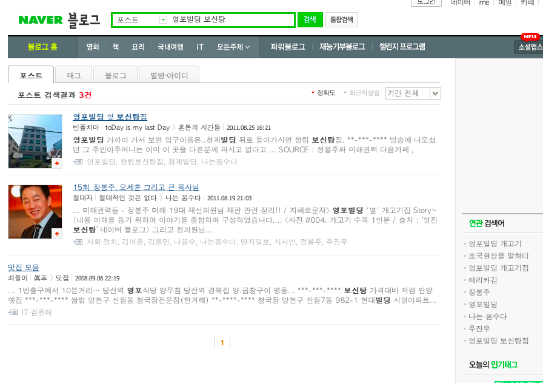
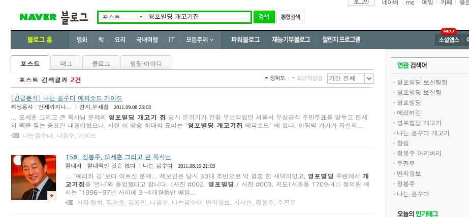
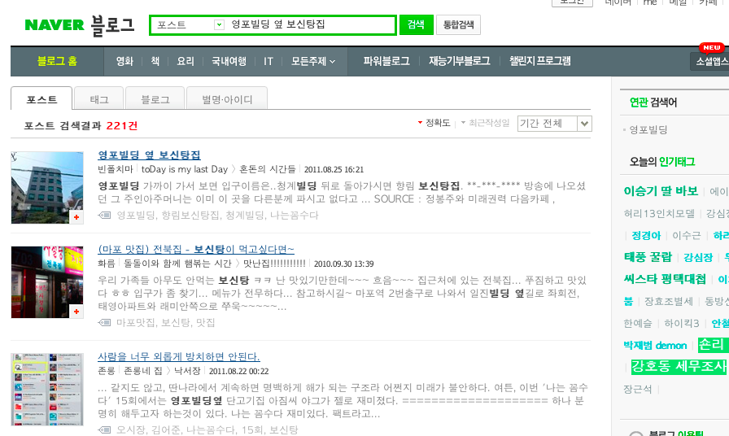
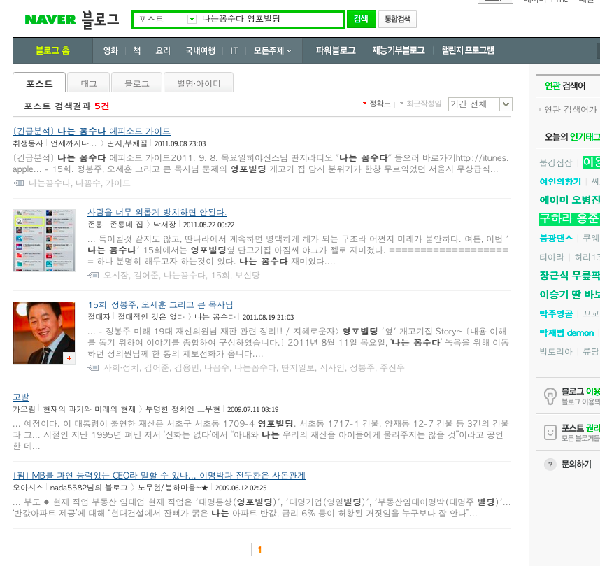
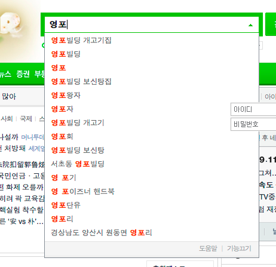

리퍼러들을 보다가, 리퍼러를 타고 네이버 검색 결과 페이지를 보다가 궁금해서 검색을 해봤는데, 그 결과가 사뭇 예상과는 달라서 포스팅;

<!-- truncate -->

2011년 9월 11일 네이버 블로그 전체에서 영포빌딩 관련 몇몇 검색어에 따라 검색되는 글 수는?

참고로 '영포빌딩 보신탕'은 가카가 대통령이 되기 전 한달 내내 5-6명 정도 되는 인원들과 함께 보신탕 집을 방문, 매일 같이 보신탕을 먹었다는 [나는 꼼수다의 내용](http://angelhalowiki.com/r1/wiki.php/%EB%82%98%EB%8A%94%20%EA%BC%BC%EC%88%98%EB%8B%A4/%EC%97%90%ED%94%BC%EC%86%8C%EB%93%9C#s-15 "[http://angelhalowiki.com/r1/wiki.php/%EB%82%98%EB%8A%94%20%EA%BC%BC%EC%88%98%EB%8B%A4/%EC%97%90%ED%94%BC%EC%86%8C%EB%93%9C#s-15]로 이동합니다.")과 연관된 검색어입니다. 

**영포빌딩 보신탕 : 3건**

**영포빌딩 개고기집 : 2건**

**영포빌딩 옆 보신탕집 : 221건**(그런데, 대부분이 "영포빌딩 옆 보신탕집"과는 관계없는 다른 보신탕집 관련 포스트들)

**나는꼼수다 영포빌딩 : 5건**

**이 결과를 보고 해봤던 추측**

- [나는 꼼수다](http://itunes.apple.com/us/podcast/id438624412 "[http://itunes.apple.com/us/podcast/id438624412]로 이동합니다.")가 가야 할 길이 아직 멀었다?
- 정치적인 사안들은 트위터 등 소셜 네트워크를 타고 전파된다?
- 글 하나를 쓰고 그 글이 댓글을 통해 공감하는 카페나 커뮤니티를 타고 전파된다?
- 블로그 글이 전체적으로 줄었다?

그런데, 네이버 블로그에서 유통되는 글이 이렇게 적은데 네이버 메인 검색창에서 **'영포'**만 입력해도 "영포빌딩 보신탕", "영포빌딩 보신탕집", "영포빌딩 개고기집", "영포빌딩 개고기" 등이 바로 완성되니 이상하더군요.

2011년 9월 11일 자동완성 결과

저 자동완성은 정말 많은 검색어 쿼리가 있어야 자동 완성이 되는 것 아닌가요? 글은 턱없이 빈약한데 검색 커리만 많다? 좀 이상합니다.

이 자동완성 검색어를 보니 위의 추측들과는 다르게 **다들 내용은 알고 있고, 궁금해서 검색은 많이 해보지만 직접 글을 쓰는데는 부담을 느끼는 것이 아닌가** 하는 생각이 들더군요.

하긴, 그 동안 광우병 파동을 비롯해서 각종 정치 관련 사건들에 대해 신경질적인 반응, 일단 구속하거나 처벌을 남발하는 등 정부가 보여줬던 행동들을 감안하면 그럴 수도 있겠다 싶기도 해요.
