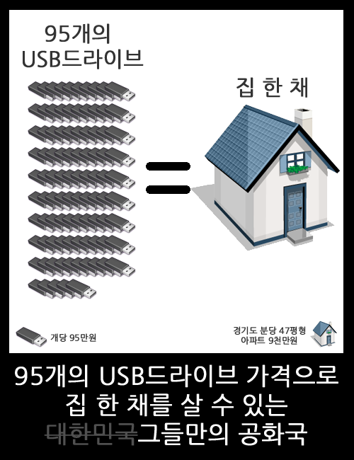

<!-- truncate -->

  
당연히 말도 안되는 얘기죠. 짤방은 그냥 한 번 만들어봤어요. 얼마나 어처구니가 없나 확인해보려고요. 만들어 놓고 보니 정말 어처구니가 없네요.  
  
그런데, 저런 말도 안되는 이야기들이 나오는데, 누구 하나 책임지거나 처벌받는 사람이 없군요. 인사 청문회가 언제부터 범죄 세탁소가 되었는지...  
  
정말 대단합니다.  
  

국회 국방위원회 송영선(미래희망연대) 의원은 보도자료를 통해 "대포병사격지휘체계(BTCS)의 전술통제기에 사용되는 4GB USB 보조기억장치가 시중에서 판매되는 상용 제품과 성능 면에서 큰 차이가 없음에도 시중가(1만원)보다 무려 95배나 비싼 95만원에 납품됐다"고 밝혔다.

이 USB는 국내 모 방산업체에서 생산해 지난 2007년부터 지난달까지 모두 660개가 군에 납품됐고 군은 USB 구입에 총 6억2천700만원의 예산을 사용했다.

그러나 이와 같은 용량의 USB는 시중에서 1만원이면 구입할 수 있는 제품으로 2007년에도 3~4만원에 불과했던 것으로 나타났다.

  
출처 : [노컷뉴스 (미디어다음) - "軍 1개에 95만원짜리 USB구입·보급, 예산낭비"](http://media.daum.net/politics/dipdefen/view.html?cateid=1068&newsid=20110915085257527&p=nocut "[http://media.daum.net/politics/dipdefen/view.html?cateid=1068&newsid=20110915085257527&p=nocut]로 이동합니다.")

  

"분당 47평 아파트를 9000만원에 구입했다니 경이로운 일입니다. 국토부 장관에 임명해야겠습니다. 3년 동안 소유했다가 9500만원에 팔았다니, 반값 아파트가 아니라 4분의 1 아파트가 실현 가능합니다. 국토해양부 장관해서 4분의 1값 아파트 실현해야 하지 않겠습니까. 어떻게 9000만원에 분당의 47평 아파트를 살 수 있습니까. 마법을 부리지 않고선 불가능한일입니다."(김재윤 민주당 의원)   
  
출처 : [한겨레 (미디어다음) - MB정부서 장관하려면 ‘다운계약서’는 기본?](http://media.daum.net/politics/others/view.html?cateid=1020&newsid=20110914153051278&p=hani "[http://media.daum.net/politics/others/view.html?cateid=1020&newsid=20110914153051278&p=hani]로 이동합니다.")
