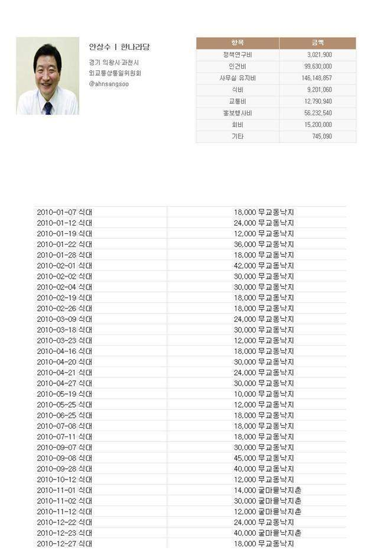

<!-- truncate -->

위는 '낙지왕 안상수'라는 이름으로 돌고 있는 짤방

안상수가 1년에 낙지집을 무려(?) 32번이나 갔다던 짤방을 보고 처음에는 막 웃었는데, 생각해 보니 저도 1년 내내 먹는 음식이 거기서 거기, 1년 내내 식사하는 식당이 거기서 거기더군요. 

어쨌든 짤방을 보고 제 식당 출입 경우를 생각해 봤습니다.

> 22일 (한달, 월~금) \* 2회 (점심, 저녁) \* 12달 (1년) / 10곳 (평상시 사무실 근처에서 주로 다니는 식당수) = 52.8회

즉, 계산상으로 저는 제가 평상시 다니는 모든 식당을 1년 동안 52.8회씩 갑니다.

그렇다면 저 역시 흔한 백반을 제외하고는 냉면킹, 쌀국수황제, 낙지왕(저도ㅠ.ㅠ), 복해장국대장,짜장면마제스터 등등이 될 수 있는 것이죠.

이런 계산을 끝낸 이후부터는 안상수 ASS를 낙지왕이라고 부르지 않기로 했습니다. ㅠ.ㅠ 

그렇다면 왜 저 짤방이 낙지왕이라는 이름이 붙어 돌아다니는 걸까요? 제 추측으로는 아래와 같은 이유 중의 하나가 아닌가 싶더군요.

1. 안상수는 이제 뭘해도 터지는 캐릭터
2. 한국사람은 역시 뭐니뭐니해도 백반이다
3. 사람들이 보통 식사로 낙지 (낙지볶음 등)를 자주 먹지 않는다
4. 매일 사무실 근처에서 밥먹는 사람이 어딨느냐! 저녁은 친구들과 술집에서 해결한다
5. 정치인은 활동 반경이 크기 때문에 저렇게 한 곳에서 자주 밥을 먹을 리 없다
6. 저거 실제로 먹은 게 아니라 간이 영수증 모아 세금처리했을 것이라는 추측을 우회적으로 비웃는 것이다

저는 1번 '안상수는 이제 뭘해도 터지는 캐릭터'에 한 표 던집니다. 정치인 사상 최초로 종편 출연 제의를 받을 수 있는 유일한 캐릭...(읭?) -.-

어쨌든 잠시나마 미안, 보온상수횽.
