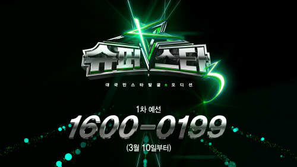

(이 글은 슈퍼스타K3를 6회까지 보고 난 소감입니다.)

<!-- truncate -->

저는 슈퍼스타K, 슈퍼스타K2를 모두 제대로 본 적이 없습니다. 고작해야 슈퍼스타K2 때 장재인 & 김지수의 신데렐라 퍼포먼스를 보고 '아- 재밌다-' 했던 것과 존박이 최종전(?)까지 올랐을 때 그 때까지 출연했던 장면들을 몇 개 찾아보며 '내가 보기엔 상당히 느끼하고 오버하는 창법인 것 같은데, 다들 가창력이 좋다고 하네. 흠흠' 했던 정도입니다.

그러던 제가 슈퍼스타K3를 첫 회부터 보고 있는데요 (본방사수파는 아닙니다만) 나름 재미있기도 하고 잔인하기도 한 프로그램이더군요. 이제까지 6회 정도 방영됐나요? 6회 정도 보고 나니까 슈퍼스타K 시리즈를 두고 왜 **'악마의 편집'**이라고 하는지 조금 알겠더라고요.

* * *

편집과 관련해서 제가 느낀 특징은 크게 3가지입니다.

**1. 빠른 속도감**

사실 제가 생각할 때 슈퍼스타K3는 국내 공중파 포함 모든 방송을 통틀어서 편집을 빠르게 하는 방송 중 하나인 것 같아요. 속도감이 느껴져서 참 좋더군요. 참가자 수가 워낙 많기도 하고 초반에 이슈를 만들어야 하기 때문에 보여줘야 할 것도 많은 프로그램의 특성상 당연한 결과가 아닌가 싶은데 그 결과가 좋은 것 같아요.

**2. 인물들의 캐릭터화**

무한도전이나 1박2일 등 매니아들이 많은 국내 버라이어티 프로그램들을 보면 등장인물들이 자신만의 캐릭터를 하나씩 꿰어차고 있고 그 캐릭터를 바탕으로 상황을 만들거나 이야기를 풀어나가곤 합니다. 심지어 ['나는 꼼수다'](http://itunes.apple.com/us/podcast/id438624412 "[http://itunes.apple.com/us/podcast/id438624412]로 이동합니다.")만 봐도 캐릭터의 분배가 잘 이루어져 있죠.

그런데, 이건 각본 없는 승부, 결과를 예측할 수 없는 오디션 프로그램이기 때문에 사람도 너무 많고 누굴 주인공으로 키워야 할지 어정쩡하죠. 하지만 생생한 캐릭터들이 등장해서 이런 저런 일들을 벌여줘야 흥행이 되는 법... 그래서 대충 사람이 추려진 이후에 오래 남을 것 같은 사람들을 두고 본격적으로 캐릭터를 잡아주는 것 같아요.

**3. 비교와 반복**

사실 1번과 2번의 특징은 <빅 브라더>나 <아메리칸 아이돌> 같은 대성공한 해외 서바이벌 프로그램들의 특징을 안정적으로 잘 따라하고 있는 거라 할 수 있습니다. 그런데, 그에 덧붙여 2번의 효과를 극대화 하기 위한 한국식 특징이 하나 더 있는데 바로 비교와 반복입니다.

슈퍼스타K3를 보고 있으니 뭔가 하나의 상황이 생기면 예전에 벌어졌던 일들까지 모아 반복해서 보여주더군요. '이게 얘 캐릭터야' 이러면서 노골적으로, 친절하게 알려준달까요? 또한 빠른 시간 안에 캐릭터를 만들어주기 위해 비교 대상을 직접 선정해서 편집합니다. 예를 들어 'XX 닮은 꼴', 'OO의 친척', '제2의 ㅁㅁㅁ' 이런 식이죠. 가이드라인을 잡아주는 거예요.

* * *

인물들을 캐릭터화 시키다 보면 당연히 악역 혹은 미움 받는 캐릭터가 필요합니다. 무한도전의 정준하 같은 캐릭터 말이죠. 인터넷을 검색해보니 매회 악역 혹은 미움 받는 캐릭터들이 있었던 것 같은데, 이번 시즌에는 신지수와 예리밴드인 것 같더군요. 집요하게 편집을 하며 그들의 비타협적이고 이기적인 모습을 부각시키더군요.

그런데, TOP10 까지 올라간 예리밴드가 슈퍼스타K3가 자신들의 리더를 나쁜 사람으로 악의적으로 편집했다고 발표하며  프로그램에서 이탈해버렸습니다. 슈퍼스타K3를 악마의 편집, 막장방송이라고 비난하면서 말이죠. 슈퍼스타K3 측은 이에 무편집 원본이라고 비공개 영상을 내놓았는데 그게 또 편집이 된 것 같더라고요. 그러던 와중에 예리밴드는 기자회견을 한다고 해놓고 취소하고... 드라마 속 막장이 현실화된 것 같아요.

1화를 보면서 '분명 출연자들에게 자신의 촬영분은 엠넷에 귀속되고, 본인의 의사와는 관계없이 얼마든지 방송에 내놓을 수 있다는 각서를 쓰게 했을 거야' 하는 생각이 들더군요. 그렇지 않으면 1화부터 시작된 우스꽝스럽게 묘사된 그 수많은 출연자들이 아무런 불평도 없었을 리가 없으니까요. 다만 예리밴드는 '자신들이 한 걸 그대로 내놓은 게 아니라, 조작을 통해 왜곡을 했다. 그러니 이건 각서랑 다른 내용 아니냐.' 뭐 이런 생각을 했던 것 같고요.

생각해 보면 출연자들은 이미 시즌1과 시즌2를 모두 봤을 것이고, 이미 자신들의 이미지가 어떤 식으로든 소비될 것이라는 것을 알았을텐데, 이제와서 저러는 게 좀 의아스럽기는 합니다. 예리밴드가 자신들 팬카페에 '어머니 품처럼 따뜻한 언더그라운드로 돌아갈 것'이라고 남겼다는 걸 보면 애초에 무슨 생각이었을까 싶을 정도예요.

* * *

사실 모든 영상은 컷이 분할되는 순간 이미 자연 그대로의 인물은 없어지기 마련이죠. 컷을 분할하고 시간을 압축하는 과정에서 갈등이 생기고 캐릭터가 만들어지는 것은 현실을 보여주는 과정이 아닙니다. 가공의 이야기일 뿐이죠. 심지어 다큐멘터리가 다큐멘터리가 아니더라는 걸 마이클 무어 같은 사람들이 훌륭하게 보여주기까지 했잖아요.

그나저나 저는 예리밴드가 한 '어머니 품처럼 따뜻한 언더그라운드로 돌아갈 것'이라는 말에서 욕망의 한 자락이 보이더군요. 그 한 자락이 남들보다 큰지, 아니면 그저 소박한 바람이었는지는 파악되지 않지만 씁쓸하고 헐떡이는 힘든 삶의 한 단편을 본 것 같아 마음이 편치 않더군요. '소비되도 괜찮아' 하면서 발을 떼었지만 정신을 차리고 났을 때는 더 나아가기도, 물러서기도, 인정하기도 쉽지 않을 것 같아요.

슈퍼스타K3가 악마의 편집, 막장방송이라는 수식어를 스스로 훈장처럼 달고 다닌다고 예리밴드가 언급했던데, 결국 슈퍼스타K3에게 훈장 하나를 더 달아준 셈이 됐군요.

>**이충한** 요즘 넘쳐나는 오디션 프로그램이 바로 현재 기성세대가 청춘을 바라보는 시각을 보여주는 것 같아요. “우리 기준에 안 맞으면 능력 없는 거야” 이런 식이죠.
>
>**김창완** 지금 있는 수많은 오디션 프로그램에 매우 반대하는 입장입니다. 난 절대 안 된다고 생각하는데, 왜 그리 기를 쓰고 그런 프로그램을 만드는지…. 그냥 매일매일 만들어지는 졸작들, 만들고 좌절하는 음악, 실망스러운 문학작품, 그림들… 그게 다 그 자체로 예쁜 거거든요. 그걸 되지도 않는 잣대로, 박수소리 하나만 갖고 잣대를 매겨서 누굴 상 주고 떨어뜨리고. 그런 걸 즐기는 사람들의 잔인한 속성을 부추겨서 장사를 해먹는 건 나는 반대입니다. 잘하는 애 칭찬하지 말라는 것에도 배치될 뿐 아니라 진짜 음악·예술이 갖고 있는 본질적인 즐거움을 상품화하는 거니까요. 아이들이 유치원에서 그린 그림을 봐봐요. 어마어마하게 이쁩니다. 우리 어렸을 때 되는 대로 엄마·아빠 얼굴 그려놓고 여기 초록색을 칠해도 될지 불안해하다가 칠하고 나서 좋아하고 이런 기억들 있잖아요. 왜 그런 건 다 잊어버리고 점점 바보가 되는 건지, 사랑도 하고 배려도 하면서 자랄수록 아름다워져야 하는데 바보 같은 어른들 때문에 청춘들이 너무 불쌍합니다.
>
>**이충한** 갈수록 ‘오디션’의 압박이 심해져요.
>
>**김창완** 각종 오디션 프로그램이 난무하다 보니 이제는 개개인들이 다 오디션을 받고 있는 거나 다름이 없어요. 세상이 다 오디션 중인 거죠. 이게 무슨 삶이고 인생입니까? 나한테도 오디션 프로그램의 심사를 해달라는 제안이 왔는데 다 쫓아냈어요. 이제 세상이 갈수록 교활한 오디션을 합니다. 절대 현혹되지 말고 삶의 참뜻을 생각하며 ‘유아독존’적으로 살아가길 바랍니다. 
>
>출처 : [한겨레 - [청춘상담앱] 넘쳐나는 오디션 프로그램이 청춘을 망치죠](http://www.hani.co.kr/arti/opinion/column/495522.html "[http://www.hani.co.kr/arti/opinion/column/495522.html]로 이동합니다.")
