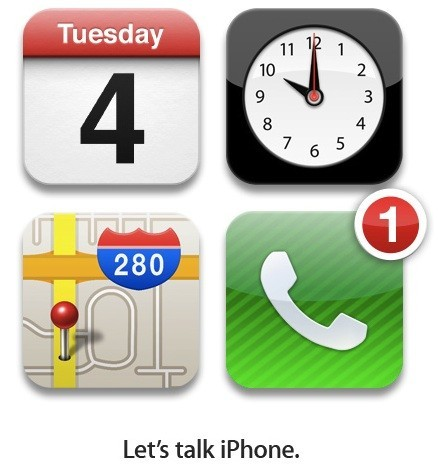
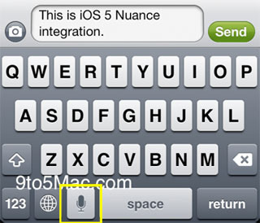

잡스가 떠나도 애플의 센스는 여전하군요. 아래 그림이 초대장이라는데,

<!-- truncate -->

- 달력 앱 : (10월) 4일 (화요일)
- 시계 앱 : 10시
- 지도 앱 : [애플 쿠퍼티노 본사](http://maps.google.com/maps?client=safari&q=1+Infinite+Loop,+Cupertino,+CA&oe=UTF-8&ie=UTF8&hq=&hnear=1+Infinite+Loop,+Cupertino,+CA+95014&ei=f1m6Sv-7JdiJsAbe0JCRBA&z=16&iwloc=A)
- 전화 앱 : 아이폰

즉, 10월 4일 오전 10시 애플 쿠퍼티노 본사에서 아이폰 발표를 하겠다는 거군요. 우리나라로는 10월 5일 새벽 2시쯤 되려나요?

어쨌든 기대가 됩니다.

* * *

개인적으로 이번 발표에서 가장 기대되는 것은 아이폰이 아니라 iOS5의 기능에 들어갈 것이라고 추측되는 음성 입력 (Voice-To-Text) 기능입니다.

지난번 iOS5 를 최초로 공개할 당시에는 시연이나 귀뜸이 없던 기능인데 [9to5mac](http://9to5mac.com/2011/08/06/ios-5s-nuance-powered-speech-to-text-feature-revealed-screenshot/) 이 그 존재를 밝혀낸 기능이죠. 저 위의 초대장에서 Let's Talk 이라고 한 것이 바로 이 음성 입력 기능을 의미하는 것 아니냐고 추측하는 분들도 계시더군요.

아시다시피 안드로이드의 Voice Text 기능은 정말 훌륭하지 않습니까. (역시 대량의 데이터를 가지고 결과를 뽑아내는 능력은 구글을 따를 자가 없달까요?) 이번에 애플도 구글 만큼이나 뛰어난 성능을 보여줄지 기대가 됩니다. 솔직히 이미 아이폰에서 지원하고 있는 음성 명령 기능은 너무 단순하고 성능도 그리 좋지 않았잖아요. 특히 한글은 쓸 수 없을 정도였고요.

음성 입력 기능이 정확하고 사용하기 쉽다면 이걸 이용한 여러 가지 앱 아이디어가 있는데 구현해 보고 싶어요.