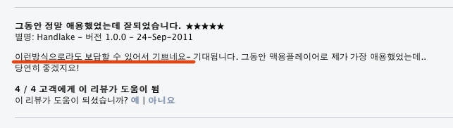
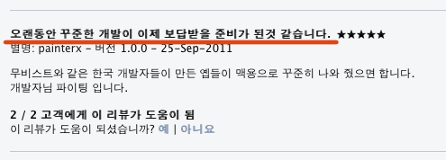

맥용 소프트웨어 중에 동영상 플레이어인 무비스트는 오래 전부터 한국 맥 사용자들에게 가뭄의 단비 같은 무료 어플리케이션이었는데 (여러 가지 옵션이나 기능이 한국 사용자 입맛에 맞춘 어플리케이션이었죠), 이번에 [맥 앱 스토어에 등록](http://itunes.apple.com/kr/app/id461788075?mt=12) 되면서 유료로 바뀌었습니다. 가격은 $4.99

<!-- truncate -->

그런데 이 맥 앱 스토어에 달린 댓글들을 보니 참 재밌습니다. 세상이 바뀌고 있는 걸까요?

수많은 불법 복제와 '소프트웨어를 돈 주고 사다니, 미친거임?'이라는 마인드가 굳건한 우리나라도 애플의 앱 스토어가 열린 이후에 사정이 조금씩 달라지고 있는 것 같아요.

소규모 개발사들도 1년에 몇 억씩 거뜬히 버는 곳들이 생겨나고 유료 소프트웨어 판매나 구매가 그리 대단한 일이 아닌 것이라 생각하지 않는 사람들의 숫자가 늘어나고 있고요.

* * *

어쨌거나 저도 한 마디 하자면, [무비스트 개발자님](http://cocoable.tistory.com/) ~ 그 동안 저도 잘 썼고요, 맥 앱 스토어에 나온 거 보고 바로 결제했습니다. 앞으로도 업데이트 잘 부탁드립니다. :-)